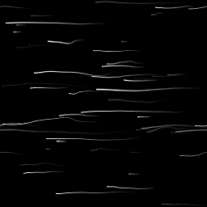

# Scratches生成器

<table>
<tr style="border: 0;">
<td width="33.33%" style="border: 0;" valign="top">

<b>进入：</b>纹理生成器>图案

</td>
<td width="100.00%" style="border: 0;" valign="top">

## 描述

这将放置带有许多自定义选项的随机划痕，例如，允许您设置方向、扩展和扭曲。

Scratches生成器的一个特殊版本是Scratches生成器Normal，它根据这些划痕的深度生成正常映射。 大多数选项完全相同，但它有一些额外的参数明确标记为“正常”设置（请参阅下文）。

</td>
</tr>
</table>

## 参数

|  |  |
|:---|:---|
| <b>样条数</b> <i>1 - 512</i> | 要放置的划痕（样条）量。 |
| <b>每个样条的最大段数</b> <i>2 - 256</i> | 划痕长度上的分段/细分的数量。 导致曲线和扭曲更平滑。 扭曲值越高，效果越明显。 |
| <b>样条旋转</b> <i>0.0 - 1.0</i> | 所有花键的均匀旋转，以使其朝某一方向定向。 |
| <b>样条旋转随机</b> <i>0.0 - 1.0</i> | 角度变化，随机旋转每个样条。 |
| <b>样条缩放</b> <i>0.0 - 1.0</i> | 统一缩放所有样条。 |
| <b>样条尺度随机</b> <i>0.0 - 1.0</i> | 分别随机缩放每个样条。 |
| <b>样条扭曲</b> <i>0.0 - 1.0</i> | 所有样条的扭曲级别一致。 |
| <b>样条扭曲随机</b> <i>0.0 - 1.0</i> | 分别随机化每个样条的扭曲级别。 |
| <b>样条扭曲频率</b> <i>0.0 - 1.0</i> | 设置扭曲频率，控制扭曲细节的比例。 |
| <b>样条宽度</b> <i>0.0 - 2.0</i> | 统一设置所有样条的宽度。 |
| <b>样条宽度随机</b> <i>0.0 - 1.0</i> | 分别随机化每个样条的样条宽度。 |
| <b>样条位置随机</b> <i>0.0 - 1.0</i> | 分别随机化每个样条的位置。 此值越低，群集到画布中心的样条越多。 可用于创建划痕点。 |
| <b>以像素为单位设置样条宽度</b> <i>False/True</i> | 确定用于样条宽度设置的单位。 |
| <b>随机明亮度（仅限灰度版本）</b> <i>0.0 - 1.0</i> | 分别随机化每个样条的明亮度。 |
| <b>正常强度（仅限正常版本）</b> <i>0.0 - 1.0</i> | 全局设置每个样条的“正常”效果强度。 |
| <b>正常强度随机（仅限正常版本）</b> <i>0.0 - 1.0</i> | 分别随机化每个样条的法向强度。 |
| <b>正常格式（仅限正常版本）</b> <i>DirectX， OpenGL</i> | 在不同正常映射格式之间切换（反转绿色通道）。 |
| <b>渐隐模式</b> <i>无、开始、结束、开始+结束</i> | 设置样条渐隐的是否及方向。 |
| <b>渐隐长度</b> <i>0.0 - 1.0</i> | 设置渐隐效果的长度（如上面已启用）。 |
| <b>非正方形扩展</b> <i>False/True</i> | 启用以非方形比例补偿挤压和拉伸。 |

## 示例

<table style="margin-top: 32px; margin-bottom: 32px">
    <tr style="border: 0">
        <td style="border: 0; background: transparent">
            
        </td>
        <td style="border: 0; background: transparent">
            
        </td>
    </tr>
</table>
