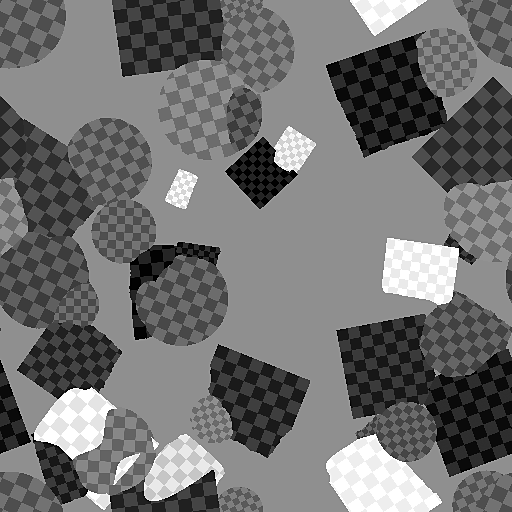

# 形状飞溅混合

<table>
<tr style="border: 0;">
<td style="border: 0;" valign="top">

{width="128px"}

## 形状飞溅混合（颜色）

**英寸：** *纹理生成器**/Patterns*

**复杂**

</td>
<td style="border: 0;" valign="top">

## 描述

将[形状飞溅](../../../../../../compositing-graphs/nodes-reference-for-com/node-library/texture-generators/patterns/shape-splatter/shape-splatter.md)数据作为输入以从中生成颜色或灰度映射。

## 参数

* **背景颜色**： *颜色输入*
* **图案1-8**： *颜色输入*
* **颜色输入**： *颜色输入*
* **飞溅数据1**： *颜色输入*
* **飞溅数据2**： *颜色输入*

### 参数

* **图案编号**： *1 - 8*
* **随机模式分配（仅限颜色）**： *0.0 - 1.0*
* **&#x200B;是正常映射**（仅限颜色）**&#x200B;**： *False/True*
* **HSL/明亮度调整**： *-1.0 - 1.0*
* **HSL/明亮度随机**： *-1.0 - 1.0*
* **&#x200B;法线角度随机**（仅限颜色）**&#x200B;**： *0.0 - 1.0*
* **颜色输入不透明度**： *0.0 - 1.0*

## 示例图像

</td>
</tr>
</table>
