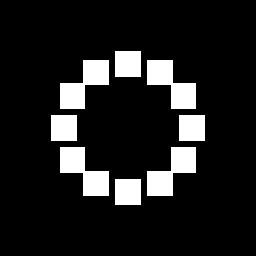

# 飞溅的圆形

<table>
<tr style="border: 0;">
<td width="33.33%" style="border: 0;" valign="top">

{width="128px"}

{width="128px"}

<b>进入：</b>纹理生成器>图案

</td>
<td width="100.00%" style="border: 0;" valign="top">

## 描述

“Scatter Circular”（飞溅圆形）通过各种控件生成基于圆环的图案。 它可以使用预定义形状或自定义输入。 它类似于[Tile Generator](../../../../../../compositing-graphs/nodes-reference-for-com/node-library/texture-generators/patterns/tile-generator/tile-generator.md)，但使用圆形放置而不是网格。

当您希望使用各种随机选项以圆形方式放置形状时，此功能非常有用。

</td>
</tr>
</table>

## 输入

两个输入均为可选项。

|  |  |
|:---|:---|
| <b>图案图像输入1-6</b> <i>灰度输入（颜色输入）</i> | 仅限飞溅圆形：自定义图案图像，在“Pattern”参数设置为“Image Input”时使用。 |
| <b>背景</b> <i>灰度输入（颜色输入）</i> |  |

## 参数

|  |  |
|:---|:---|
| <b>图案数量</b> <i>1 - 64</i> | 环上要放置的图案拼贴数量。 |
| <b>图案数量随机</b> <i>0.0 - 1.0</i> | 要放置的图案数量的随机化。 最好用于“振铃量”大于1的情况。 |
| <b>图案数量随机最小值</b> <i>1 - 10</i> | 设置用于随机化的最小模式量。 |
| <b>振铃量</b> <i>1 - 10</i> | 设置要填充的环数。 这些环始终位于外环的内部，间距均匀。 |
| <b>非正方形扩展</b> <i>False/True</i> | 启用以非方形比例补偿挤压和拉伸。 |
| <b>图案</b> |  |
| <b>图案</b> <i>图像输入，正方形，磁盘，抛物面，铃声，高斯，荆棘，金字塔，砖块，层次，波形，半圆，脊状的圆，新月，胶囊体，锥形</i> | 选择要使用的图案形状。 |
| <b>模式输入编号</b> <i>1 - 6</i> | 设置要使用的不同图像输入的数量。 仅在上面选择了“<i>图像输入</i>”时可用。 |
| <b>模式输入分布</b> <i>随机，按图案号，按振铃号</i> | 设置如何选择多个模式输入。 “随机”表示选择一个随机环路，“模式数”表示它们只置入循环序列中，“按环路”表示每个环依次有不同的环路。 |
| <b>图像输入筛选</b> <i>双线性+ Mipmaps，双线性，最接近</i> |  |
| <b>特定图案</b> <i>0.0 - 1.0</i> | 可以更改选定图案的形状。 该效果取决于所选图案。 |
| <b>对称随机</b> <i>0.0 - 1.0</i> | 设置应根据以下行为随机翻转/镜像的拼贴数。 |
| <b>对称随机模式</b> <i>水平+垂直，水平，垂直</i> | 确定对称镜像行为。 |
| <b>位置</b> |  |
| <b>半径</b> <i>0.0 - 1.0</i> | 设置从图案放置中心的半径。 |
| <b>半径随机</b> <i>0.0 - 1.0</i> | 随机分布每个图案拼贴的半径。 |
| <b>环半径乘数</b> <i>0.0 - 1.0</i> | 影响多个环的间距。 |
| <b>角度随机</b> <i>0.0 - 1.0</i> | 随机设置每个图案的角度。 数量越高，旋转角度越大。 |
| <b>螺旋因子</b> <i>0.0 - 1.0</i> | 将环变成螺旋形，其中每个拼贴都以略微增加的半径放置。 |
| <b>跨页</b> <i>0.0 - 2.0</i> | 设置环的作用旋转量。 这可以超出其限度。 |
| <b>沿方向</b>偏移 <i>0.0 - 1.0</i> | 沿每个图案的角度从中心向外移动它们。 此效果在很大程度上取决于“角度随机”，或者它看起来像“半径”的乘数。 |
| <b>全局偏移</b> <i>0.0 - 1.0</i> | 转换整个形状。 |
| <b>大小</b> |  |
| <b>连接图案</b> <i>False/True</i> | 使图案拼贴的长度取决于半径，这意味着每个形状都应贴合上一个和下一个形状。 |
| <b>大小（已连接）</b> <i>0.0 - 1.0</i> | 全局更改每个图案的大小。 连接后，它相对于总半径。 |
| <b>大小随机</b> <i>0.0 - 1.0</i> | 分别随机调整每个图案的大小。 |
| <b>缩放</b> <i>0.0 - 2.0</i> | 统一缩放每个图案。 |
| <b>随机缩放</b> <i>0.0 - 1.0</i> | 随机均匀缩放。 |
| <b>按图案编号缩放</b> <i>0.0 - 1.0</i> | 使图案缩放取决于环上的位置。 |
| <b>反转图案编号</b> <i>False/True</i> | 与前一个选项结合使用，可以将缩放比例从小调整为大，反之亦然。 |
| <b>按振铃号缩放</b> <i>0.0 - 1.0</i> | 使刻度依赖于环数。 |
| <b>反转振铃号</b> <i>False/True</i> | 与前一个选项结合使用，可以将缩放比例从小调整为大，反之亦然。 |
| <b>旋转</b> |  |
| <b>图案旋转</b> <i>0.0 - 1.0</i> | 统一旋转每个图案。 |
| <b>图案旋转随机</b> <i>0.0 - 1.0</i> | 随机化图案旋转。 |
| <b>图案旋转透视</b> <i>中心，最小X，最大X，最小Y，最大Y</i> | 设置要单独旋转每个图案的透视点位置。 |
| <b>居中方向</b> <i>False/True</i> | 旋转每个图案，使其面向圆环中心。 将其转换为会为他们提供相同的方向 — 这可能会在使用“沿方向偏移”时产生不需要的效果。 |
| <b>环形旋转</b> <i>0.0 - 1.0</i> | 围绕中心旋转整个环。 |
| <b>环旋转随机</b> <i>0.0 - 1.0</i> | 每个环的随机旋转。 |
| <b>环形旋转偏移</b> <i>0.0 - 1.0</i> | 偏移每个环的旋转。 |
| <b>颜色</b> |  |
| <b>颜色</b> <i>（灰度值）</i> | 与选定图案相乘的颜色。 |
| <b>明亮度随机</b> <i>0.0 - 1.0</i> | 为每个图案拼贴随机选择明亮度或颜色。 |
| <b>按比例明亮度</b> <i>0.0 - 1.0</i> | 使明亮度从属于单个图案比例。 |
| <b>按图案编号明亮度</b> <i>0.0 - 1.0</i> | 使明亮度从属于图案序列。 例如，可以与螺旋线一起使用。 |
| <b>反转图案编号</b> <i>False/True</i> | 反转上一个选项。 |
| <b>按振铃号明亮度</b> <i>0.0 - 1.0</i> | 使明亮度依赖于环序列。 |
| <b>反转振铃号</b> <i>False/True</i> | 反转上一个选项。 |
| <b>随机蒙版</b> <i>0.0 - 1.0</i> | 随机隐藏图案。 |
| <b>背景颜色</b> <i>（灰度值）</i> | 更改纯背景色。 |
| <b>混合模式</b> <i>添加，最大，添加子</i> | 设置如何混合重叠图案。 |
| <b>全局不透明度</b> <i>0.0 - 1.0</i> | 设置整个结果的全局不透明度。 |

## 示例

<table style="margin-top: 32px; margin-bottom: 32px">
    <tr style="border: 0">
        <td style="border: 0; background: transparent">
            
        </td>
    </tr>
</table>
