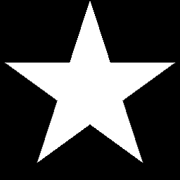

# 星形

<table>
<tr style="border: 0;">
<td style="border: 0;" valign="top">

## 星形

**英寸：** *纹理生成器**/Patterns*

**简单**

</td>
<td style="border: 0;" valign="top">

## 描述

生成五角星。

## 参数

* **缩放**： *0.0 - 1.0*\
  统一缩放整个形状。
* **非正方形扩展**： *False/True*\
  启用以非方形比例补偿挤压和拉伸。

## 示例图像

</td>
</tr>
</table>
