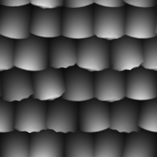

# 平铺生成器

<table>
<tr style="border: 0;">
<td width="33.33%" style="border: 0;" valign="top">

{width="128px"}

<b>进入：</b>纹理生成器>图案

</td>
<td width="100.00%" style="border: 0;" valign="top">

## 描述

Tile Generator是库中最高级的节点之一。 如果学会了如何掌握它，您就可以创建任何类型的图案（在一定限制内）。 从2017版2.1开始，进行了一些大的更新，使此节点更符合[平铺Sampler](../../../../../../compositing-graphs/nodes-reference-for-com/node-library/texture-generators/patterns/tile-sampler/tile-sampler.md)的功能。

此节点对于各种场景都非常有用，但请记住，仅仅读取参数并不能完全教您如何使用它们。 我们建议你也试试！

在所有情况下，99%不需要颜色版本！

一些常规使用提示：

* 您可以从基本形状开始，但如果您有自定义输入（将&#x200B;**图案类型**&#x200B;设置为&#x200B;*图像输入*），请先创建它！ 那个决定很多外观。
* 首先正确设置X和Y数量。
* 查找正确的&#x200B;**大小**&#x200B;模式：相对模式（如&#x200B;**间隙**）的行为与&#x200B;**绝对**&#x200B;模式截然不同。
* 接下来，调整全局&#x200B;**缩放**&#x200B;和非一致&#x200B;**大小**。
* 最后，调整任何&#x200B;**“变量”**&#x200B;参数，直到它满足您的需要。 微妙是变化的关键！

</td>
</tr>
</table>

## 输入

|  |  |
|:---|:---|
| <b>模式输入1-6</b> <i>灰度输入</i> | 自定义图案图像，在“Pattern”参数设置为“Image Input”时使用。 |
| <b>背景</b> <i>灰度输入</i> | 要使用的背景，而不是纯色。 |

## 参数

|  |  |
|:---|:---|
| <b>X数量</b> <i>1 - 64</i> | 图案的X重复次数。 |
| <b>Y数量</b> <i>1 - 64</i> | 模式的Y重复次数。 |
| <b>非正方形扩展</b> <i>False/True</i> | 启用以非方形比例补偿挤压和拉伸。 |
| <b>图案</b> |  |
| <b>图案</b> <i>图像输入，正方形，磁盘，抛物面，铃声，高斯，荆棘，金字塔，砖块，层次，波形，半圆，脊状的圆，新月，胶囊体，锥形</i> | 选择要使用的图案形状。 |
| <b>模式输入编号</b> <i>1 - 6</i> | 要使用的不同图像输入数。 仅在上面选择了“<i>图像输入</i>”时可用。 |
| <b>模式输入分布</b> <i>随机，按模式号</i> | 如果选择的图像输入大于1，如何在不同的图像输入之间进行选择。 |
| <b>特定图案</b> <i>0.0 - 1.0</i> | 可以更改选定图案的形状。 效果取决于选定的图案。 |
| <b>图像输入筛选（仅限引擎>v4）</b> <i>双线性+ Mipmaps，双线性，最接近</i> |  |
| <b>旋转</b> <i>0, 90, 180, 270</i> | 以90度的步长按设定的角度全局旋转所有拼贴。 |
| <b>旋转随机</b> <i>0.0 - 1.0</i> | 随机将拼贴旋转4个90度步长之一。 |
| <b>精灵翻转</b> <i>False/True</i> | 每隔拼贴旋转90度。 |
| <b>对称随机</b> <i>0.0 - 1.0</i> | 通过选定的对称随机模式随机镜像某些图案。 此值越高，镜像的图案就越多。 |
| <b>对称随机模式</b> <i>水平+垂直，水平，垂直</i> | 确定对称随机度大于0时的镜像行为。 |
| <b>大小</b> |  |
| <b>大小模式</b> <i>正常 — 空隙，正常 — 大小，保持比例，绝对，像素</i> | 设置图案大小的常规行为。  正常 — 空隙允许您定义图案元素之间的间隙。 受X和Y值的影响。  正常 — 大小允许您定义图案元素的大小，而不考虑间隙。 受X和Y值的影响。  使用“保持比例”，可以设置受X和Y量影响的大小，但两者之间的X和Y比例保持不变。  使用“绝对”可设置不受X和Y数量影响的绝对大小。使用  像素可设置绝对大小（以像素为单位），不受X和Y数量影响。 更改分辨率将会影响元素的大小。 |
| <b>中等大小</b> <i>0.0 - 1.0</i> | 以列和行为单位交替更改大小。 |
| <b>间隙X/Y</b> <i>0.0 - 1.0</i> | 仅在“正常 — 间隙大小”模式下可用。 更改间隙间隙。 影响形状之间的接缝，从而允许不同于<b>比例</b>的非均匀控制。 |
| <b>大小（绝对/像素）</b> <i>0.0 - 1.0</i> | 仅在“正常 — 间隙大小”模式之外可用。 设置非一致大小，不同于<b>缩放</b>。 |
| <b>缩放</b> <i>0.0 - 2.0</i> | 设置全局缩放。 |
| <b>随机缩放</b> <i>0.0 - 1.0</i> | 设置每个拼贴的全局缩放变化。 |
| <b>缩放随机植入</b> <i>0 - 1000</i> | 偏移缩放变化种子。 |
| <b>位置</b> |  |
| <b>偏移</b> <i>0.0 - 1.0</i> | 在每行或每列上增量偏移整个图案（行为取决于“垂直偏移”参数）。 |
| <b>随机偏移</b> <i>0.0 - 1.0</i> | 随机设置行偏移。 |
| <b>偏移随机植入</b> <i>0 - 1000</i> | 更改随机偏移效果的相对植入。 |
| <b>垂直偏移</b> <i>False/True</i> | 设置是在行还是行上应用位移效果；水平还是垂直。 |
| <b>位置随机</b> <i>0.0 - 1.0</i> | 通过分别控制X和Y，以非均匀方式随机调整位置。 |
| <b>全局偏移</b> <i>0.0 - 1.0</i> | 将整个结果移动到X和Y轴之上。 |
| <b>旋转</b> |  |
| <b>旋转</b> <i>0.0 - 1.0</i> | 对所有图案拼贴执行统一的自由旋转。 |
| <b>旋转随机</b> <i>0.0 - 1.0</i> | 随机化所有拼贴的自由旋转。 此值越高，可以旋转更多的拼贴。 |
| <b>颜色</b> |  |
| <b>颜色</b> <i>（灰度值）</i> | 设置拼贴纯色。 |
| <b>明亮度/颜色随机</b> <i>0.0 - 1.0</i> | 引入每拼贴颜色或明亮度变化。 |
| <b>按数字</b>明亮度 <i>False/True</i> | 在整个图案上淡化明亮度。 |
| <b>按比例明亮度</b> <i>False/True</i> | 使明亮度变化取决于拼贴比例。 |
| <b>检查器蒙版</b> <i>False/True</i> | 隐藏所有其他拼贴。 |
| <b>水平蒙版</b> <i>False/True</i> | 隐藏所有其他列。 |
| <b>垂直蒙版</b> <i>False/True</i> | 每隔一行都隐藏。 |
| <b>随机蒙版</b> <i>0.0 - 1.0</i> | 随机隐藏拼贴。 此值越高，拼贴消失得越多。 |
| <b>反转蒙版</b> <i>False/True</i> | 反转此部分中的任何蒙版效果的结果。 |
| <b>混合模式</b> <i>添加，最大，添加子</i> | 设置要使用的混合模式。 |
| <b>背景颜色</b> <i>（灰度值）</i> | 设置纯背景色。 |
| <b>全局不透明度</b> <i>0.0 - 1.0</i> | 设置全局拼贴不透明度。 |
| <b>反向渲染顺序</b> <i>False/True</i> | 将拼贴渲染到前面或反之。 |

## 示例

<table style="margin-top: 32px; margin-bottom: 32px">
    <tr style="border: 0">
        <td style="border: 0; background: transparent">
            
        </td>
        <td style="border: 0; background: transparent">
            
        </td>
        <td style="border: 0; background: transparent">
            
        </td>
        <td style="border: 0; background: transparent">
            
        </td>
    </tr>
</table>
