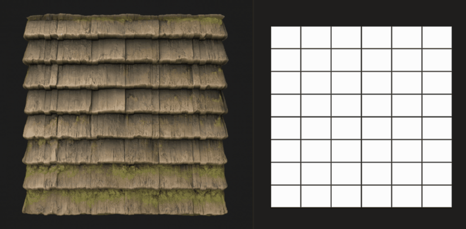

# 平铺随机2

<table>
<tr style="border: 0;">
<td width="41.60%" style="border: 0;" valign="top">

{width="200px"}

**在：** *纹理生成器* */图案*

**复杂**

</td>
<td width="58.30%" style="border: 0;" valign="top">

## 描述

**拼贴随机2**&#x200B;节点生成随机大小和Height与宽度比的相邻拼贴。

可以通过随机&#x200B;*倾斜*&#x200B;形状的两侧来调整网格以断开角度。

可以使用&#x200B;*缩放*、*斜切*、*圆角化*&#x200B;以及&#x200B;*扭曲旋转*&#x200B;的选项调整形状。

这些调整可由&#x200B;*输入图*&#x200B;控制。

专用输出允许您将形状的&#x200B;**UV**&#x200B;输入到&#x200B;**Flood Fill(...)**&#x200B;中 用于应用其他变体的节点。

</td>
</tr>
</table>

## 参数

### 输入

* **随机大小映射** *灰度*\
  控制形状的随机缩放的灰度输入图像。\
  其影响由&#x200B;**随机大小输入图乘数**&#x200B;参数控制。
* **随机倾斜映射** *灰度*&#x200B;控制形状随机倾斜的灰度输入图像。\
  其影响由&#x200B;**随机倾斜输入图乘数**&#x200B;参数控制。
* **圆角半径映射** *灰度*\
  控制形状圆角半径的灰度输入图像。\
  其影响由&#x200B;**圆角半径输入图多项式**&#x200B;控制。 参数。
* **斜角距离图** *灰度*\
  控制形状斜角的灰度输入图像。\
  其影响由&#x200B;**斜面距离输入图Mult.**&#x200B;控制 参数。
* **蒙版图** *灰度*\
  控制形状蒙版的灰度输入图像。\
  其影响由&#x200B;**蒙版映射输入开始**&#x200B;和&#x200B;**蒙版映射输入结束**&#x200B;参数控制。

### 参数

* **数量X** *整数*\
  **X**&#x200B;轴上的单元格数。
* **数量Y** *整数*\
  **Y**&#x200B;轴上的单元格数。
* 大小
  * **随机大小乘数** *Float*\
    将&#x200B;*全局*&#x200B;调整应用于随机缩放的强度。
  * **随机大小的输入映射乘数** *浮点*\
    使用从&#x200B;**随机大小映射**&#x200B;输入值&#x200B;*采样*&#x200B;调整随机缩放的强度。
  * **随机大小X** *浮点*\
    调整&#x200B;**X**&#x200B;轴&#x200B;*仅*&#x200B;上的随机缩放强度。
  * **随机大小Y** *Float*\
    调整&#x200B;**Y**&#x200B;轴&#x200B;*仅*&#x200B;上的随机缩放强度。
  * **随机大小分布** *整数*\
    控制分布随机缩放值的方法：
    * *一致*：对所有单元格应用&#x200B;*相同方式*&#x200B;的随机缩放
    * *蓝色杂色*：使用蓝色杂色图案&#x200B;*调整了随机比例*
* 形状长宽比 — 变换
  * **间隙Thickness** *浮动*&#x200B;调整形状之间间隙的Thickness。 所有&#x200B;*形状的*&#x200B;相等。
  * **随机位置乘数** *Float*\
    将随机位置偏移应用于形状，直至&#x200B;*符合其单元格的边框*。
  * **圆角半径** *Float*&#x200B;调整形状圆角的&#x200B;*半径*。 值&#x200B;**0**&#x200B;表示不应用舍入。\
    *注意*：当&#x200B;**启用每轴斜角控件**&#x200B;参数设置为&#x200B;*True*&#x200B;时，无法应用此效果。
  * **圆角半径输入映射多项式。** *浮动*&#x200B;调整&#x200B;**圆角半径映射**&#x200B;输入映射影响圆角半径的强度。\
    该映射用作&#x200B;**圆角半径**&#x200B;参数的&#x200B;*每像素*&#x200B;乘数。\
    *注意*：当&#x200B;**启用每轴斜角控件**&#x200B;参数设置为&#x200B;*True*&#x200B;时，无法应用此效果。
  * **缩放乘数** *浮点*\
    按其单元格&#x200B;*的*&#x200B;区域比例调整每个形状的大小。
  * **随机缩放***Float*&#x200B;调整将随机缩放应用于&#x200B;*每个*&#x200B;形状的强度。
  * **旋转***Float*&#x200B;通过沿单元格边框将每个&#x200B;*角*&#x200B;移动到其&#x200B;*邻居*&#x200B;来旋转单元格中的形状。\
    此方法导致对旋转处的形状应用某些&#x200B;*扭曲*&#x200B;和&#x200B;*缩放*。
  * **旋转随机** *浮动*&#x200B;调整对每个形状应用随机旋转量的强度。\
    旋转方法在&#x200B;**旋转**&#x200B;参数中描述。
  * **角位置随机***Float*&#x200B;通过在单元格边框上对其每个&#x200B;*角*&#x200B;应用随机数量&#x200B;*偏移*&#x200B;来扭曲形状。
* 倾斜
  * **随机倾斜乘数** *Float*\
    将&#x200B;*全局*&#x200B;调整应用于随机倾斜的强度。
  * **随机倾斜输入图乘数** *Float*\
    使用从&#x200B;**随机倾斜映射**&#x200B;输入值&#x200B;*取样*&#x200B;调整随机倾斜的强度。
  * **随机倾斜X** *Float*\
    调整随机倾斜的强度\
    在&#x200B;**X**&#x200B;轴&#x200B;*仅*&#x200B;上。
  * **随机倾斜Y** *Float*\
    调整随机倾斜的强度\
    在&#x200B;**Y**&#x200B;轴&#x200B;*仅*&#x200B;上。
  * **随机倾斜分布** *整数*\
    控制分布随机倾斜值的方法：
    * *一致*：对所有单元格应用&#x200B;*相同方式*&#x200B;的随机倾斜
    * *蓝色噪声*：使用蓝色噪声图案&#x200B;*调整了随机倾斜*
* 斜面
  * **斜面距离模式** *整数*\
    设置&#x200B;*获取形状应斜切的距离*&#x200B;的方法：
    * *相对于网格大小*：形状按照其网格大小的指定&#x200B;*比例进行斜切*- *相对于形状大小*：形状按照其大小的指定&#x200B;*比例进行斜切*
    * *相对于图像大小*：形状按指定的&#x200B;*图像比例*&#x200B;倾斜
  * **斜距乘数** *Float*\
    将&#x200B;*全局*&#x200B;调整应用于斜面距离。
  * **斜距输入映射多项式。** *浮动*\
    使用&#x200B;**斜角距离图**&#x200B;输入映射作为&#x200B;*每像素*&#x200B;乘数调整斜角的距离。
  * **斜角圆曲线** *浮动*\
    调整应用于斜角的圆角强度，使其更为&#x200B;*凸起*。
  * **启用每个轴斜角控件** *布尔值*\
    当&#x200B;*True*&#x200B;时，可以在&#x200B;**X**&#x200B;和&#x200B;**Y**&#x200B;轴上&#x200B;*单独*&#x200B;应用和调整斜角。\
    *注意*：此&#x200B;*取消* **圆角**&#x200B;效果。
  * **斜面距离X** *浮动*\
    仅调整&#x200B;**X**&#x200B;轴&#x200B;**&#x200B;上的斜面距离。 此距离取决于&#x200B;**斜面距离模式**&#x200B;参数的值。\
    *注意*：仅当&#x200B;**启用每个轴斜角控件**&#x200B;参数设置为&#x200B;*True*&#x200B;时，此参数才可用。
  * **斜面距离Y** *Float*\
    仅调整&#x200B;**Y**&#x200B;轴&#x200B;**&#x200B;上的斜面距离。 此距离取决于&#x200B;**斜面距离模式**&#x200B;参数的值。\
    *注意*：仅当&#x200B;**启用每个轴斜角控件**&#x200B;参数设置为&#x200B;*True*&#x200B;时，此参数才可用。
* 遮罩
  * **蒙版随机反转** *布尔值*\
    反转形状的随机蒙版。
  * **蒙版随机启动** *Float*\
    对于给定的&#x200B;**随机植入**，伪随机蒙版按照从起始形状到结束形状的&#x200B;*特定顺序*&#x200B;应用。 此参数允许您&#x200B;*偏移*&#x200B;起始&#x200B;*形状的索引*。\
    *注意*：这确定了蒙版的&#x200B;*值范围*&#x200B;的一个限制。 因此，该值可能比&#x200B;**掩码随机结束**&#x200B;值&#x200B;*大*。
  * **蒙版随机结束***Float*&#x200B;对于给定的&#x200B;**随机种子**，按&#x200B;*特定顺序*&#x200B;从起始形状到结束形状应用伪随机蒙版。 此参数允许您&#x200B;*偏移*&#x200B;结束&#x200B;*形状的索引*。\
    *注意*：这确定了蒙版的&#x200B;*值范围*&#x200B;的一个限制。 因此，该值可能比&#x200B;**掩码随机起始**&#x200B;值&#x200B;*大*。
  * **按单元格区域进行蒙版反转** *布尔值*\
    按形状单元格的区域反转形状蒙版。
  * **按单元格区域蒙版起始** *Float*\
    调整蒙版形状的&#x200B;*最小*&#x200B;单元格的区域阈值。\
    *注意*：这确定了蒙版的&#x200B;*值范围*&#x200B;的一个限制。 因此，该值可能比&#x200B;**按单元格区域结束蒙版**&#x200B;的值大&#x200B;**。
  * **按单元格区域结束进行蒙版***Float*&#x200B;调整蒙版形状的&#x200B;*最大*&#x200B;单元格区域阈值。\
    *注意*：这确定了蒙版的&#x200B;*值范围*&#x200B;的一个限制。 因此，该值可能比&#x200B;**按单元格区域蒙版起始**&#x200B;值&#x200B;*低*。
  * **蒙版映射输入反转** *布尔值*\
    通过&#x200B;**蒙版映射**&#x200B;输入映射反转形状的蒙版。
  * **蒙版映射输入开始** *Float*\
    调整蒙版形状的&#x200B;**蒙版映射**&#x200B;输入图中的&#x200B;*最小灰度值*&#x200B;阈值。\
    *注意*：这确定了蒙版的&#x200B;*值范围*&#x200B;的一个限制。 因此，该值可能比&#x200B;**掩码映射输入端**&#x200B;值&#x200B;*大*。
  * **蒙版映射输入端** *浮动*&#x200B;调整蒙版形状的&#x200B;**蒙版映射**&#x200B;输入映射中的&#x200B;*最大灰度值*&#x200B;阈值。\
    *注意*：这确定了蒙版的&#x200B;*值范围*&#x200B;的一个限制。 因此，该值可能比&#x200B;**蒙版映射输入开始**&#x200B;值&#x200B;*低*。

## 示例图像

<table>
<tr style="border: 0;">
<td style="border: 0;" valign="top">

{width="256px"}

</td>
<td style="border: 0;" valign="top">

{width="256px"}

</td>
<td style="border: 0;" valign="top">

{width="256px"}

</td>
<td style="border: 0;" valign="top">

{width="512px"}

</td>
<td style="border: 0;" valign="top">

{width="512px"}

</td>
<td style="border: 0;" valign="top">

{width="512px"}

</td>
<td style="border: 0;" valign="top">

{width="340px"}

</td>
</tr>
</table>
