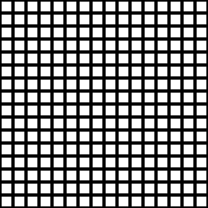

# 平铺Sampler

<table>
<tr style="border: 0;">
<td width="33.33%" style="border: 0;" valign="top">

{width="128px"}

<b>进入：</b>纹理生成器>图案

</td>
<td width="100.00%" style="border: 0;" valign="top">

## 描述

拼贴Sampler是终极的拼贴图案生成节点。 它是[Tile Generator](../../../../../../compositing-graphs/nodes-reference-for-com/node-library/texture-generators/patterns/tile-generator/tile-generator.md)的演化版本，更为复杂。 截至2017年2.1月，拼贴Sampler与[生成器](../../../../../../compositing-graphs/nodes-reference-for-com/node-library/texture-generators/patterns/tile-generator/tile-generator.md)之间的差异已小得多。 主要的差异现在仅在七个不同的映射槽中，这些槽可用于驱动缩放、位置、旋转、大小、颜色和蒙版。 它们的效果可以单独混合。

拼贴Sampler可用于创建人造程序模式，并可额外控制由外部输入映射驱动的特定参数。

在转到“平铺Sampler”之前，请确保您熟悉[Tile Generator](../../../../../../compositing-graphs/nodes-reference-for-com/node-library/texture-generators/patterns/tile-generator/tile-generator.md)。 在大多数情况下，您会发现[Tile Generator](../../../../../../compositing-graphs/nodes-reference-for-com/node-library/texture-generators/patterns/tile-generator/tile-generator.md)已足够，您不需要增加平铺Sampler的复杂性。

</td>
</tr>
</table>

## 输入

|  |  |
|:---|:---|
| <b>模式输入1-6</b> <i>灰度输入/彩色输入</i> | 自定义模式图像，在“Pattern”参数设置为“Image Input”时使用。  可用输入量由<b>Pattern Input Number</b>参数决定。 |
| <b>缩放映射输入</b> <i>灰度输入</i> | 灰度映射可驱动磁贴缩放。 |
| <b>位移的映射输入</b> <i>灰度输入</i> | 灰度映射可驱动平铺位移。 |
| <b>输入旋转贴图</b> <i>灰度输入</i> | 灰度映射可驱动拼贴旋转。 |
| <b>矢量图输入</b> <i>颜色输入</i> | 用于驱动非均匀缩放的彩色矢量图。 |
| <b>彩图输入</b> <i>灰度输入/彩色输入</i> | 映射到驱动器每磁贴色调。 |
| <b>蒙版映射输入</b> <i>灰度输入</i> | 用于隐藏某些拼贴的蒙版插槽。 |
| <b>模式分布图输入</b> <i>灰度输入</i> | 用于驱动多个自定义模式输入的掩码插槽。 |
| <b>背景输入</b> <i>灰度输入/彩色输入</i> | 可选的背景图像。 |

## 参数

|  |  |
|:---|:---|
| <b>X数量</b> <i>0 - 64</i> | 图案的X重复次数。 |
| <b>Y数量</b> <i>0 - 64</i> | 模式的Y重复次数。 |
| <b>非正方形扩展</b> <i>False/True</i> | 启用以非方形比例补偿挤压和拉伸。 |
| <b>图案</b> |  |
| <b>图案</b> <i>图案输入，方形，磁盘，抛物面，铃声，高斯，荆棘，金字塔，砖块，层次，波形，半铃声，脊状的圆，新月，胶囊体，锥形</i> | 选择要使用的图案形状。 |
| <b>模式输入编号</b> <i>1 - 6</i> | 要随机选择的自定义图案的数量。 |
| <b>模式输入分布</b> <i>随机，模式数，分布图</i> | 设置如何选择多个模式输入。 “随机”表示选择随机类型，“模式编号”表示它们仅置入循环序列中。 分布图使用灰度图输入来驱动放置。 |
| <b>模式输入筛选(引擎> v4)</b> <i>双线性+ Mipmaps，双线性，最接近</i> |  |
| <b>特定图案</b> <i>0.0 - 1.0</i> | 可以更改选定图案的形状。 该效果取决于所选图案。 |
| <b>模式特定的随机</b> <i>0.0 - 1.0</i> | 随机化效果取决于选定的模式。 |
| <b>旋转</b> <i>0, 90, 180, 270</i> | 步进式旋转（90度）。 |
| <b>旋转随机</b> <i>0.0 - 1.0</i> | 基于每个拼贴的随机自由旋转。 |
| <b>对称随机</b> <i>0.0 - 1.0</i> | 设置应根据以下行为随机翻转/镜像的拼贴数。 |
| <b>对称随机模式</b> <i>水平+垂直，水平，垂直</i> | 确定对称镜像行为。 |
| <b>大小</b> |  |
| <b>大小模式</b> <i>正常，保持比例，绝对，像素</i> | 设置图案大小的常规行为。“  正常”允许您定义图案元素的大小。 受X和Y值的影响。  使用“保持比例”，可以设置受X和Y量影响的大小，但两者之间的X和Y比例保持不变。  使用“绝对”可设置不受X和Y数量影响的绝对大小。使用  像素可设置绝对大小（以像素为单位），不受X和Y数量影响。 更改分辨率将会影响元素的大小。 |
| <b>大小（绝对/像素）</b> <i>0.0 - 1.0</i> | 更改拼贴的不均匀比例。 确切的行为取决于大小模式。 |
| <b>大小随机</b> <i>0.0 - 1.0</i> | 随机选择每个拼贴的比例。 |
| <b>缩放</b> <i>0.0 - 10.0</i> | 设置全局拼贴缩放。 |
| <b>随机缩放</b> <i>0.0 - 1.0</i> | 随机选择每个图块的比例。 |
| <b>缩放映射乘数</b> <i>0.0 - 1.0</i> | 比例图效果中的混合。 |
| <b>缩放矢量映射乘数</b> <i>0.0 - 1.0</i> | 混合在缩放矢量映射的影响下驱动非均匀缩放。 |
| <b>缩放参数化影响</b> <i>X和Y、X、Y</i> | 设置缩放参数化所影响的轴。 用于使比例映射仅影响元素的X或Y。 |
| <b>位置</b> |  |
| <b>位置随机</b> <i>0.0 - 10.0</i> | 在两个轴上随机分布拼贴位置。 |
| <b>偏移</b> <i>0.0 - 1.0</i> | 根据“位移类型”移动拼贴。 |
| <b>偏移类型</b> <i>水平quincux、垂直quincux、水平全局、垂直全局</i> | 更改“偏移”操作的方向。 |
| <b>全局偏移</b> <i>0.0 - 1.0</i> | 全局偏移X或Y轴上的所有拼贴。 |
| <b>位移的地图强度</b> <i>0.0 - 1.0</i> | “偏移”上的混合映射的强度中的位移。 |
| <b>位移角度</b> <i>0.0 - 1.0</i> | 设置要置换的角度。 |
| <b>矢量图位移</b> <i>0.0 - 1.0</i> | 使用矢量映射来驱动位移和角度。 |
| <b>旋转</b> |  |
| <b>旋转</b> <i>0.0 - 1.0</i> | 全局旋转所有拼贴。 |
| <b>旋转随机</b> <i>0.0 - 1.0</i> | 为每个拼贴随机旋转。 |
| <b>旋转贴图乘数</b> <i>0.0 - 1.0</i> | 旋转贴图对每拼贴旋转的影响下的混合。 |
| <b>矢量映射乘数</b> <i>0.0 - 1.0</i> | 使用矢量映射来驱动每磁贴旋转。 |
| <b>颜色</b> |  |
| <b>蒙版映射阈值</b> <i>0.0 - 1.0</i> | 蒙版映射的阈值何时开始隐藏拼贴。 |
| <b>蒙版映射反转</b> <i>False/True</i> | 反转蒙版映射效果。 |
| <b>蒙版图采样技术</b> <i>图案中心，图案定界框（较慢）</i> | 隐藏操作应该由单点决定，还是由定界框决定。 避免导致奇怪效果的游离像素。 |
| <b>蒙版随机</b> <i>0.0 - 1.0</i> | 随机蒙版与蒙版映射并行工作。 |
| <b>反转蒙版</b> <i>False/True</i> | 反转随机蒙版。 |
| <b>混合模式</b> <i>添加/订阅，最大（平铺Sampler）/添加/订阅，Alpha混合（平铺Sampler颜色）</i> | 背景上的拼贴以及拼贴彼此的混合模式。 |
| <b>颜色</b> <i>（灰度值）/（颜色值）</i> | 纯色全局拼贴颜色。 |
| <b>颜色/明亮度随机</b> <i>0.0 - 1.0</i> | 颜色的随机化，按拼贴。 |
| <b>颜色参数化模式</b> <i>颜色输入，缩放，行索引，行索引，图案索引（拼贴Sampler） /色图，缩放，行索引，行索引，图案索引，图案中心位置，图案中心位置(RG)球面大小(B) （拼贴Sampler颜色）</i> | 设置颜色随机化的确切程度。 |
| <b>颜色参数化乘数</b> <i>0.0 - 1.0</i> | 以上参数化效果中的混合。 |
| <b>颜色参数化效果（仅限颜色）</b> <i>RGB+Alpha，仅限RGB，仅限Alpha</i> | 设置参数化如何影响颜色。 |
| <b>全局不透明度（仅灰度）</b> <i>0.0 - 1.0</i> | 设置全局拼贴不透明度。 |
| <b>背景颜色</b> <i>（灰度值）/（颜色值）</i> | 设置纯背景色。 |
| <b>反向渲染顺序</b> <i>False/True</i> | 反转渲染顺序以从后到前。 |

## 示例

<table style="margin-top: 32px; margin-bottom: 32px">
    <tr style="border: 0">
        <td style="border: 0; background: transparent">
             <i>示例显示参数如何由输入图（图案分布、缩放、旋转）驱动。</i>
        </td>
    </tr>
</table>
