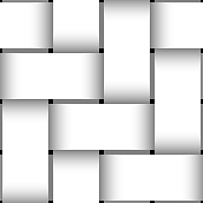

# 编织生成器

<table>
<tr style="border: 0;">
<td width="33.33%" style="border: 0;" valign="top">

{width="128px"}

<b>进入：</b>纹理生成器>图案

</td>
<td width="100.00%" style="border: 0;" valign="top">

## 描述

此节点生成一个简单的交织图案，其中包含几个选项。 它允许比预定义的编织模式更多的控制，并且呈现了一种不能用其它节点实现的模式。

</td>
</tr>
</table>

## 参数

|  |  |
|:---|:---|
| <b>平铺X</b> <i>1 - 20</i> | 设置X轴上重复的数据块数。 |
| <b>平铺Y</b> <i>1 - 20</i> | 设置Y轴上重复的数据块数。 |
| <b>形状</b> <i>0.0 - 1.0</i> | 设置串联的曲线Height轮廓。 |
| <b>编织</b> <i>1 - 10</i> | 设置每个块的缝合数。 |
| <b>间隙</b> <i>0.0 - 1.0</i> | 设置X轴和Y视图上线迹之间的间隙。 |
| <b>非正方形扩展</b> <i>False/True</i> | 启用以非方形比例补偿挤压和拉伸。 |

## 示例

<table style="margin-top: 32px; margin-bottom: 32px">
    <tr style="border: 0">
        <td style="border: 0; background: transparent">
            
        </td>
    </tr>
</table>
