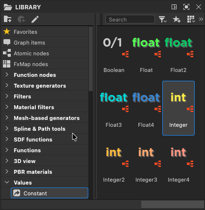

# 常数

常量节点是一种创建静态值的方法，用于在Substance图形内使用。

您可以在库的&#x200B;**值>常量**&#x200B;部分中找到这些节点。\
它们都包含一个生成值的简单[值处理器](../../atomic-nodes/value-processor/value-processor.md)节点。

+++ 库中的常量节点

+++

## 整数

常整数生成整数，步骤为1。

[可以将它们转换为Float，](../../../../function-graphs/nodes-reference-for-fun/atomic-function-nodes/cast-nodes/cast-nodes.md)，当执行任何比加法、减法和简单比较更复杂的操作时，建议执行此操作。

<table>
<tr style="border: 0;">
<td width="16.67%" style="border: 0;" valign="top">

</td>
<td width="100.00%" style="border: 0;" valign="top">

<b>整数</b>

整数具有单个组件。 它可用作建立选区的索引，例如：

* 选择一个作为下拉菜单呈现给用户的选项（请参阅[此页面](../../../../compositing-graphs/manage-parameters/exposing-a-parameter/exposing-a-parameter.md)中的“下拉列表”）。
* 选择[多交换机](../../../../compositing-graphs/nodes-reference-for-com/node-library/filters/blending/multi-switch/multi-switch.md)节点的输入。<b></b>

>[!IMPORTANT]
>
> 参数函数中的<b>负整数</b>是&#x200B;*不受支持*。 请参阅[此页面](../../../../technical-issues/parameters-not-working/parameters-not-working-as-expected.md)的“技术问题”部分以获得解决方法。

</td>
</tr>
</table>

<table>
<tr style="border: 0;">
<td width="16.67%" style="border: 0;" valign="top">

</td>
<td width="100.00%" style="border: 0;" valign="top">

<b>整数2</b>

Integer2节点生成带有(X， Y)分量的静态2分量整数向量。

Integer2的一个常见用例是设置X和Y网格大小，如[Tile Generator](../../../../compositing-graphs/nodes-reference-for-com/node-library/texture-generators/patterns/tile-generator/tile-generator.md)节点。

</td>
</tr>
</table>

<table>
<tr style="border: 0;">
<td width="16.67%" style="border: 0;" valign="top">

</td>
<td width="100.00%" style="border: 0;" valign="top">

<b>整数3</b>

Integer3节点生成带有(X、Y、Z)分量的静态3分量整数向量。

</td>
</tr>
</table>

<table>
<tr style="border: 0;">
<td width="16.67%" style="border: 0;" valign="top">

</td>
<td width="100.00%" style="border: 0;" valign="top">

<b>整数4</b>

Integer4节点生成带有(X、Y、Z、W)分量的静态4分量整数向量。

</td>
</tr>
</table>

## 浮动

固定浮点值生成小数，即它们支持小数符号后的值，并且可以在小于1的步骤中进行调整。 （默认：0.01）

[浮点数可以转换为整数](../../../../function-graphs/nodes-reference-for-fun/atomic-function-nodes/cast-nodes/cast-nodes.md)，但会向上或向下舍入到最接近的整数，这意味着数据和准确性会丢失。

<table>
<tr style="border: 0;">
<td width="16.67%" style="border: 0;" valign="top">

</td>
<td width="100.00%" style="border: 0;" valign="top">

<b>浮动</b>

Float具有单个组件，通常用于任何需要精度的单个值。

</td>
</tr>
</table>

<table>
<tr style="border: 0;">
<td width="16.67%" style="border: 0;" valign="top">

</td>
<td width="100.00%" style="border: 0;" valign="top">

<b>浮点2</b>

Float2节点生成带有(X， Y)分量的2分量向量。

Float2常用于[采样坐标](../../../../function-graphs/nodes-reference-for-fun/atomic-function-nodes/sampler-nodes/sampler-nodes.md)、[偏移变换](../../../../compositing-graphs/nodes-reference-for-com/node-library/filters/transforms/transforms.md)和常规2D矢量操作。

</td>
</tr>
</table>

<table>
<tr style="border: 0;">
<td width="16.67%" style="border: 0;" valign="top">

</td>
<td width="100.00%" style="border: 0;" valign="top">

<b>浮点3</b>

Float3节点生成3分量(X、Y、Z)矢量。

Float3主要用于处理3D对象和[3D缩放坐标](../../../../compositing-graphs/nodes-reference-for-com/node-library/texture-generators/patterns/cube-3d/cube-3d.md)（例如[3D SDF节点](../../../../function-graphs/nodes-reference-for-fun/function-node-library/function-node-library.md#sdf-functions)），并且作为一种存储RGB颜色的更简单方法（即无Alpha）。

</td>
</tr>
</table>

<table>
<tr style="border: 0;">
<td width="16.67%" style="border: 0;" valign="top">

</td>
<td width="100.00%" style="border: 0;" valign="top">

<b>浮点4</b>

Float4生成4分量(X、Y、Z、W)矢量。

Float4是存储和设置XYZW值映射到RGBA的颜色信息的首选方法，例如[统一颜色节点](../../../../compositing-graphs/nodes-reference-for-com/atomic-nodes/uniform-color/uniform-color.md)中。

</td>
</tr>
</table>

## 非数值

<table>
<tr style="border: 0;">
<td width="16.67%" style="border: 0;" valign="top">

</td>
<td width="100.00%" style="border: 0;" valign="top">

<b>布尔值</b>

布尔型是最简单的数据类型，只知道两种状态： <code>true</code> 或<code>false</code>.

此类型在使用切换参数和[If/Else](../../../../function-graphs/nodes-reference-for-fun/atomic-function-nodes/control-nodes/control-nodes.md)条件时非常常见。 布尔值是控制函数或图表的流的简单而有效的方法，例如使用[切换节点](../../../../compositing-graphs/nodes-reference-for-com/node-library/filters/blending/switch/switch.md)。

</td>
</tr>
</table>
