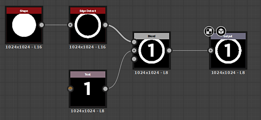

# Substance 图形

<table>
<tr style="border: 0;">
<td width="16.67%" style="border: 0;" valign="top">

[{width="120px"}](https://substance3d.adobe.com/)

</td>
<td width="100.00%" style="border: 0;" valign="top">

[Substance图形](https://substance3d.adobe.com/)是在Substance 3D Designer中创建的主要图形类型。 其目的是<b>生成和处理不受设置分辨率、颜色或形状限制的2D图像数据</b>。 这些模板是用途极为广泛的图像处理和生成工具，而不仅仅是静态的预设置结果。

结果可以是简单的黑白图案、只在其他图像上运行并且不单独生成内容的滤镜，或者甚至是具有多个通道的完整的程序材料。

Substance图形是[最受支持的图形类型](../getting-started/overview/overview.md)，可以导出并在大量不同的工作流程中使用。

</td>
</tr>
</table>

## 示例

在下面您可以找到一些常见用例的典型示例。

+++简单形状
{width="512px"}

通过生成[一段文本](../compositing-graphs/nodes-reference-for-com/atomic-nodes/text/text.md)和[圆盘形状](../compositing-graphs/nodes-reference-for-com/node-library/texture-generators/patterns/shape/shape.md)，[从圆盘中提取边缘](../compositing-graphs/nodes-reference-for-com/node-library/filters/effects/edge-detect/edge-detect.md)，最后[将它们混合在一起](../compositing-graphs/nodes-reference-for-com/atomic-nodes/blend/blend.md)，然后将它们设置为最终的[输出](../compositing-graphs/nodes-reference-for-com/atomic-nodes/output/output.md)，可以创建贴花的简单蒙版形状。

带有编号的文本或边缘的Thickness可以对外公开，使其成为更动态的图表。

+++

+++调整滤镜
{width="512px"}

滤镜图表将法线图作为[输入](../compositing-graphs/nodes-reference-for-com/atomic-nodes/input/input.md)（使用自定义预览），[将其转换为曲率](../compositing-graphs/nodes-reference-for-com/node-library/filters/effects/curvature-smooth/curvature-smooth.md)，然后[调整对比度](../compositing-graphs/nodes-reference-for-com/node-library/filters/adjustments/histogram-scan/histogram-scan.md)以创建凸边缘蒙版作为最终[输出](../compositing-graphs/nodes-reference-for-com/atomic-nodes/output/output.md)。

可以公开在直方图中设置的对比度值，使其与动态输入槽相结合，成为简单但有用的滤镜。

+++

+++全材质
{width="512px"}

更复杂的图形[混合两个基础材质](../compositing-graphs/nodes-reference-for-com/node-library/material-filters/blending-material/material-blend/material-blend.md)。 一个[基础材质](../compositing-graphs/nodes-reference-for-com/node-library/material-filters/pbr-utilities/base-material/base-material.md)保持简单，另一个使用一些自定义输入来增加兴趣。 蒙版用于确定在将设置为最终[输出](../compositing-graphs/nodes-reference-for-com/atomic-nodes/output/output.md)之前，两种素材中的哪些素材出现在哪里。

此示例使用[链接创建模式](../interface/the-graph-view/link-creation-modes/link-creation-modes.md)来简化使用多个链接的过程。

+++
