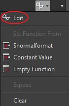

# 创建和编辑函数

## 创建函数

若要创建函数，只需单击函数图标并选择“**空函数**”。

## 编辑函数

创建函数后，可以通过再次单击函数图标或在下拉列表中选择编辑来修改它。

然后，您将进入图表的功能模式。

## 函数图

函数图的工作方式与Designer中的其他图表类型相同：使用节点编辑器。

## 创建节点

您可以通过右键单击图形并选择“添加元素”或按空格键来创建节点：

{width="600px"}

## 设置输出

与Substance图相反，函数没有“输出”节点，必须指定图中的哪个节点是函数输出。

可以通过右键单击某个节点并选择<b>“设置为输出节点”来设置输出。</b>

设置为输出的节点将变为黄色。

>[!NOTE]
>
> **输出类型**
> 
> 要设置为输出的节点必须保持与其控制的参数相同的值类型。 否则，“设置为输出节点”选项将呈灰显状态。

>[!WARNING]
>
> 函数必须具有输出才能工作。 如果您的函数没有任何输出集，您将在图形中看到警告。
