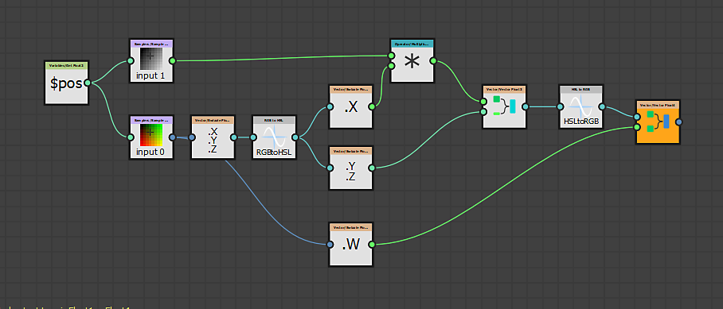

# Substance函数图表

<table>
<tr style="border: 0;">
<td style="border: 0;" valign="top">

[{width="120px"}](https://substance3d.adobe.com/)

</td>
<td style="border: 0;" valign="top">

[Substance函数图表](https://substance3d.adobe.com/)<b>处理单值</b>（整数、浮点、矢量）而不是图像数据（整组像素）。 函数也是带有节点网络的图形，但[使用的节点](../function-graphs/nodes-reference-for-fun/function-nodes-overview/function-nodes-overview.md)和接口不同于[常规Substance图形](../compositing-graphs/substance-compositing-graphs.md)。 此工作流程完全基于<b>数学运算</b>，不显示任何图像预览缩略图，这使它成为<b>使用Substance 3D Designer的一种更高级的方式</b>。

函数可用于许多不同的上下文，其中主要函数用于修改[公开参数](../compositing-graphs/manage-parameters/exposing-a-parameter/exposing-a-parameter.md)的行为，编写[像素处理器](../compositing-graphs/nodes-reference-for-com/atomic-nodes/pixel-processor/pixel-processor.md)或[FX-Maps](../compositing-graphs/nodes-reference-for-com/atomic-nodes/fx-map/fx-map.md)的行为，以及在Substance图中使用[值](../compositing-graphs/values-compositing-graphs/values-in-substance-compositing-graphs.md)。

</td>
</tr>
</table>

## 示例

下面是函数常见用例的一些示例。

### Simple函数

公开参数上下文中的简单函数。 它会获取一个名为“强度”的输入浮点值，该值决定为从0到1（一个易于理解的范围），并将它重新映射到设置为0.1 - 0.8的范围。 这意味着，如果用户将强度设置为0，则将使用内部0.1，如果Ui设置为1，则将使用0.8，并且其间的任何值都将进行线性插值。 在[公开参数](../compositing-graphs/manage-parameters/exposing-a-parameter/exposing-a-parameter.md)但使用自定义函数时，常使用此类型的函数。

此函数也可以写为&#x200B;*lerp(0.1， 0.8， Intensity)*，伪码类似于HLSL或GLSL。

### 高级功能

{width="545px"}

此高级函数显示[像素处理器](../compositing-graphs/nodes-reference-for-com/atomic-nodes/pixel-processor/pixel-processor.md)的内部工作，该处理器用于根据第二灰度蒙版输入的强度调整色图输入的色相。

它使用“$pos”Alpha对两个输入进行采样，然后去除颜色，将颜色值转换为HSL，并通过将色相分量与采样的灰度值相乘来修改色相分量。 然后，它重新组合矢量，将HSL转换回RGB，并重新添加Alpha以用于最终输出。

在伪代码中，这是一个复杂的函数，无法在一行中运行。
