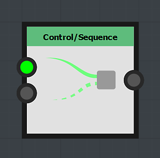
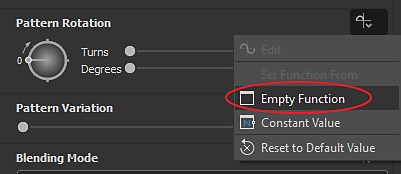

# 使用Set/Sequence节点

此页面描述了&#x200B;**集**&#x200B;和&#x200B;**序列**&#x200B;节点，并提供了&#x200B;**FX-Maps**&#x200B;上下文中的示例用例。

<table>
<tr style="border: 0;">
<td style="border: 0;" valign="top">

## 概述

在<b>FX-Maps</b>中使用函数时，有时需要从参数的&#x200B;*[Substance函数图形](../../../../function-graphs/the-function-graph/the-function-graph.md)*&#x200B;输出值，这样您就可以&#x200B;*将它用于另一个函数图形*。 但默认情况下，Substance函数图表仅输出&#x200B;*一个*&#x200B;值：驱动相关参数的值。

</td>
<td style="border: 0;" valign="top">

</td>
</tr>
</table>

在这种情况下，可以使用<b>Set</b>和<b>Sequence</b>节点的组合，这将允许您跨单个或多个函数控制变量。

此过程包括两个步骤：

1. 使用<b>Set</b>节点可创建新变量，以便在其他位置调用该变量并为其分配值。
1. <b>序列</b>节点用于在执行图形的另一个分支&#x200B;*之前（例如，实际涉及输出当前图形的预期值的逻辑）执行整个步骤1中的逻辑*

<table>
<tr style="border: 0;">
<td width="100.00%" style="border: 0;" valign="top">

## “集”节点

使用<b>Set</b>节点，可以设置新变量并为其分配连接到节点&#x200B;*输入*&#x200B;的类型和值。

变量的&#x200B;*名称*&#x200B;由用户在节点的属性中输入。

默认情况下，此节点设置的变量在此Substance函数图形的&#x200B;*parent*&#x200B;的作用域内是&#x200B;*仅*&#x200B;可访问的 — 例如，承载函数定义的参数的节点。

</td>
<td width="25.00%" style="border: 0;" valign="top">

</td>
</tr>
</table>

<table>
<tr style="border: 0;">
<td style="border: 0;" valign="top">

在此示例中，变量名称已设置为&#x200B;**`myVariable`**，其值为&#x200B;**1**。

</td>
<td style="border: 0;" valign="top">

</td>
</tr>
</table>

<table>
<tr style="border: 0;">
<td width="100.00%" style="border: 0;" valign="top">

## “序列”节点

<b>Sequence</b>节点通过确保&#x200B;*在第二个分支*&#x200B;之前完全执行第一个分支，使您能够控制Substance函数图形的&#x200B;*执行流*。

然后，*第二个分支*&#x200B;的输出将传递给节点的输出。

</td>
<td width="25.00%" style="border: 0;" valign="top">

</td>
</tr>
</table>

<table>
<tr style="border: 0;">
<td style="border: 0;" valign="top">

在此示例中，<b>序列</b>节点设置为图形的输出。 因此，函数的输出是<b>Float</b>节点输出的<b>0.5</b>值。

但是，在此之前将`<b>myVariable</b>`变量设置为浮点值<b>1.0</b>。 然后，可以在节点的上下文中使用&#x200B;*其他*&#x200B;处使用此变量。

</td>
<td style="border: 0;" valign="top">

</td>
</tr>
</table>

**序列**&#x200B;节点可以&#x200B;*链接*&#x200B;以控制图形的执行流。

例如，您可以先&#x200B;*设置*&#x200B;变量，*更新*&#x200B;稍后再更新其值，然后&#x200B;*读取*&#x200B;其最终值，同时确保这些操作以&#x200B;*特定顺序*&#x200B;发生。

## 变量可见性

请注意，声明的变量是&#x200B;*无法从任何地方访问*&#x200B;的！\
虽然在父级中声明的变量可以在子级访问，但相反的是&#x200B;*不是true*。

因此，在节点中设置的变量在图形级别是&#x200B;*不*&#x200B;可访问的，而在图形级别设置的变量&#x200B;*可以*&#x200B;在其节点的参数函数中访问。

例如，此规则位于&#x200B;*公开参数*&#x200B;的核心，用于公开实际上涉及以下步骤：

1. 创建图形输入参数
1. 在参数的Substance函数图中进行访问
1. 将其值设置为函数的输出

让我们构建一个较小的示例：想象一下我们希望<b>象限</b>节点的<b>旋转</b>值受<b>颜色/发光度</b>值的影响：发光度越亮，旋转角度就越多。

<table>
<tr style="border: 0;">
<td style="border: 0;" valign="top">

我们将在<b>颜色/光度</b>参数函数中进行所有计算。 此参数将&#x200B;*first*&#x200B;计算，因此其中的任何变量集都可用于其他节点参数。

</td>
<td style="border: 0;" valign="top">

</td>
</tr>
</table>

<table>
<tr style="border: 0;">
<td style="border: 0;" valign="top">

我们的函数将非常简单：明度将是介于&#x200B;**0**&#x200B;和&#x200B;**1**&#x200B;之间的随机值，此值将存储在`myRotation`变量中，然后我们将该值设置为函数的输出。

这意味着&#x200B;**颜色/明度**&#x200B;参数的值将是随机的&#x200B;*，并且*&#x200B;将存储在`myRotation`变量中。

请注意，**位置**&#x200B;属性已由随机值定义，并且使用&#x200B;**迭代**&#x200B;节点获取多个随机放置的图案。

</td>
<td style="border: 0;" valign="top">

</td>
</tr>
</table>

<table>
<tr style="border: 0;">
<td style="border: 0;" valign="top">

现在`myRotation`变量存在且具有值，让我们访问<b>图案旋转</b>属性的Substance函数图表。

</td>
<td style="border: 0;" valign="top">

</td>
</tr>
</table>

<table>
<tr style="border: 0;">
<td width="100.00%" style="border: 0;" valign="top">

在函数中，我们使用&#x200B;**Get Float**&#x200B;节点读取`myRotation`参数的值 — 我们知道变量包含浮点值 — 并将其设置为函数的输出。

</td>
<td width="25.00%" style="border: 0;" valign="top">

</td>
</tr>
</table>

亮度现在还可以控制旋转。

