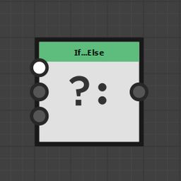
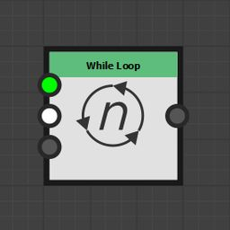

# 控制节点

此页面描述了[函数图形](../../../../function-graphs/the-function-graph/the-function-graph.md)的节点，其用途是控制&#x200B;*执行流*。

<table>
<tr style="border: 0;">
<td width="33.33%" style="border: 0;" valign="top">

</td>
<td width="100.00%" style="border: 0;" valign="top">

## If...Else

与编程语言类似，如果……另外引入根据预先定义的条件对结果进行滤波的可能性。

</td>
</tr>
</table>

您将将此节点与[逻辑节点](../../../../function-graphs/nodes-reference-for-fun/atomic-function-nodes/logical-nodes/logical-nodes.md)和[比较节点](../../../../function-graphs/nodes-reference-for-fun/atomic-function-nodes/comparison-nodes/comparison-nodes.md)一起使用，它们将帮助您构建要检查的条件。

+++输入连接器
<b>条件</b> *布尔值*\
控制节点输出的条件。

<b>如果</b> *变量类型*&#x200B;如果<b>条件</b>为&#x200B;*True*，则节点输出的值。

<b>Else</b> *变量类型*&#x200B;如果<b>条件</b>为&#x200B;*False*，则节点输出的值。

+++

<table>
<tr style="border: 0;">
<td width="33.33%" style="border: 0;" valign="top">

</td>
<td width="100.00%" style="border: 0;" valign="top">

## 序列

确保先计算图形的一部分，然后再计算另一个部分。

</td>
</tr>
</table>

这对于控制变量在创建、读取和更新时的状态至关重要。

您可以在本文档的[使用Set/Sequence节点](../../../../function-graphs/fxmaps/using-functions-in-fxmaps/using-the-set-sequence/using-the-set-sequence-nodes.md)页面中了解有关序列节点的更多信息。

+++输入连接器
<b>进入</b> *变量类型*\
图形中应首先计算的部分

<b>最后</b> *变量类型*\
图形中应在最后计算的部分

+++

<table>
<tr style="border: 0;">
<td width="33.33%" style="border: 0;" valign="top">

</td>
<td width="100.00%" style="border: 0;" valign="top">

## 当型循环

执行一次<b>初始化</b>分支，然后迭代<b>退出条件</b>。 和<b>循环体</b>分支，直到<b>退出条件</b> 分支返回&#x200B;*True*。

循环完成后，节点将输出<b>循环主体</b>的上一次迭代的结果。

</td>
</tr>
</table>

循环具有隐含的最大迭代数，可通过将其设置为–1来禁用该值。

变量在迭代中保留其值，并且可在退出条件(“退出条件”(Exit Cond.))中访问。\
这意味着可以在每次迭代时向索引值添加值，并在退出条件中检查其值，以控制所需的循环数。

>[!IMPORTANT]
>
> 连接到<b>退出条件</b>的节点 和<b>循环体</b>分支不能连接到图形的其他分支。

+++输入连接器
<b>初始化。</b> *变量类型*\
在第一个迭代之前计算的图形部分 — 即循环的开始。

<b>退出条件</b> *布尔值*\
循环停止所需的条件为true。 在每次迭代中重新计算它。\
*注意：*&#x200B;最大迭代次数仍限制为<b>最大迭代次数</b>参数。

<b>循环正文</b> *变量类型*\
从循环中获益的图形。 在每次迭代中重新计算它。

+++

+++参数
<b>最大 迭代</b> *整数*\
节点执行的最大迭代数。\
当先满足以下任一条件时，节点停止迭代：达到此最大数目或退出条件变为true 。\
可以通过将值设置为&#x200B;*-1*&#x200B;来禁用此最大值。 此时，只有退出条件才能停止迭代。

正在设置&#39;Max. 迭代的–1提高了小环路的性能，因为跟踪和更新的计数器少了一个。

但是，请注意节点的配置方式，因为这可能会产生<b>无限循环</b>，从而可能导致Designer无响应。

+++

查看有关While循环节点的此教程：
