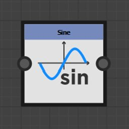

# 函数节点

函数节点根据它们所代表的数学函数来变换输入值。

虽然它们的输入连接器通常不键入，但它们不支持所有值类型。

## 节点列表

+++Pow

返回第一个输入，其值为第二个输入的次方： <b>X^Y</b>。

+++

+++2Pow

返回其输入值的幂为2： <b>2^X</b>。

+++

+++平方根

返回其输入值的平方根： <b>√X</b>。

+++

+++指数

返回其输入值的指数值： <b>e^X</b>

<b>e</b>约等于2.7182818。

+++

+++对数

返回其输入值的自然对数： <b>ln(X)</b>。

+++

+++以 2 为底的对数

返回其输入值的基2对数： <b>log2(X)</b>。

+++

+++绝对值

返回其输入的绝对值： <b>abs(X)</b>。

+++

+++上限

向上舍入其输入值。 它返回不小于X的最小整数值： <b>ceil(X)</b>。

+++

+++向下取整

向下舍入其输入值。 它返回不大于X的最大整数值： <b>floor(X)</b>。

+++

+++线性插值

返回浮动值的函数中两个值之间的线性插值： <b>(1 - X)\*A + X\*B</b>。

+++

+++最小

返回两个输入值中的最低值： <b>min(A， B)</b>。

+++

+++最大

返回两个输入值中的最高值： <b>max(A， B)</b>。

+++

+++余弦

以弧度返回其输入值的余弦： <b>cos(X)</b>。

+++

+++正弦

以弧度返回其输入值的正弦： <b>sin(X)</b>。

+++

+++正切

以弧度返回其输入值的正切： <b>tan(X)</b>。

+++

+++反正切 2

返回输入2D矢量与水平方向之间的角度。

它是<b>笛卡尔</b>函数的倒数。

不必像通常的<b>atan2</b>函数那样切换输入矢量的X和Y分量。

+++

+++直角坐标

将极坐标转换为笛卡尔坐标。

它是<b>反正切2 </b>函数的倒数： <b>长度\*浮点2(cos（角度），sin（角度）。</b>

极坐标是指距原点的距离，以及距水平线的角度（以弧度为单位）。

+++

+++随机

返回介于0和输入值<b>X</b>之间的随机值。

+++
