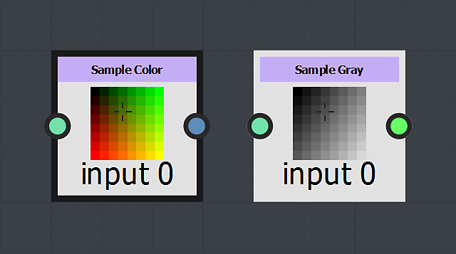

# Sampler节点

这些节点在提供的2D坐标下对输入图像中的值进行采样：

<b>灰度示例</b>对灰度图像中输入<b>位置</b>处的明亮度值采样，并将其输出为<b>浮点</b>值。

<b>示例颜色</b>对彩色图像中输入<b>位置</b>处的RGBA值进行采样，并将其输出为<b>Float4</b>值，其中R、G、B和A组件分别映射到X、Y、Z和W组件。

<table>
<tr style="border: 0;">
<td width="100.00%" style="border: 0;" valign="top">

坐标从输入的左上角开始，水平和垂直范围介于0和1之间。

超出此范围的位置将根据所选的<b>寻址模式</b>进行处理（请参阅下文）。

</td>
<td width="33.33%" style="border: 0;" valign="top">

</td>
</tr>
</table>

>[!NOTE]
>
> <b>位置</b>输入应为Float2值，其中图像的X和Y坐标分别映射到值的X和Y组件

## 参数

+++输入图像
用于选择要用于采样的节点输入。

该列表会动态适应当前连接的输入。 这意味着在连接节点输入时会添加条目。

输入的编号从0开始，因此连接到节点第一个输入的图像列为&#x200B;*输入图像0*。

+++

+++筛选模式
用于定义在取样图像中的像素由于分辨率差异而无法精确映射到输出图像时如何处理插值。

<b>最接近</b>\
像素将在匹配坐标处映射到目标&#x200B;*“原样”*。 如果目标的分辨率较低，则可以完全忽略像素。 如果目标具有更高分辨率，则将映射到覆盖其范围的所有像素。 输出更清晰&#x200B;**，看起来略有&#x200B;*锯齿*。

<b>双线性过滤</b>\
对源图像应用筛选处理，以便将其像素映射到目标分辨率，从而使&#x200B;*像素之间的过渡变平滑*。 输出为&#x200B;*更平滑*，看起来略有&#x200B;*模糊*。

+++

+++编址模式
控制如何处理超出[0；1]范围的位置值。

<b>重复</b>\
随着值的增加，在[0；1]范围内循环。\
例如：3.4是0.4，-1.7是0.3。

<b>固定到边缘</b>\
将超出[0；1]范围的值限制到其最接近的极限。\
例如：.3.4为1，-1.7为0。

+++
