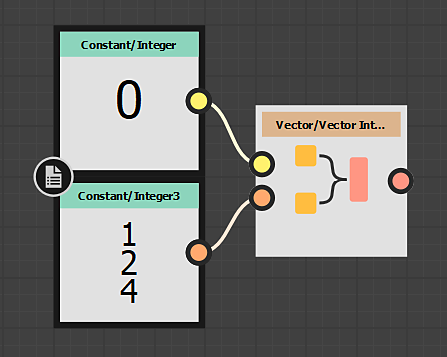

# 矢量和交换机节点

矢量节点和交换机节点允许您分别从单独的组件构建矢量节点和解构矢量节点。它们类似于[RGBA Merge](../../../../compositing-graphs/nodes-reference-for-com/node-library/filters/channels/rgba-merge/rgba-merge.md)和[RGBA Split](../../../../compositing-graphs/nodes-reference-for-com/node-library/filters/channels/rgba-split/rgba-split.md)，但是用于函数图。 它们也是在Vector Data类型之间转换的主要方法，因为[转换](../../../../function-graphs/nodes-reference-for-fun/atomic-function-nodes/cast-nodes/cast-nodes.md)在许多情况下不是选项。

## 矢量节点

<table>
<tr style="border: 0;">
<td style="border: 0;" valign="top">

矢量节点允许您将矢量或分量较少的元素组合到矢量中，分量较多的元素组合到矢量中。 Vector节点存在一些特定的规则或限制：

* 矢量节点只有&#x200B;**两个输入**，即使生成的矢量包含2个以上的组件。
* 矢量输入&#x200B;**不限于一种类型**：它们可以将任何较小的组件作为输入。
* 结果输出的顺序由&#x200B;**输入顺序**&#x200B;决定。

这意味着最好使用以下方法：

* 用两种方式构建矢量4：连接两个双分量矢量，或连接一个单分量矢量和一个三分量矢量。
* 如果要从单个整数或浮点构建3或4分量矢量，则必须首先至少执行一个Vector 2组合，然后才能将它们组合到3分量矢量中。

好好考虑一下联系的顺序。 输入连接顺序如下图所示。

{width="200px"}

左边的示例先连接一个整数(1)，然后连接一个整数3。 结果如下

| 输出 | X | Y | Z | W |
| --- | --- | --- | --- | --- |
| 输入 1 | 0 |  |  |  |
| 输入 2 |  | 1 | 2 | 4 |

{width="200px"}

左边的示例将第一个示例中的输入交换为Integer 3，然后交换为Integer(1)。

| 输出 | X | Y | Z | W |
| --- | --- | --- | --- | --- |
| 输入 1 | 1 | 2 | 4 |  |
| 输入 2 |  |  |  | 0 |

</td>
<td style="border: 0;" valign="top">

| 

 | 

 | 

 |
| --- | --- | --- |
| **矢量整数2** | **矢量整数3** | **矢量整数4** |
| 

 | 

 | 

 |
| **矢量浮点2** | **矢量浮点3** | **矢量浮点4** |

</td>
</tr>
</table>

## 切换节点

<table>
<tr style="border: 0;">
<td style="border: 0;" valign="top">

切换节点从多分量矢量中分解或分离分量，允许您单独使用X、Y、Z和W分量以及交换它们。 适用以下规则和限制：

* 交换机节点只有&#x200B;**一个输出**。
* 切换节点&#x200B;**采用正确类型（整数或Float）的任何输入**。

### 拆分组件

Swizzle最常见的用例是用来拆分组件，例如将整数4拆分为4个单独的整数。 这些限制确实意味着您需要四个单独的Swizzle 整数节点才能实现此目的。

对于整数4，如两个整数2，或者一个整数和一个整数3，任何其它类型的拆分也是可能的，同样要牢记每个结果需要其自己的节点。

### 交换/交换组件

就像它的名字所暗示的那样，Swizzle可用来更改值的顺序，甚至覆盖值。 可以从X、Y、Z、W更改顺序到W、Y、X、Z，也可以将值从X、Y、Z、W更改为X、X、X、W。

</td>
<td style="border: 0;" valign="top">

| 

 | 

 | 

 | 

 |
| --- | --- | --- | --- |
| **Swizzle 整数** | **切换** **整数2** | **切换** **整数3** | **交换** **整数4** |
| 

 | 

 | 

 | 

 |
| **切换** **Float** | **切换** **Float2** | **切换** **Float3** | **交换** **Float4** |

</td>
</tr>
</table>
