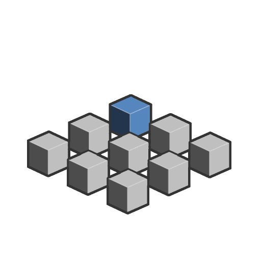

# 重复镜像范围

<table>
<tr style="border: 0;">
<td width="33.33%" style="border: 0;" valign="top">

<b>In：</b>SDF 函数>运算符

</td>
<td width="100.00%" style="border: 0;" valign="top">

## 描述

在X、Y和Z正或负轴的常规间距上以任意次数镜像和复制SDF形状。 此运算符每次重复形状时，也会将其镜像。 这将在形状的原始方向和翻转的副本之间产生交替。

</td>
</tr>
</table>

>[!INFO]
> 
> 要了解有关涉及SDF 函数的概念和工作流的更多信息，请转到专用页面： [使用SDF 函数](../../working-with-sdf-functions.md)

## 输入

|  |  |
| :--- | :--- |
| <b>SDF</b> *浮动* | 输入SDF形状。 |
| <b>金额+</b> *整数3* | 沿正X、Y、Z轴的重复量。  <i>默认值： (2， 0， 0)</i> |
| <b>数量 — </b> *整数3* | 沿X、Y、Z轴负值的重复量。  <i>默认值： (2， 0， 0)</i> |
| <b>间距</b> *浮点3* | 每个副本之间的世界空间。  该间距以立方助手可视化，其大小是X、Y和Z方向上的副本之间的间距。 间距从<b>原点位置</b>开始，并且从该位置对称增加。  <i>默认值： (2， 2， 2)</i> |
| <b>原点位置</b> *浮点3* | 定义将复制的SDF形状的中心。  原始位置由立方助手的中心位置可视化。  <i>默认值： (0， 0， 0)</i> |
| <b>P</b> *Float3* | 变换的世界空间位置。 使用此输入可使用<b>偏移P</b>和<b>旋转P</b>节点来应用其他变换。  <i>默认：未变换的世界空间位置。</i> |
