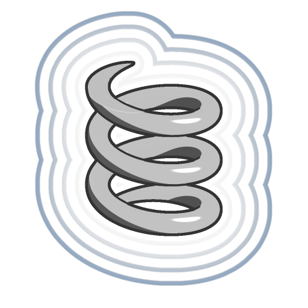

# 螺旋（约）

<table>
<tr style="border: 0;">
<td width="33.33%" style="border: 0;" valign="top">

<b>In：</b>SDF 函数>基元

</td>
<td width="100.00%" style="border: 0;" valign="top">

## 描述

螺旋的逼近SDF 函数，它是通过沿一条曲线绕着轴向上缠绕来扫描一个圆而形成的形状。  <i>注意：</i>由于此SDF 函数是逼近，因此渲染时可能会出现伪像。

</td>
</tr>
</table>

>[!INFO]
> 
> 要了解有关涉及SDF 函数的概念和工作流的更多信息，请转到专用页面： [使用SDF 函数](../../working-with-sdf-functions.md)

## 输入

|  |  |
| :--- | :--- |
| <b>大半径</b> *浮动* | 缠绕曲线与轴的距离。  <i>默认值： 0.4</i> |
| <b>小半径</b> *浮动* | 沿曲线扫描以形成螺旋曲面的圆半径。  <i>默认值： 0.1</i> |
| <b>Height</b> *浮动* | 螺旋的Z-upHeight。  <i>默认值： 0.5</i> |
| <b>绕组</b> *浮动* | 曲线围绕轴线完全环绕的次数（阶数）为0.5。 ，即螺旋线在0.5的Height内旋转的次数。  <i>默认值： 4</i> |
| <b>中心位置</b> *浮点3* | 螺旋线的旋转点的世界空间位置。  <i>默认值： (0， 0， 0)</i> |
| <b>P</b> *浮点3* | 改变的世界空间位置。 使用此输入可使用<b>偏移P</b>和<b>旋转P</b>节点来应用其他变换。  <i>默认：未变换的世界空间位置。</i> |
