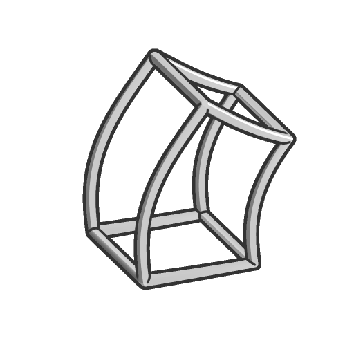

# 折弯（不精确）

<table>
<tr style="border: 0;">
<td width="33.33%" style="border: 0;" valign="top">

<b>进入：</b>SDF 函数>变换

</td>
<td width="100.00%" style="border: 0;" valign="top">

## 描述

以一定角度在起点和终点之间的局部Y轴周围折弯SDF形状。  <i>注意：</i>由于此转换函数不精确，因此渲染时可能会出现伪像。

</td>
</tr>
</table>

>[!INFO]
> 
> 要了解有关涉及SDF 函数的概念和工作流的更多信息，请转到专用页面： [使用SDF 函数](../../working-with-sdf-functions.md)

## 输入

|  |  |
| :--- | :--- |
| <b>SDF</b> *浮动* | 输入SDF形状。 |
| <b>角度</b> *浮动* | 应用于折弯末端的旋转的角度。 |
| <b>开始</b> *浮动* | 弯曲开始处的Z轴上的世界位置。 下面的所有体积块都没有弯曲。 |
| <b>结束</b> *浮动* | Z轴上折弯结束处的世界位置。 以上所有体积均以指定角度均匀旋转。 |
| <b>P</b> *浮点3* | 改变的世界空间位置。 使用此输入可使用<b>偏移P</b>和<b>旋转P</b>节点来应用其他变换。  <i>默认：未变换的世界空间位置。</i> |
