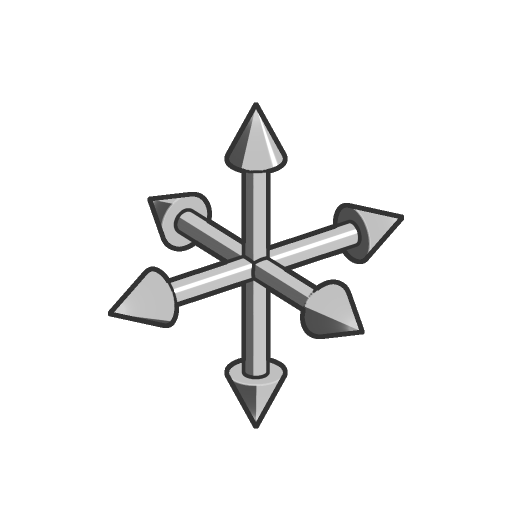

# 位移

<table>
<tr style="border: 0;">
<td width="33.33%" style="border: 0;" valign="top">

<b>进入：</b>SDF 函数>变换

</td>
<td width="100.00%" style="border: 0;" valign="top">

## 描述

沿矢量偏移SDF形状。

</td>
</tr>
</table>

|  |  |
| :--- | :--- |
| <b>SDF</b> *浮动* | 输入SDF形状。 |
| <b>偏移</b> *浮点3* | SDF形状将在X、Y、Z方向偏移的距离。  <i>默认值： (0， 0， 0)</i> |
| <b>P</b> *浮点3* | 改变的世界空间位置。 使用此输入可使用<b>偏移P</b>和<b>旋转P</b>节点来应用其他变换。  <i>默认：未变换的世界空间位置。</i> |
