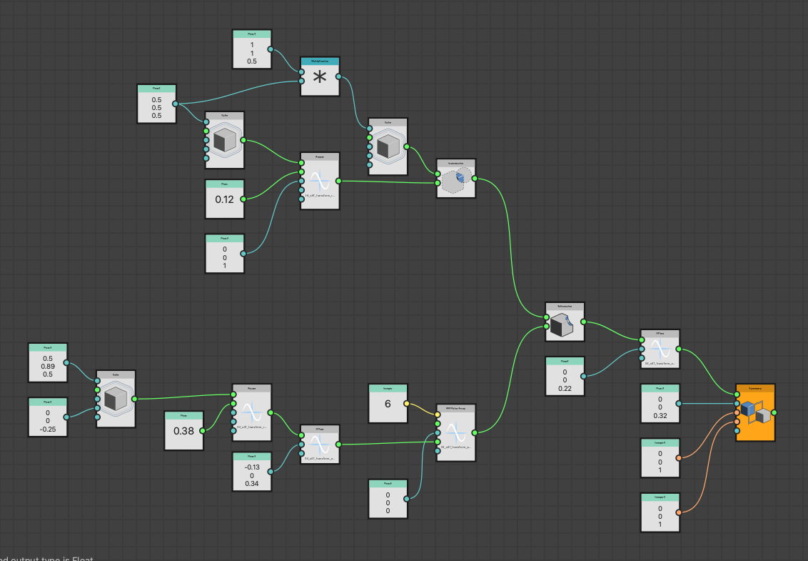
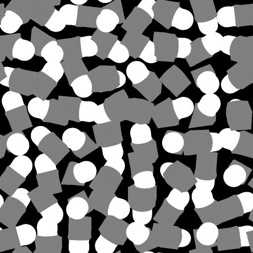
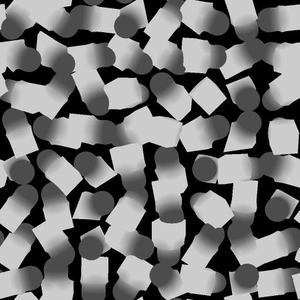

# 使用SDF 函数

在16.0.0版中，Substance 3D Designer向创作SDF 函数引入了一组强大的节点，可用于创建和处理程序化3D形状。

SDF 函数是Substance函数图表，它们组合了工具集中提供的SDF节点，并应用于支持SDF 函数的节点中的专用参数。

首先，请记住，基本工作流程如下所示：

1. 在[3D查看器](../../../../compositing-graphs/nodes-reference-for-com/node-library/filters/effects/3d-viewer/3d-viewer.md)SDF 函数中创作用于可视化结果的节点。
2. 将最终函数图形（或[实例化它](../../../../glossary/glossary.md#instance-node)）复制到支持SDF 函数的SDF 函数的节点参数中，如[形状飞溅v2](../../../../compositing-graphs/nodes-reference-for-com/node-library/texture-generators/patterns/shape-splatter-v2/shape-splatter-v2.md)。

## 什么是SDF 函数？

<table style="border: none">
    <tr style="border: 0">
        <td style="border: 0; vertical-align: top">
            
正如数学函数可以在2D中绘制为曲线一样，它们也可以在3D中绘制为曲面。

有符号距离场是一种数学函数，通过计算空间中任意点到曲面上最近点的距离来定义3D空间中的曲面。

让我们细分“符号距离字段”这个名称，更好地理解它：<ul><li><b>带符号</b>表示如果点在曲面外/前面，则函数返回正值；如果点在曲面内/后面，则返回负值；如果点恰好在曲面上，则函数返回零。</li><li><b>距离</b>是指此函数计算从空间中的任何点到曲面上*nearest*点的距离。</li><li><b>字段</b>表示该函数描述一个值字段，因为空间中的每个点都有一个相应的值，该值表示其到最近曲面的距离。</li></ul>

        </td>
        <td style="border: 0; width: 33%; vertical-align: top">
            
        </td>
    </tr>
</table>

这些功能在计算机图形学中有着广泛的应用，如绘制表面、阴影投影、轮廓遮蔽、碰撞检测等。

在Substance 3D Designer中，SDF 函数用于以程序化的方式创建和操作3D形状。

### SDF 函数的输出和预期用途

SDF 函数节点输出单个浮点值：到最近曲面的带符号距离。

然而它们还有更多功能：它们从内部获取和设置变量值，主机节点需要定义和/或了解这些变量来处理和绘制生成的形状。

这意味着，这些节点需要在&#x200B;*支持SDF 函数*&#x200B;的节点上下文中使用，因为它知道这些变量并原生集成它们。

节点包括[形状飞溅v2](../../../../compositing-graphs/nodes-reference-for-com/node-library/texture-generators/patterns/shape-splatter-v2/shape-splatter-v2.md)和[3D查看器](../../../../compositing-graphs/nodes-reference-for-com/node-library/filters/effects/3d-viewer/3d-viewer.md)。

### Substance函数图

SDF 函数节点旨在用于专用Substance功能图形，因此仅在该图形类型中可用。
应作为函数表示的节点参数使用“编辑函数”按钮。

关于Substance函数图形您需要了解的内容：
* 与图形类似，节点连接器是&#x200B;*专用的*，这意味着它们只能连接到&#x200B;*匹配颜色* [表示其类型](../../function-nodes-overview/function-nodes-overview.md#color-coding)的其他连接器。
* 节点没有参数，只能有输入。 （但有一些特定的例外情况）
* 该图形具有一个输出节点。 右键单击某个节点，然后选择`Set as output`以将其指定为输出节点。
* 同样，与Substance图类似，有&#x200B;*原子*&#x200B;节点（基本构造块）和&#x200B;*实例*&#x200B;节点表示其他Substance函数图。
* 您可以对图形中的值执行单独的运算符（代数、逻辑和比较），但是SDF节点具有[自己的运算符](#operators)

+++ 定义SDF 函数的函数图示例

+++

## 快速入门

对于编写的SDF 函数，首先需要将其可视化，以便了解所调整节点和参数的影响。

[3D查看器](../../../../compositing-graphs/nodes-reference-for-com/node-library/filters/effects/3d-viewer/3d-viewer.md)节点具有用于可视化使用SDF 函数创作的形状的专用模式：将节点的<b>场景类型</b>参数设置为`SDF function`，然后单击&#x200B;**编辑函数**&#x200B;按钮以打开将托管SDF 函数本身的函数图表。

该节点提供了用于可视化SDF 函数各方面的专用功能，这些功能将让我们更直观、更高效地构建节点，例如边界帧和等值线。

[物理太阳/天空](../../../../compositing-graphs/nodes-reference-for-com/node-library/3d-view-library/hdri-tools/physical-sun-sky/physical-sun-sky.md)节点可用于在3D查看器中快速设置环境光照。

>[!TIP]
> 
> <table style="border: none"><tr style="border: none"><td style="border: none; vertical-align: top">
所有SDF 函数节点及其输入连接器都有工具提示，可让您详细了解其用途和使用方法。

一定要检查他们！
</td><td style="border: none; width: 33%; vertical-align: top"></td></tr></table>

### 设置节点值

与Substance函数图形中的所有节点一样，SDF 函数节点没有参数，只有作为参数的输入连接器。

若要设置这些输入的值，您可以使用[常量Float](../../atomic-function-nodes/constant-nodes/constant-nodes.md)，例如&#x200B;**节点**、**Float3**&#x200B;和&#x200B;**整数3**。\
您可以按照常规方式通过node菜单创建这些节点，或者从连接器中拖动新连接以从匹配类型节点的过滤列表中受益。

大多数SDF 函数节点的输入连接器都有一个默认值，此默认值在其工具提示中公开。

>[!TIP]
> 
> <table style="border: none"><tr style="border: none"><td style="border: none; vertical-align: top">
如果您不需要始终保持某些值可见，请使用<code>D</code>键停靠节点以节省空间并减少图形。

您还可以使用注释来跟踪值。
</td><td style="border: none; width: 67%; vertical-align: top"></td></tr></table>

### 定界帧

<table style="border: none">
    <tr style="border: none">
        <td style="border: none; vertical-align: top">
            
边界帧是3D空间中的一个框，它定义了<i>边界</i>，在<a href="../../../../compositing-graphs/nodes-reference-for-com/node-library/texture-generators/patterns/shape-splatter-v2/shape-splatter-v2.md">形状飞溅v2</a>SDF 函数中计算和绘制该节点。

如果边界帧太小，可能会裁切部分形状。 如果它过大，则可能会导致不必要的计算和较长的处理时间。

使用<b>边界帧</b>参数可以启用边界帧的可视化。 然后，您可以通过更改<b>定界帧大小</b>参数的值来调整定界帧的大小。

使用<b>帧外着色</b>参数可以将定界帧之外的区域显示为亮红色，以便您可以相应地调整帧。

        </td>
        <td style="border: none; width: 33%; vertical-align: top">
            
        </td>
    </tr>
</table>

### 等值线

<table style="border: none">
    <tr style="border: none">
        <td style="border: none; vertical-align: top">
            
由于变换形状涉及实际*变换绘制形状时的空间*，因此某些变换后使用的节点结果可能会令人吃惊。 在这种情况下，将空间本身可视化会很有帮助，可以通过<i>将形状的距离场</i>可视化来实现。

为此，3D查看器节点使用<i>等高线</i>，这些等高线是表示与形状表面相距给定距离的重复轮廓线。 <b>SDF等值线</b>参数启用该可视化。 等高线绘制在位于<b>SDF等高线位置</b>参数所指定Height的水平平面上。

观察等值线是如何通过应用于形状的变换而变形的，有助于了解形状本身是如何变换的，并相应地调整节点的参数。

        </td>
        <td style="border: none; width: 33%; vertical-align: top">
            
        </td>
    </tr>
</table>

## SDF 函数节点类别

在库中，SDF 函数节点根据其功能和目的进行分类。

您可以根据需要创建任意数量的库视图来整理工作区，使SDF 函数工具集按类别排列，同时保持一切就绪。 转到&#x200B;**窗口>新建库**&#x200B;视图以添加库的单独独立视图。

+++ 工作区示例

+++

### 基元

SDF 函数的基本构成要素，您可以通过这些要素创建球体、箱子、圆柱体等基本形状。

+++ 节点

[封顶圆锥体](./sdf-functions-primitives/3d-sdf-capped-cone/3d-sdf-capped-cone.md)\
[封顶圆锥（2点）](././sdf-functions-primitives/3d-sdf-capped-cone-2-points/3d-sdf-capped-cone-2-points.md)\
[带顶圆环](./sdf-functions-primitives/3d-sdf-capped-torus/3d-sdf-capped-torus.md)\
[胶囊体](./sdf-functions-primitives/3d-sdf-capsule/3d-sdf-capsule.md)\
[锥形](./sdf-functions-primitives/3d-sdf-cone/3d-sdf-cone.md)\
[多维数据集](./sdf-functions-primitives/3d-sdf-cube/3d-sdf-cube.md)\
[圆柱体](./sdf-functions-primitives/3d-sdf-cylinder/3d-sdf-cylinder.md)\
[圆柱体（2点）](./sdf-functions-primitives/3d-sdf-cylinder-2-points/3d-sdf-cylinder-2-points.md)\
[椭球](./sdf-functions-primitives/3d-sdf-ellipsoid/3d-sdf-ellipsoid.md)\
[细长圆柱体](./sdf-functions-primitives/3d-sdf-elongated-cylinder/3d-sdf-elongated-cylinder.md)\
[地面平面](./sdf-functions-primitives/3d-sdf-ground-plane/3d-sdf-ground-plane.md)\
[螺旋](./sdf-functions-primitives/3d-sdf-helix/3d-sdf-helix.md)\
[六角棱镜](./sdf-functions-primitives/3d-sdf-hexagonal-prism/3d-sdf-hexagonal-prism.md)\
[无限平面](./sdf-functions-primitives/3d-sdf-infinite-plane/3d-sdf-infinite-plane.md)\
[平面](./sdf-functions-primitives/3d-sdf-plane/3d-sdf-plane.md)\
[金字塔](./sdf-functions-primitives/3d-sdf-pyramid/3d-sdf-pyramid.md)\
[金字塔方形](./sdf-functions-primitives/3d-sdf-pyramid-square/3d-sdf-pyramid-square.md)\
[岩石](./sdf-functions-primitives/3d-sdf-rock/3d-sdf-rock.md)\
[球体](./sdf-functions-primitives/3d-sdf-sphere/3d-sdf-sphere.md)\
[环面](./sdf-functions-primitives/3d-sdf-torus/3d-sdf-torus.md)

+++

### 运算符

通过这些节点，可以合并和修改使用图元创建的形状。 其中包括：
* **直布尔型**&#x200B;运算符，如[联合](sdf-functions-operators/3d-sdf-op-union/3d-sdf-op-union.md)、[交集](sdf-functions-operators/3d-sdf-op-intersection/3d-sdf-op-intersection.md)和[减法](sdf-functions-operators/3d-sdf-op-subtraction/3d-sdf-op-subtraction.md)，允许您以各种方式组合形状。
* **变形布尔型**&#x200B;运算符，例如[舍入](sdf-functions-operators/3d-sdf-op-rounding/3d-sdf-op-rounding.md)和[Morph](sdf-functions-operators/3d-sdf-op-morph/3d-sdf-op-morph.md)，它们允许您使用混合效果组合形状。
* 允许您修改和/或复制形状的&#x200B;**其他专门化**&#x200B;运算符，例如[Shell](sdf-functions-operators/3d-sdf-op-shell/3d-sdf-op-shell.md)和[Symmetry](sdf-functions-operators/3d-sdf-op-symmetry/3d-sdf-op-symmetry.md)。

+++ 节点

[交集](./sdf-functions-operators/3d-sdf-op-intersection/3d-sdf-op-intersection.md)\
[交叉平滑](./sdf-functions-operators/3d-sdf-op-intersection-smooth/3d-sdf-op-intersection-smooth.md)\
[交集曲面](./sdf-functions-operators/3d-sdf-op-intersection-surface/3d-sdf-op-intersection-surface.md)\
[变形](./sdf-functions-operators/3d-sdf-op-morph/3d-sdf-op-morph.md)\
[重复镜像](./sdf-functions-operators/3d-sdf-op-repeat-mirror/3d-sdf-op-repeat-mirror.md)\
[舍入](./sdf-functions-operators/3d-sdf-op-rounding/3d-sdf-op-rounding.md)\
[外壳](./sdf-functions-operators/3d-sdf-op-shell/3d-sdf-op-shell.md)\
[减法](./sdf-functions-operators/3d-sdf-op-subtraction/3d-sdf-op-subtraction.md)\
[相减平滑](./sdf-functions-operators/3d-sdf-op-subtraction-smooth/3d-sdf-op-subtraction-smooth.md)\
[对称](./sdf-functions-operators/3d-sdf-op-symmetry/3d-sdf-op-symmetry.md)\
[联合](./sdf-functions-operators/3d-sdf-op-union/3d-sdf-op-union.md)\
[联合倒角](./sdf-functions-operators/3d-sdf-op-union-chamfer/3d-sdf-op-union-chamfer.md)\
[联合平滑](./sdf-functions-operators/3d-sdf-op-union-smooth/3d-sdf-op-union-smooth.md)

+++

### 变换

形状可以多种方式进行变换，例如[平移](sdf-functions-transforms/3d-sdf-transform-offset/3d-sdf-transform-offset.md)、[旋转](sdf-functions-transforms/3d-sdf-transform-rotate/3d-sdf-transform-rotate.md)、[缩放](sdf-functions-transforms/3d-sdf-transform-scale/3d-sdf-transform-scale.md)、[扭曲](sdf-functions-transforms/3d-sdf-transform-twist/3d-sdf-transform-twist.md)等等。
通过这些节点，您可以通过*变换定义曲面的空间本身*&#x200B;来执行这些变换。

该空间称为`P`，请转到下一部分，以了解更多有关这意味着什么以及空间转换的工作方式的信息。

+++ 节点

[弯曲](./sdf-functions-transforms/3d-sdf-transform-bend/3d-sdf-transform-bend.md)\
[拉长](./sdf-functions-transforms/3d-sdf-transform-elongate/3d-sdf-transform-elongate.md)\
[翻转](./sdf-functions-transforms/3d-sdf-transform-flip/3d-sdf-transform-flip.md)\
[偏移](./sdf-functions-transforms/3d-sdf-transform-offset/3d-sdf-transform-offset.md)\
[偏移P](./sdf-functions-transforms/3d-sdf-transform-offset-p/3d-sdf-transform-offset-p.md)\
[旋转](./sdf-functions-transforms/3d-sdf-transform-rotate/3d-sdf-transform-rotate.md)\
[旋转P](./sdf-functions-transforms/3d-sdf-transform-rotate-p/3d-sdf-transform-rotate-p.md)\
[缩放](./sdf-functions-transforms/3d-sdf-transform-scale/3d-sdf-transform-scale.md)\
[扭转](./sdf-functions-transforms/3d-sdf-transform-twist/3d-sdf-transform-twist.md)

+++

### 材质

对于使用SDF 函数创作的形状，可以使用基本材料管理。

您可以定义基本材料属性：颜色、粗糙度和金属度，以用于3D查看器节点中的直接可视化，或作为形状飞溅v2节点中材料工作的基础。\
您也可以将材料ID指定给形状的不同部分以将其分开。

了解有关这些节点[以下](#material-id)的应用程序的更多信息。

+++ 节点

* [设置材料ID](./sdf-functions-material/set-id/set-id.md)
* [设置材质](./sdf-functions-material/set-material/set-material.md)
* [设置颜色](./sdf-functions-material/set-color/set-color.md)
* [设置金属度](./sdf-functions-material/set-metalness/set-metalness.md)
* [设置粗糙度](./sdf-functions-material/set-roughness/set-roughness.md)

+++

## “P”输入

当我们对形状应用变换，例如偏移或旋转，我们实际上变换了定义形状的空间。

如果我们想将变换应用到其他形状，例如，如果我们想以相同的方式旋转多个形状，我们需要确保它们都使用相同的变换空间。

通过使用其专用的`P`输入（可在大多数SDF节点中找到），可以在节点之间共享变换空间。\
“P”表示世界空间&#x200B;**P**&#x200B;位置：表示世界空间中点坐标的3D矢量。

[偏移P](sdf-functions-transforms/3d-sdf-transform-offset-p/3d-sdf-transform-offset-p.md)和[旋转P](sdf-functions-transforms/3d-sdf-transform-rotate-p/3d-sdf-transform-rotate-p.md)节点变换空间，并允许您将该转换传播到应继承它的所有节点。\
例如，通过将多个形状的`P`输入连接到同一个“旋转P”节点，可以一起旋转多个形状。

这不仅仅是一个便利的问题，而是要确保SDF节点在空间中的位置相同。

示例如下：

重复球体以将空间可视为3D网格。 *重复空格*&#x200B;重复此域。\
如果没有共享`P`，弯曲圆柱将使用球面使用的重复空间。\
使用共享的`P`，可以在共享的旋转空间中正确定义形状。

## 使用“形状飞溅v2”节点中的SDF 函数

在3D查看器SDF 函数的上下文中完成节点后，您可以复制整个函数并将其粘贴到[形状飞溅v2](../../../../compositing-graphs/nodes-reference-for-com/node-library/texture-generators/patterns/shape-splatter-v2/shape-splatter-v2.md)节点中，以将其用作该节点的形状生成器。

将&#x200B;**形状类型**&#x200B;参数设置为`SDF function`，然后转到&#x200B;**图案SDF 函数**&#x200B;参数并单击&#x200B;**编辑函数**&#x200B;按钮以打开该参数的函数图形。
然后可以将从3D查看器图形复制的函数粘贴到该节点中。 （不要忘记再次设置函数图形的输出节点！）

确保调整&#x200B;**SDF边界帧大小**&#x200B;参数以匹配您在3D查看器帧中使用的[边界节点](#the-bounding-frame)，并确保形状绘制正确。

\
*形状类型&#x200B;**设置为`SDF function`的形状飞溅v2。**&#x200B;请注意，**SDF边界帧大小**&#x200B;已调整为适合形状。*

>[!TIP]
> 
> 要轻松重复使用SDF 函数，请将其复制到新的Substance功能图形，并在3D查看器和形状飞溅v2图形中将该实例化用作&#x200B;**节点**。
> 
> 这提供了以下几项好处：
> * 您对函数所做的任何更新都将反映在两个节点中，而无需再次复制粘贴。 这是对复杂形状生活质量的极大改进。
> * 该图形可具有在实例化中可见的描述性名称，这将使使用您自己的SDF形状库更加易于管理，并使您的图形更具可读性。
> * 您可以为函数图形创建输入，以便与[Get](../../atomic-function-nodes/get-nodes/get-nodes.md)节点一起使用。 这些输入将在实例化中作为输入连接器公开，并允许您轻松进行形状变化。

### 材质 ID

可以为SDF形状分配材料ID，该整数值可用于在[3D查看器](../../../../compositing-graphs/nodes-reference-for-com/node-library/filters/effects/3d-viewer/3d-viewer.md)和[形状飞溅v2](../../../../compositing-graphs/nodes-reference-for-com/node-library/texture-generators/patterns/shape-splatter-v2/shape-splatter-v2.md)节点中区分形状的某些部分并为它们分配不同的材料。

请注意，具有不同材料ID的曲面在混合形状上用硬边分割，如下例所示。

在要用特定材料ID标记的形状部分后面使用[设置材料ID](./sdf-functions-material/set-id/set-id.md)节点，并使用[整数](../../atomic-function-nodes/constant-nodes/constant-nodes.md)常量节点设置所需的材料ID值。\
在3D查看器节点中，将&#x200B;**输出**&#x200B;参数设置为`Material ID`以可视化形状的材料ID。

\
*在右侧，合成两个3D查看器节点的输出以显示形状（左）及其材料ID（右），以说明在混合形状中，如何在材料ID拆分时插值材料。*

材料ID可由Shape Splatter v2伴随节点使用：
* [形状飞溅v2映射器](../../../../compositing-graphs/nodes-reference-for-com/node-library/texture-generators/patterns/shape-splatter-v2-mapper-color/shape-splatter-v2-mapper-color.md)节点可以使用这些材料ID来分配不同的模式。
* [要遮盖的形状飞溅v2](../../../../compositing-graphs/nodes-reference-for-com/node-library/texture-generators/patterns/shape-splatter-v2-to-mask/shape-splatter-v2-to-mask.md)可以根据形状的材料ID遮盖部分形状。

<table style="border: none; margin-top: 32px">
    <tr style="border: 0">
        <td style="border: 0; width: 33%">
            <i>用于形状飞片v2映射器颜色中的材料映射的ID </i>
        </td>
        <td style="border: 0; width: 33%">
            <i>材料ID用于形状飞溅v2映射器颜色中的三平面映射 </i>
        </td>
        <td style="border: 0; width: 33%">
             <i>用于遮盖的材料ID 在形状飞溅v2中遮盖</i>
        </td>
    </tr>
</table>

### 色彩、粗糙度和金属感

使用[设置颜色](./sdf-functions-material/set-color/set-color.md)、[设置粗糙度](./sdf-functions-material/set-roughness/set-roughness.md)和[设置金属度](./sdf-functions-material/set-metalness/set-metalness.md)SDF 函数可以为形状定义这些材料属性。

然后，在[形状飞溅v2](../../../../compositing-graphs/nodes-reference-for-com/node-library/texture-generators/patterns/shape-splatter-v2/shape-splatter-v2.md)节点中将该SDF 函数用作形状类型时，这些材料属性将作为映射显示在节点的&#x200B;**SDF粗糙度**、**SDF颜色**&#x200B;和&#x200B;**SDF金属性**&#x200B;输出中。 这些映射可以作为使用其他节点进行更复杂材料工作的基础。

请注意，与材料ID不同，值在混合形状上作为渐变进行&#x200B;*插值*，如下例所示。

<table style="border: none; margin-top: 32px">
    <tr style="border: 0">
        <td style="border: 0; width: 33%">
            <i>SDF颜色输出</i>
        </td>
        <td style="border: 0; width: 33%">
             <i>SDF粗糙度输出</i>
        </td>
        <td style="border: 0; width: 33%">
            <i>SDF金属性输出</i>
        </td>
    </tr>
</table>

### 材料样本

<table style="border: none">
    <tr style="border: none">
        <td style="border: none; vertical-align: top">
            
<b>生锈螺栓</b> <a href="../../../../compositing-graphs/creating-compositing-gra/material-samples/material-samples.md">材料样本</a>可用于跳转到在“形状飞溅”v2SDF 函数上下文中应用的节点。

图形的组织和注释可指导您了解其结构、节点设置和SDF 函数设置。

它也是<i>完全可编辑</i>，因此可用作沙盒，以更深入地了解形状飞溅v2和SDF 函数工具集。 您可以创建任意数量的示例图形，因此请尽情使用吧！

        </td>
        <td style="border: none; width: 20%; vertical-align: top; text-align: right">
            
        </td>
    </tr>
</table>
