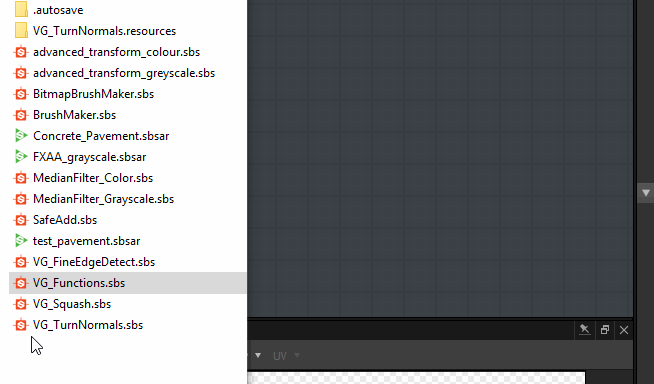

# 与Substance图表的相似之处

乍一看，Substance功能图与Substance功能图非常相似，工作流程也几乎相同。

Substance

## 导航类似

在Substance功能图表中，您可以创建和组织节点，就像在Substance图表中一样。

您可以用相同的方式访问节点：

* 从库
* 按空格键或Tab键
* 右键单击并使用“添加节点”菜单

### 工作流程类似

就像在Substance图中，您将通过链接一系列节点来构建函数，其中每个节点均使用上一个节点生成的结果。

输出将定义参数值或像素处理器节点的输出。

## 与Substance图表的差异

<table>
<tr style="border: 0;">
<td width="100.00%" style="border: 0;" valign="top">

### 节点

Substance函数图中的可用节点与在Substance图中将遇到的节点完全不同。

</td>
<td width="25.00%" style="border: 0;" valign="top">

</td>
</tr>
</table>

<table>
<tr style="border: 0;">
<td style="border: 0;" valign="top">

### 输出

与Substance图相反，一个函数只能有一个输出。

需要注意的另一点是，没有特定的输出节点用于插入最终结果。 相反，您可以直接标记为输出，即生成预期结果的节点：

</td>
<td style="border: 0;" valign="top">

</td>
</tr>
</table>

#### 如何定义输出节点？

要定义输出，只需右键单击生成预期输出的节点，然后单击&#x200B;*设置为输出节点：*

>[!WARNING]
>
> <b>请仔细检查生成的结果类型</b>
> 
> 如果您注意到&#x200B;*设置为输出节点*&#x200B;呈灰显状态，则表示节点生成的值不同于参数或像素处理器所需的值。

<table>
<tr style="border: 0;">
<td style="border: 0;" valign="top">

对于Substance图表，您可以导入在另一个图表中所做的函数。 可以通过右键单击参照图形并选择“打开参照”来打开它：

</td>
<td style="border: 0;" valign="top">

</td>
</tr>
</table>

如果您有一个包含多个函数的SBS，您可以将其直接拖放到Substance函数图表中，并在显示的列表中选择要导入的函数：

