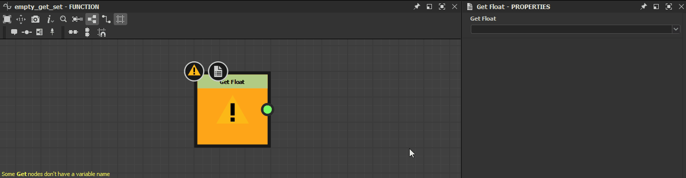

# 函数图表中的警告

此页面列出了Substance 3D Designer中的[函数图表](../../function-graphs/function-graphs.md)可能触发的警告和错误消息，并且提供了相应的常见故障诊断步骤。

警告显示在[资源管理器](../../interface/the-explorer-window/the-explorer-window.md)面板中图形资源的警告图标的工具提示中，如果加载了图形，则也会显示在[图形视图](../../interface/the-graph-view/the-graph-view.md)的左下角。\
如果函数&#x200B;*应用于[Substance图形](../../compositing-graphs/substance-compositing-graphs.md)中的参数*，则任何警告都将导致为该参数引发警告“*[x]参数的函数存在一些错误*”。

## 未定义输出节点

函数未定义输出节点。

<table>
<tr style="border: 0;">
<td width="58.30%" style="border: 0;" valign="top">

**解决方案**

选择图形中输出类型与此函数的预期类型匹配的值的任何节点（如果有），然后单击RMB并在上下文菜单中选择&#x200B;**设置为输出节点**&#x200B;选项。\
函数图表的输出节点被着色&#x200B;*橙色*。

>[!NOTE]
>
> 如果函数具有所需的输出值类型，则[图形视图](../../interface/the-graph-view/the-graph-view.md)左下角的注释可让您了解该类型。

</td>
<td width="41.60%" style="border: 0;" valign="top">

</td>
</tr>
</table>

### 当前输出节点返回类型为&#x200B;*x*&#x200B;的值

函数的输出节点返回一个类型与该函数的预期输出值类型不匹配的值。

<table>
<tr style="border: 0;">
<td width="58.30%" style="border: 0;" valign="top">

**解决方案**

选择图形中输出类型与此函数的预期类型匹配的值的任何节点，然后单击RMB并在上下文菜单中选择&#x200B;**设置为输出节点**&#x200B;选项。\
函数图表的输出节点被着色&#x200B;*橙色*。

>[!NOTE]
>
> 如果函数具有所需的输出值类型，则[图形视图](../../interface/the-graph-view/the-graph-view.md)左下角的注释可让您了解该类型。

</td>
<td width="41.60%" style="border: 0;" valign="top">

</td>
</tr>
</table>

### 某些Get节点没有变量名称

一个或多个[Get](../../function-graphs/nodes-reference-for-fun/atomic-function-nodes/get-nodes/get-nodes.md)节点的<b>Get...</b>属性留空，因此不引用任何变量。

<table>
<tr style="border: 0;">
<td width="58.30%" style="border: 0;" valign="top">

**解决方案**

将与该函数作用域&#x200B;*中可用的变量*&#x200B;的名称匹配的字符串输入到Get节点的&#x200B;**Get...**&#x200B;属性中，引发此警告。

>[!NOTE]
>
> 输入字符串在node *中显示为*，这样可以很容易找到值为空的节点。

</td>
<td width="41.60%" style="border: 0;" valign="top">

</td>
</tr>
</table>

### 某些集节点没有变量名称

一个或多个[Set](../../function-graphs/fxmaps/using-functions-in-fxmaps/using-the-set-sequence/using-the-set-sequence-nodes.md)节点的&#x200B;**Set**&#x200B;属性留空，因此不引用任何变量。

<table>
<tr style="border: 0;">
<td width="58.30%" style="border: 0;" valign="top">

**解决方案**

将任何字符串输入到Set节点的&#x200B;**Set**&#x200B;属性中引发此警告。

>[!NOTE]
>
> 输入字符串在node *中显示为*，这样可以很容易找到值为空的节点。

>[!NOTE]
>
> 如果字符串&#x200B;*不*&#x200B;与该函数作用域中的任何可用变量匹配，则会在该作用域中创建&#x200B;*新变量*，并用该字符串命名。

</td>
<td width="41.60%" style="border: 0;" valign="top">

</td>
</tr>
</table>
