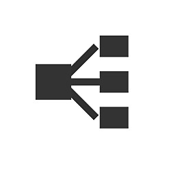

# 概述

[Substance 3D Designer](https://www.adobe.com/cn/products/substance3d-designer.html)是一款用于在基于节点的界面中创建2D纹理、素材和滤镜的应用程序，主要侧重于程序生成、参数化和非破坏性工作流程。 它是Substance 3D生态系统中运行时间最长的应用程序，用它创建的资源也是最具通用性和动态性的资源。

下面是它与其他应用程序的比较：

|  | 

  Substance 3D Sampler | 

  Substance 3D Painter | 

  Substance 3D Designer |
| --- | --- | --- | --- |
| <b>学习曲线</b> | 低 | 中 | 高 |
| <b>作者素材</b> | 是 | 是 | 是 |
| <b>创作3D模型</b> | 否 | 有限\* | 有限\* |
| <b>作者滤镜、图案和效果</b> | 否 | Limited | 是 |
| <b>导出参数内容</b> | 否 | 否 | 是 |

\*：仅限位移，请参阅[3D视图](../../interface/3d-view/3d-view.md)部分中的<b>场景导出</b>功能。

简言之，Substance 3D Designer应被视为可用的最具技术性、最先进的纹理应用程序。

它允许您为几乎任何用例或情景创作内容。 这意味着您不仅限于单一类型的输出（如UV映射网格的独特素材/纹理集），还可以为更广泛的用途集创建内容。

例如，Painter和Sampler中的大多数程序化智能内容都是从Designer创作和导出的。 画笔Alpha、生成器、滤镜和基础材质等内容都可以在Designer中创作。

## 工作流

Substance 3D Designer是基于节点的编辑器，可让您以多种不同的方式构建各种复杂程度的内容。 [在专用页面](../../getting-started/workflow-overview/workflow-overview.md)上对该工作流程进行了进一步说明，但使用该软件有以下好处：

<b>[非线性](../../compositing-graphs/substance-compositing-graphs.md) </b>：您可以一次创作多个纹理输出。 编辑一个蒙版或滑块，将自动重新计算任何已连接的输出。 不再需要单独创作地图，如基色、粗糙度、法线等。

<b>[非破坏性](../../compositing-graphs/compositing-graph-key-con/substance-compositing-graph-key-concepts.md) </b>：您可以撤消任何操作&#x200B;*，而不*&#x200B;丢失任何作品。 迭代和试验速度更快，找到更高效的工作流程。

<b>[集成烘焙](../../bakers/bakers.md) </b>：可在软件中访问高级、超快的网格烘焙工具。 您不必再在单独的软件中执行烘焙并执行漫长的导入和导出过程。

<b>[参数化](../../compositing-graphs/manage-parameters/exposing-a-parameter/exposing-a-parameter.md) </b>：您可以通过单个滑块或下拉菜单设置来控制纹理的几乎任何方面。 这允许您仅对单个资源添加无限的控制和变化。

## 文件类型

应用程序及其生态系统使用4种不同的文件类型。 需要明确的是：这些是<b>从Substance 3D Designer</b>导出的文件类型，可以导入到某些或所有其他Substance 3D应用程序中。

<table>
<tr style="border: 0;">
<td style="border: 0;" valign="top">

### Substance 3D文件

*(\*.SBS)*

Substance文件是Designer的&#x200B;**主源文件**。 打开Substance文件时，您可以&#x200B;**查看和编辑图形中的所有节点**。 它们以包的形式表示，包可以包含任意数量的资源，如图形、函数、位图、网格等。它们更难分享，计算起来也不那么快。 只能在Substance 3D Designer和Substance Player中打开它们。

</td>
<td style="border: 0;" valign="top">

### Substance 3D 资源

*(\*.SBSAR)*

Substance存档是<b>个已编译、已优化的</b>个Substance文件。 它们计算速度快得多，可以轻松共享，无参考问题。 仍然可以调整参数，但编辑图表时<b>被锁定</b>。 Substance存档可用于所有Substance 3D应用程序和具有[Substance 3D集成](https://experienceleague.adobe.com/en/docs/substance-3d/ecosystem/home)（某些带有外部增效工具）的任何应用程序，例如Autodesk 3DS Max &amp; Maya、Unreal Engine或Unity Engine。

</td>
<td style="border: 0;" valign="top">

{width="48px"}

### 静态文件

*（\*.TGA， \*.BMP， \*.PNG， \*.FBX， \*.OBJ等……）*

Substance 3D Designer始终支持导出为静态文件类型。 2D图像可以导出为位图文件，3D模型可以导出为常见的3D文件类型。 导出到静态文件时，**所有动态功能都将丢失**。 图像被锁定在分辨率中，3D模型被锁定在多重计数中。

</td>
</tr>
</table>

这通常意味着您在使用Designer时将以SBS格式保留您的工作，在目标支持SBSAR时（例如，Painter），您将导出为SBSAR，或者如果您不需要或不支持SBSAR，则您将使用静态位图文件。

## 资源类型

Substance 3D文件可能包含多种用于不同用途的资源。 某些资源只能在Designer中创作，而某些资源将来自外部应用程序。

<table>
<tr style="border: 0;">
<td width="16.67%" style="border: 0;" valign="top">

[{width="150px"}](../../compositing-graphs/substance-compositing-graphs.md)

</td>
<td width="100.00%" style="border: 0;" valign="top">

### Substance 图形

Substance图形允许您生成和处理&#x200B;*2D图像数据*，然后将其输出到一个或多个纹理输出。 在许多用例中，项目将围绕一个或多个Substance图形旋转。

[转至专门Substance图表部分。](../../compositing-graphs/substance-compositing-graphs.md)

</td>
</tr>
</table>

<table>
<tr style="border: 0;">
<td width="16.67%" style="border: 0;" valign="top">

[{width="150px"}](../../function-graphs/function-graphs.md)

</td>
<td width="100.00%" style="border: 0;" valign="top">

### Substance函数图表

<b>函数</b>的抽象和复杂性级别更高：您需要&#x200B;*处理单个值*（整数、浮点、矢量），而不是处理图像数据（像素值集）。 当您要执行更复杂的操作或要微调特定行为时，可使用函数。 函数通常不能独立工作，并且不能在Substance图形上下文之外使用。

[转至专门Substance函数图一节。](../../function-graphs/function-graphs.md)

</td>
</tr>
</table>

<table>
<tr style="border: 0;">
<td width="16.67%" style="border: 0;" valign="top">

[{width="150px"}](../../resources/importing-linking-and-new/importing-linking-and-new-resources.md)

</td>
<td width="100.00%" style="border: 0;" valign="top">

### 非图形资源

非图形资源可以来自外部应用程序（例如Photoshop或Autodesk Maya），而一些也可以&#x200B;*在Designer中创建*。 主要区别在于它们不是基于节点的图表；它们大多数是在前面提到的图表类型内部或旁边使用的元素。

存在以下资源类型：

* [位图](../../resources/bitmap-resource/bitmap-resource.md)
* [矢量图形(SVG)](../../resources/vector-graphics-svg-res/vector-graphics-svg-resource.md)
* [3D](../../resources/3d-scene-resource/3d-scene-resource.md)
* [字体](../../resources/font-resource/font-resource.md)
* [AxF文件](../../resources/axf-appearance-exchange/axf-appearance-exchange-format.md)

</td>
</tr>
</table>
