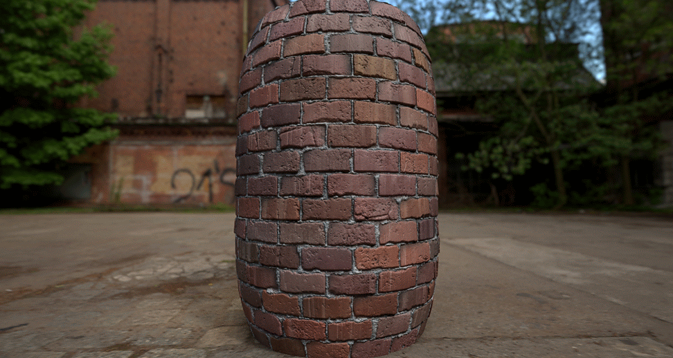

# 什么是Substance 3D文件？

Substance 3D文件(`*.sbs`)，也称为&#x200B;**包**，是资源（如Substance图形）的容器，这些资源是可导出以在许多纹理中使用的应用程序的动态生成器。

图形是动态的，因为与传统位图文件不同，Substance图形的创建者可以选择&#x200B;**公开参数**，以便对图形生成的结果进行控制。

例如，可以动态更改物体上的Dust量、足球队球衣的颜色或石头地板的图案。 想象力几乎是唯一限制。

包可以&#x200B;*发布*&#x200B;到已编译的自包含&#x200B;**Substance 3D存档文件** (`*.sbsar`)，这样，它包含的图形便可以在存在[Substance集成](https://www.adobe.com/products/substance3d/plugins.html)的外部应用程序中使用。

图形可以生成&#x200B;**100%程序化**&#x200B;的纹理，从而导致包文件大小非常小。

*由Kay Vriend制作的砖块墙材料示例。\
可以更改参数以动态控制材料的外观。*
