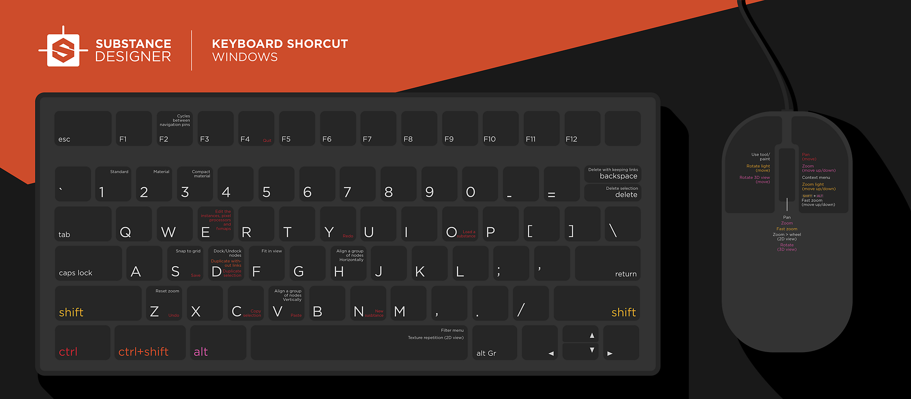

# 快捷键

在此页面上，您可以找到Substance 3D Designer所有快捷键的概述。

## 目录

[键图](#keymaps)

[快捷键列表](#shortcuts-lists)

## 键图

**Windows**

{zoomable="yes"}

**macOS**

{zoomable="yes"}

## 快捷键列表

### 全球

| 操作 | Windows | macOS |
| --- | --- | --- |
| [新建Substance图形](../../compositing-graphs/creating-compositing-gra/creating-a-substance-compositing-graph.md) | Ctrl + N | ⌘ + N |
| 加载包 | Ctrl + O | ⌘ + O |
| 关闭所选包 | Ctrl + F4 | ⌘ + W |
| 保存包 | Ctrl + S | ⌘ + S |
| 还原 | Ctrl + Z | ⌘ + Z |
| 重做 | Ctrl + Y | ⌘ + Y |

### 图形视图

<b>视区</b>

| 操作 | Windows | macOS |
| --- | --- | --- |
| 缩放 | 鼠标滚轮Alt + RMB +拖动 | 鼠标滚轮⌥ + RMB +拖动 |
| 快速缩放 | ⇧ + MouseWheel ⇧ + Alt + RMB +拖动 | ⇧ + MouseWheel ⇧ + ⌥ + RMB +拖动 |
| 平移 | MMB +拖动Ctrl + RMB +拖动 | MMB +拖动⌘ + RMB +拖动 |
| 重置缩放 | Z | Z |
| 适合视图 | F | F |
| 复制 | Ctrl + C | ⌘ + C |
| 粘贴 | Ctrl + V | ⌘ + V |
| 上下文菜单 | 人民币 | 人民币 |
| 节点菜单 | 空格键 | 空格键 |
| 循环[导航大头针](../../interface/the-graph-view/graph-items/graph-items.md) | F2 | F2 |

<b>链接创建模式</b>

>[!NOTE]
>
> 了解本文档的[此页面](../../interface/the-graph-view/link-creation-modes/link-creation-modes.md)中的链接创建模式。

| 模式 | Windows | macOS |
| --- | --- | --- |
| 标准 | 1 | 1 |
| 材质 | 2 | 2 |
| 紧凑材质 | 3 | 3 |

<b>在图形中选择对象时</b>

| 操作 | Windows | macOS |
| --- | --- | --- |
| 复制所选项 | Ctrl + C | ⌘ + C |
| 复制所选项 | Ctrl + D | ⌘ + D |
| 无链接复制 | Ctrl + ⇧ + D | ⌘ + ⇧ + D |
| 删除所选项 | 删除 | 删除 |
| 删除选区并保留链接 | ⌫ | ⌫ |
| 停靠/取消停靠节点 | D | D |
| 禁用节点 | ⇧ + D | ⇧ + D |

### 2D 视图

| 操作 | Windows | macOS |
| --- | --- | --- |
| 缩放 | 鼠标滚轮Alt + RMB +拖动 | 鼠标滚轮⌥ + RMB +拖动 |
| 快速缩放 | ⇧ + MouseWheel ⇧ + Alt + RMB +拖动 | ⇧ + MouseWheel ⇧ + ⌥ + RMB +拖动 |
| 平移 | MMB +拖动Ctrl + RMB +拖动 | MMB +拖动⌘ + RMB +拖动 |
| 重置为100%比例 | Z | Z |
| 适合视图 | F | F |
| 切换拼贴显示 | 空格键 | 空格键 |

### 3D 视图

| 操作 | Windows | macOS |
| --- | --- | --- |
| 移动摄像头（前/后平移） | 鼠标滚轮Alt + RMB +拖动 | 鼠标滚轮⌥ + RMB +拖动 |
| 轨道相机 | 按住LMB并拖动 | 按住LMB并拖动 |
| 卡车和基座摄像头（横向和垂直平移） | MMB +拖动Ctrl + RMB +拖动 | MMB +拖动⌘ + RMB +拖动 |
| 旋转环境 | Ctrl + ⇧ + RMB | Ctrl + ⇧ + RMB |
| 临时切换到“点光1”控件 | ⇧（定格） | ⇧（定格） |
| 轨道点光1 | 按住LMB并拖动 | 按住LMB并拖动 |
| 推拉点光1 | RMB +拖动 | RMB +拖动 |
