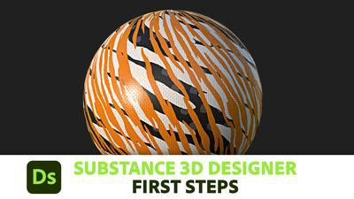
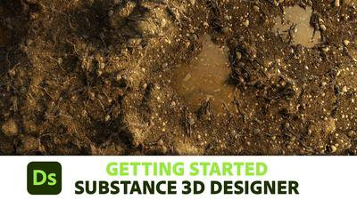
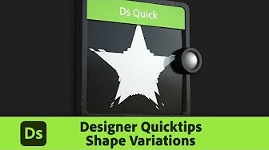
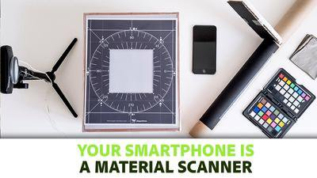

# Tutorials与学习

本文档主要是为了提供全面的技术参考。 如果您更喜欢使用视频和其他重点更突出的学习材料，那么这些教程适合快速入门。

## 教程

|                                                                                                                                                                                                                                      |                                  |                                                                                                                                                                                                                                                                                                                                |
|:-------------------------------------------------------------------------------------------------------------------------------------------------------------------------------------------------------------------------------------|:---------------------------------|:-------------------------------------------------------------------------------------------------------------------------------------------------------------------------------------------------------------------------------------------------------------------------------------------------------------------------------|
| {width="200px"} | **第一步** | 初学者级系列侧重于使用Designer迈出第一步。 介绍用户界面、基本概念，然后转到核心技术，最后说明如何公开参数和构建完整的材料。  它简短、重点突出，但光线充足，是绝对初学者的最佳起点。 |
| {width="200px"} | **正在创建您的第一个材料** | 大型入门视频系列，带您完成创建内容广泛、完全程序化的材料的整个过程。  本课程涵盖并解释了课程中的每个步骤，因此您在完成课程后会学到很多知识，但对于初学者来说，可能会学到很多知识。 |
| {width="200px"} | **快速提示** | 每个quicktip视频的重点都是一组小规模的节点和技术。  我们解释了结果、节点以及最重要的参数，然后给您一些扩展此想法的方法。 |

## 文章

|                                                                                                                                                                                                                                                                             |                                           |                                                                                                                                                                                                                   |
|:----------------------------------------------------------------------------------------------------------------------------------------------------------------------------------------------------------------------------------------------------------------------------|:------------------------------------------|:------------------------------------------------------------------------------------------------------------------------------------------------------------------------------------------------------------------|
| {width="200px"} | **您的智能手机是材料扫描仪** | 深度中介绍使用Designer拍摄照片并处理照片的整个过程的文章。  这是如何使用Substance 3D Designer自动执行某些任务的好示例用例。 |
