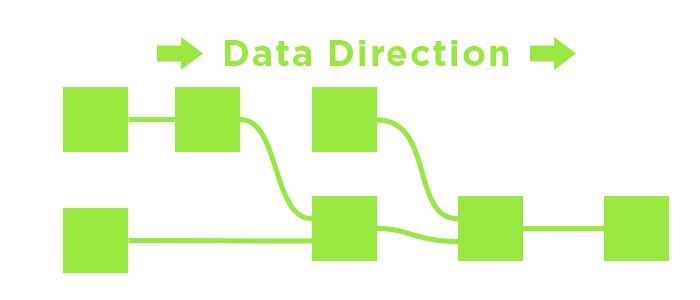
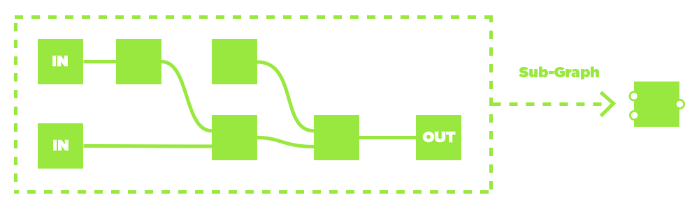
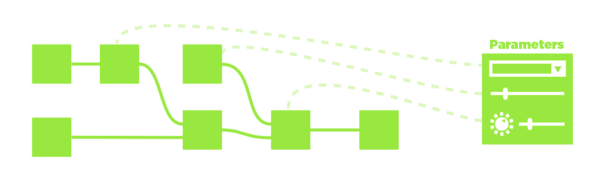
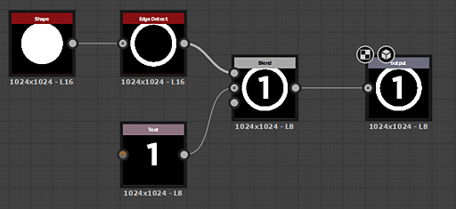
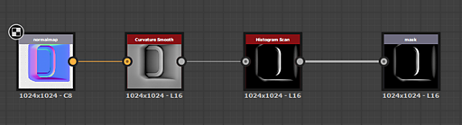
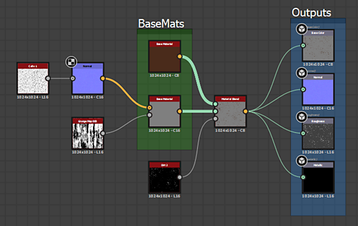
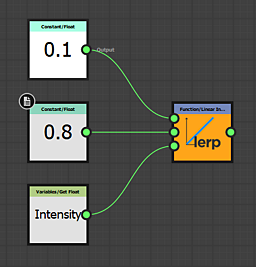
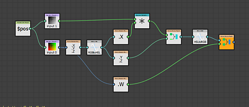

# 工作流程概述

Substance 3D Designer是一个基于节点的编辑器。 这意味着几乎所有类型的项目或资源都涉及放置节点（构建单元）并将它们连接起来以创建操作链(图形)。\
本页介绍了基于节点的工作流的概念，并概要介绍了您可以在Designer中创作的3种主要类型的图形。

{zoomable="yes"}

## 基于节点的工作流

在Designer中工作与其他2D图像编辑软件（如Photoshop）不同。 您无需手动执行操作（如通过转到菜单选项和更改滑块来调整饱和度），而是构建编辑或创建图像的逻辑步骤。 这可以通过构建一个名为“节点”的小型构建块网络来实现。 图像数据通过构造块从<b>向左到右</b>移动，由确定信息路径的链接连接。 每个节点（如果已连接）都将有助于最终结果。

主要优点是您的工作流程变为&#x200B;**非线性**：与手动执行并进入历史记录堆叠的操作不同，您始终可以在任何时间点替换或修改节点。
如果您认为影响最终结果的第一个对比度调整过于强烈，则您仍然可以返回并调整它，甚至可以将其完全抠掉，而不会丢失您之后执行的所有工作。

## 图形实例工作流

实例化图形是Designer中的一个关键过程。 它允许您通过将节点或图形的一部分打包为可重复使用的图形来构建自己的节点。 这些称为[实例化](../../compositing-graphs/creating-compositing-gra/graph-instances-sub-gra/graph-instances-sub-graphs.md)，通过重复使用图形，您可以更高效地工作。\
例如：您是否开发出了一种出色的边缘磨损技术？ 将其拆分为单独的图形，并在其他项目中重复使用！

有关图形实例的详细信息，在[Substance图形](../../compositing-graphs/substance-compositing-graphs.md)中有一部分[专门介绍的使用情况](../../compositing-graphs/creating-compositing-gra/graph-instances-sub-gra/graph-instances-sub-graphs.md)。

{zoomable="yes"}

## 自定义参数

操作链中的任何节点都有某种形式的控件：按钮、滑块、调整设置，这些控件会影响最终结果。\
如果您创建子图或要将Substance文件导出到其他应用程序，您可以为应用程序构建您自己的“控制面板”，以允许其他图形使用完全唯一的控制面板调整和修改它们。

在[此处](../../compositing-graphs/compositing-graph-key-con/substance-compositing-graph-key-concepts.md)了解自定义参数的一般概念，或在深度和[开始公开参数](../../compositing-graphs/manage-parameters/exposing-a-parameter/exposing-a-parameter.md)中了解更多信息。

## 图表类型

您可以在下面找到可以在Substance 3D Designer中编辑的三种类型的图形的摘要，以及指向文档相关部分的链接。

<table>
<tr style="border: 0;">
<td style="border: 0;">

{width="120px"}

</td>
<td style="border: 0;">

### Substance 图形

</td>
</tr>
</table>

[图形](https://substance3d.adobe.com/)是在Substance 3D Designer中创建的主要图形类型。 其目的是<b>生成和处理不受设置分辨率、颜色或形状限制的2D图像数据</b>。 这些模板是用途极为广泛的图像处理和生成工具，而不仅仅是静态的预设置结果。

结果可以表现为简单的黑白图案、只在其他图像上运行并且不单独生成内容的滤镜，或者甚至是具有多个通道的完整材料。

图形是[最广泛支持的图形类型](../../getting-started/overview/overview.md)，可以导出并在大量不同的工作流程中使用。

#### 示例

在下面您可以找到一些常见用例的典型示例。

+++ 简单形状

{width="512px" zoomable="yes"}

通过生成[一段文本](../../compositing-graphs/nodes-reference-for-com/atomic-nodes/text/text.md)和[圆盘形状](../../compositing-graphs/nodes-reference-for-com/node-library/texture-generators/patterns/shape/shape.md)，[从圆盘中提取边缘](../../compositing-graphs/nodes-reference-for-com/node-library/filters/effects/edge-detect/edge-detect.md)，最后[将它们混合在一起](../../compositing-graphs/nodes-reference-for-com/atomic-nodes/blend/blend.md)，然后将它们设置为最终的[输出](../../compositing-graphs/nodes-reference-for-com/atomic-nodes/output/output.md)，可以创建贴花的简单蒙版形状。

带有编号的文本或边缘的Thickness可在外部公开，使其成为更动态的图形。

+++

+++ 调整滤镜

{width="512px" zoomable="yes"}

滤镜图形将法线图作为[输入](../../compositing-graphs/nodes-reference-for-com/atomic-nodes/input-color/input-color.md)（使用自定义预览），[将其转换为弯曲](../../compositing-graphs/nodes-reference-for-com/node-library/filters/effects/curvature-smooth/curvature-smooth.md)，然后[调整对比度](../../compositing-graphs/nodes-reference-for-com/node-library/filters/adjustments/histogram-scan/histogram-scan.md)以创建凸边蒙版作为最终[输出](../../compositing-graphs/nodes-reference-for-com/atomic-nodes/output/output.md)。

可以公开在直方图中设置的对比度值，使其与动态输入槽相结合，成为简单但有用的滤镜。

+++

+++ 全材质

{width="512px" zoomable="yes"}

更复杂的图形[混合两个基础材质](../../compositing-graphs/nodes-reference-for-com/node-library/material-filters/blending-material/material-blend/material-blend.md)。 一个[基础材质](../../compositing-graphs/nodes-reference-for-com/node-library/material-filters/pbr-utilities/base-material/base-material.md)保持简单，另一个使用一些自定义输入来添加兴趣。 蒙版用于确定在将设置为最终[输出](../../compositing-graphs/nodes-reference-for-com/atomic-nodes/output/output.md)之前，两种素材中的哪些素材出现在哪里。

此示例使用[链接创建模式](../../interface/the-graph-view/link-creation-modes/link-creation-modes.md)来简化使用多个链接的过程。

+++

<table>
<tr style="border: 0;">
<td style="border: 0;">

{width="120px"}

</td>
<td style="border: 0;">

### Substance函数图表

</td>
</tr>
</table>

函数处理&#x200B;**单值**（整数、浮动、矢量）而不是像素集（图像）。 函数也是节点图形，但涉及的[节点](../../function-graphs/nodes-reference-for-fun/function-nodes-overview/function-nodes-overview.md)及其接口与Substance图形不同。

实际上，工作流程基于&#x200B;**数学和逻辑运算**，使它们成为Designer中一种更高级的工作方式。

函数可用于许多不同的环境，主要环境包括：
* 修改[公开参数](../../compositing-graphs/manage-parameters/exposing-a-parameter/exposing-a-parameter.md)的行为
* 创作[像素处理器](../../compositing-graphs/nodes-reference-for-com/atomic-nodes/pixel-processor/pixel-processor.md)或[FX-Maps](../../compositing-graphs/nodes-reference-for-com/atomic-nodes/fx-map/fx-map.md)的行为
* 出于特定目的，使用[值](../../compositing-graphs/values-compositing-graphs/values-in-substance-compositing-graphs.md)而不是图形中的图像

#### 示例

以下是Substance函数图的常见用例的一些示例。

+++ Simple函数

{width="256px" zoomable="yes"}

公开参数上下文中的简单函数。 它会获取一个名为“强度”的输入浮点值，该值决定为从0到1（一个易于理解的范围），并将它重新映射到设置为0.1 - 0.8的范围。 这意味着，如果用户将强度设置为0，则使用内部0.1，如果UI设置为1，则使用0.8，并且其间的任何值都将进行线性插值。 在[公开参数](../../compositing-graphs/manage-parameters/exposing-a-parameter/exposing-a-parameter.md)但使用自定义函数时，常使用此类型的函数。

此函数也可以写成伪代码（类似于HLSL或GLSL）中的`lerp(0.1, 0.8, Intensity)`。

+++

+++ 高级功能

{width="512px" zoomable="yes"}

此高级函数显示[像素处理器](../../compositing-graphs/nodes-reference-for-com/atomic-nodes/pixel-processor/pixel-processor.md)的内部工作，该处理器用于根据第二灰度蒙版输入的强度调整色图输入的色相。

它使用“$pos”Alpha对两个输入进行采样，然后去除颜色，将颜色值转换为HSL，并通过将色相分量与采样的灰度值相乘来修改色相分量。 之后，它重新组合矢量，将HSL转换回RGB，并重新添加Alpha以用于最终输出。

在伪码中，这是一个复杂的函数，不能在一行中运行。

+++
