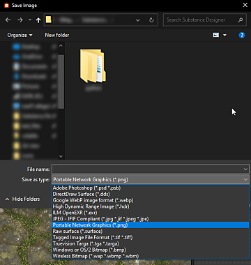
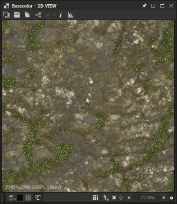
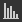

# 2D 视图

本页介绍了Substance 3D Designer中&#x200B;**2D视图**&#x200B;面板的用户界面和功能。

## 概述

[2D视图](https://substance3d.adobe.com/)是Designer用户界面的主要面板之一。 其主要目的如下：

* 显示指定的&#x200B;*节点*&#x200B;输出的&#x200B;*值*&#x200B;或&#x200B;*图像*&#x200B;或穿过指定的&#x200B;*节点连接器*
* 显示[位图](../../resources/bitmap-resource/bitmap-resource.md)和[矢量图形](../../resources/vector-graphics-svg-res/vector-graphics-svg-resource.md) [资源](../../resources/resources.md)
* 显示&#x200B;*有关当前保留内容的其他信息*，例如颜色通道或确切颜色值
* 控制参数“*小工具*”

修改显示的图像或值后，2D视图&#x200B;*会自动更新*&#x200B;以与数据的当前状态保持同步。\
*多个* 2D视图面板可以随时处于活动状态，并且每个面板可以显示不同的图像或值。 您可以使用用户界面面板的 <b>针脚</b>功能来控制何时应使用新面板。

### 在2D视图中显示内容

>[!WARNING]
>
> 本节中提到的对&#x200B;*节点*&#x200B;执行的所有操作仅适用于[Substance图形](../../compositing-graphs/substance-compositing-graphs.md)。

在2D视图中显示任何图像的最简单的方法是双击&#x200B;*LMB*...

* ...位于[资源管理器](../../interface/the-explorer-window/the-explorer-window.md)中的[位图](../../resources/bitmap-resource/bitmap-resource.md)或[矢量图形](../../resources/vector-graphics-svg-res/vector-graphics-svg-resource.md)资源上
* ...位于[图形视图](../../interface/the-graph-view/the-graph-view.md)中的节点或节点连接器上

也可以通过按住[资源管理器](../../interface/the-explorer-window/the-explorer-window.md)面板中的[资源](../../resources/resources.md)上的&#x200B;*LMB*&#x200B;或图形视图中的节点上的&#x200B;*RMB*，将图像&#x200B;*直接拖放到*&#x200B;的视口中。

在图形视图中，您可以使用<b>在2D视图中查看输出</b>上下文菜单选项将图像发送到2D视图，该菜单选项可通过单击&#x200B;*人民币*&#x200B;来访问。

* ...在&#x200B;*节点*&#x200B;上显示&#x200B;*该节点的输出*。 如果节点有多个输出，请在子菜单中选择所需的输出
* ...在图形视图中的&#x200B;*空格*&#x200B;上显示&#x200B;*该图形的输出*。 如果图形有多个输出，请在子菜单中选择所需的输出

加载图形时，默认情况下，其&#x200B;*第一输出*&#x200B;自动显示在2D视图中。 您可以在[首选项](../../interface/preferences-window/preferences-window.md)中禁用此行为。 转到<b>编辑>首选项>图形>Substance合成图形</b>和&#x200B;*取消选中* <b>打开图形时以2D视图查看输出</b>选项。

## 视口

视区是<b>2D视图</b>的&#x200B;*显示区域*，允许您使用以下鼠标和键盘快捷键&#x200B;*导航*&#x200B;显示的图像：

<table>
<tr style="border: 0;">
<td style="border: 0;" valign="top">

* <b>Pan：</b> Ctrl+RMB / MMB
* <b>缩放：</b> Alt+RMB / MouseWheel / “显示比例”工具：\
  
* <b>调整以适合视区：</b> F /“适合视图”按钮
* <b>调整为1:1比例：</b> Z / “适合比例”按钮

</td>
<td style="border: 0;" valign="top">

</td>
</tr>
</table>

使用触控板（仅限macOS）

* <b>平移： </b>两指轻扫
* <b>缩放：</b>两指捏合/在按住Cmd时两指轻扫

>[!IMPORTANT]
>
> 不可用的操作
> 
> 如果图像的当前显示大小比视区大小&#x200B;*小*，则&#x200B;*不能*&#x200B;平移图像。
> 
> 如果显示的内容&#x200B;*不再存在*，则无法&#x200B;*放大/缩小图像* — 例如，已删除图像的引用节点或资源。

>[!NOTE]
>
> 缩放方向
> 
> 每种缩放方法都会与另一种方法反转：
> 
> * 鼠标滚轮&#x200B;*拉近*&#x200B;图像距离
> * 按住Alt+RINGOM并向上拖动&#x200B;*推送*&#x200B;图像
> 
> 可在[首选项](../../interface/preferences-window/preferences-window.md)中反转缩放方向。

原生图像&#x200B;*分辨率*、*色彩格式*&#x200B;和&#x200B;*位深度*&#x200B;显示在视区的左下区域。

除了导航之外，视区还提供以下功能：

* 拼贴显示： *在视区中以拼贴图案重复图像*。 这对于检查图案或纹理将如何重复非常有用。 已使用&#x200B;**空格键**&#x200B;或 **平铺显示**&#x200B;按钮启用该功能
* 物理尺寸显示：显示具有匹配图形的[物理尺寸](../../compositing-graphs/graph-parameters/graph-parameters.md)属性的&#x200B;*比率*&#x200B;的图像使用 **物理尺寸比率**&#x200B;按钮启用此功能
* 保持视图大小：此选项&#x200B;*锁定显示比例*，使其在不同的图像中保持一致。 默认情况下，*已启用此功能*，可使用 **保持视图大小**&#x200B;按钮将其禁用

## 主工具栏

<b>2D视图</b>面板的主工具栏允许您对显示的图像执行更多操作，并提供以下功能：

+++背景图像
{width="360px"}

您可以在当前显示的图像上&#x200B;*叠加其他图像*。 按 <b>背景图像</b>按钮，系统将提示您选择要用作叠加的图像文件。

选择文件后，将出现一个新工具栏，其中包含图像叠加的以下控件：

<b>关闭：</b> *关闭*&#x200B;叠加控件工具栏和&#x200B;*禁用*&#x200B;背景图像叠加。

<b>加载图像：</b>选择&#x200B;*其他图像文件*&#x200B;用作叠加。

<b>源图像：</b>将叠加图像设置为&#x200B;*0%*&#x200B;不透明度。

<b>背景图像：</b>将叠加图像设置为&#x200B;*100%*&#x200B;不透明度。

<b>重置：</b>将叠加图像设置为&#x200B;*50%*&#x200B;不透明度。

滑块可为您提供&#x200B;*对叠加图像的不透明度进行手动控制*。

+++

+++导出图像
{width="360px"}

当前显示的图像可以&#x200B;*导出到图像文件*。 按 <b>保存图像……</b>按钮，系统将提示您为导出的文件选择&#x200B;*位置*、*名称*&#x200B;和&#x200B;*文件格式*。

虽然图像将导出为其&#x200B;*本机分辨率*（显示在视区的左下方），但&#x200B;*位深度*&#x200B;和&#x200B;*色彩格式*&#x200B;将&#x200B;*取决于所选的图像格式*。 例如，32位浮点精确度图像只能在其完整数据范围内使用支持此精确度的图像格式（例如TIFF、EXR和HDR）导出。 如果图像格式不支持数据，则在导出的图像中可能会出现钳位和/或颜色条纹。\
通常，请注意您要使用的图像格式（浮点支持、ICC配置文件等）提供了哪些精确度和功能。

如果<b>OCIO</b>或<b>AdobeACE</b> [色彩管理模式](../../color-management/color-management.md)当前已使用，其他选项可用于选择所导出图像的&#x200B;*色彩空间*。

+++

+++复制到剪贴板
{width="360px"}

当前显示的图像可以&#x200B;*复制到剪贴板*。 按 <b>“将图像复制到剪贴板”</b>按钮，即可将图像粘贴到任何第三方软件（如Adobe Photoshop）中。

图像将作为精度为&#x200B;*8位*&#x200B;的图像以&#x200B;*本机分辨率*&#x200B;进行复制，该分辨率显示在视区的左下方区域。

+++

+++切换图形输出
{width="360px"}

如果当前显示的图像是&#x200B;*图形输出*，则您可以使用 <b>选择输出</b>按钮&#x200B;*快速切换到任何*&#x200B;其他图形输出。

此功能&#x200B;*不*&#x200B;可用于其他节点，包括具有多个输出的节点。

+++

+++uv叠加
{width="357px"}

如果在[3D视图](../../interface/3d-view/3d-view.md)停靠区的<b>场景</b>菜单中启用了<b>在2D视图中显示UV</b>选项，则UV叠加功能在2D视图中可用。

您可以使用<b>UV</b>按钮启用它。

这样会将当前在3D视图[&#128279;](../../interface/3d-view/3d-view.md)中选定的网格的UV显示为彩色线框。

如果素材颜色信息在网格文件中可用，则素材颜色将用作UV叠加的颜色。

如果网格有<b>多个UV集</b>，则可以在下拉清单中选择所需的UV，单击按钮中“UV”标签旁边的箭头可打开该清单。

+++

+++图像信息
{width="360px"}

您可以使用<b>信息</b>面板在图像中显示&#x200B;*精确像素值* *和坐标*，该面板是使用 <b>图像信息</b>按钮启用的。 例如，在检查HDR图像或确保像素之间的步进遵循预期进度时，此功能非常有用。

颜色用<b>RGBA</b>和<b>HSV</b>值表示，并根据图像的&#x200B;*精度*&#x200B;显示，如下所示：

* <b>8位</b>： 0-255整数/ 0.0-1.0浮点

* <b>16位</b>： 0-65532整数/ 0.0-1.0浮点

* <b>16F</b>（16位浮点）：原始浮点值

* <b>32F</b>（32位浮点）：原始浮点值

像素坐标由<b>X</b>和<b>Y</b>值表示。

+++

+++直方图
{width="360px"}

您可以使用<b>直方图</b>面板显示图像的&#x200B;*直方图*，该面板是使用 <b>显示直方图</b>按钮启用的。

以下&#x200B;*直方图模式*&#x200B;可用：

* <b>明亮度</b>

* <b>红色</b>

* <b>绿色</b>

* <b>蓝色</b>

* <b>RGB</b>

* <b>Alpha</b>

以下信息在模式下面列出：

* <b>像素</b>：图像中的像素数

* <b>范围</b>：整个值范围可用

* <b>使用的范围</b>：值范围从最低值像素到最高值

此外，您还可以单击直方图上的&#x200B;**LMB**，或单击直方图上的&#x200B;*按住* **LMB**&#x200B;和&#x200B;*拖动*&#x200B;以&#x200B;*选择数据的特定部分*。 然后针对此选择显示以下信息：

* **所选像素**：具有所选值的像素数

* **所选范围**：所选部分的值范围

* **所选最大值**：所选部分中包含值的最大像素数

通过在直方图上单击&#x200B;**人民币**，可以&#x200B;*清除*&#x200B;所选内容。

上面某些值的表示方式取决于在面板下半部分中选择的精度，如下所示：

* **8位**： 0-255整数

* **16位**： 0-65532整数

* **32位**：原始浮点值

直方图的某些部分可能包括极低的像素计数值，因此难以读取。 在这种情况下，可以使用&#x200B;**Sqrt**&#x200B;按钮启用&#x200B;**平方根**&#x200B;模式，该按钮使用实际值的&#x200B;*平方根*&#x200B;来绘制直方图。

+++

## 显示工具栏

默认情况下，**显示**&#x200B;工具栏位于&#x200B;**2D视图**&#x200B;面板的&#x200B;*底部*，可让您控制如何在视区中显示图像。

*最左侧*&#x200B;部分包含&#x200B;*颜色*&#x200B;和&#x200B;*透明度*&#x200B;的控件，而&#x200B;*最右侧*&#x200B;部分包含&#x200B;*视口*&#x200B;控件，这些控件在本页的视口部分中进行了详细说明。

>[!NOTE]
>
> 可以使用以三条平行线表示的最左侧&#x200B;*手柄*，围绕&#x200B;**2D视图**&#x200B;面板&#x200B;*重新定位*。

{width="360px"}

### 颜色通道

可以使用 <b>颜色通道</b>按钮显示图像的单个通道。 这将打开一个组合框，允许您选择应显示<b>红色</b>、<b>绿色</b>、<b>蓝色</b>和<b>Alpha</b>声道中的哪一个。 通过选择<b>RGB</b>选项，可以恢复包含所有通道的图像的正常外观。

可使用以下&#x200B;*键盘快捷键*&#x200B;快速切换到不同的颜色通道：

* RGB： <b>C</b>
* 红色： <b>R</b>
* 绿色： <b>G</b>
* 蓝色： <b>B</b>
* Alpha： <b>A</b>

<b>颜色通道</b>按钮&#x200B;*的*&#x200B;图标&#x200B;*会根据当前显示通道而更改*。

>[!NOTE]
>
> 仅当2D视图面板具有焦点时，键盘快捷键才可用。 您可以至少单击一次此面板，以确保不会发生这种情况。
> 
> 由于面板需要焦点，因此这些快捷键&#x200B;*不干扰*&#x200B;您为在图表中创建节点而设置的任何&#x200B;*自定义快捷键* — 在[此处](../../interface/preferences-window/preferences-window.md)了解有关此功能的更多信息。

{width="360px"}

### 透明度切换开关

可以使用/ <b>显示棋盘</b>按钮打开和关闭透明度显示。 启用此选项后，将使用棋盘图案显示透明度。

解释透明度有两种主要方式，可使用/ <b>透明度模式</b>按钮选择它们：

<b>直接：</b>透明度信息仅存储在Alpha通道中，不影响图像的任何其他方面

<b>预乘：</b>透明度信息存储在Alpha通道中，并且还会影响RGB通道，因为它们已针对Alpha通道进行了有效乘

若要显示&#x200B;*正确的颜色*，应在<b>2D视图</b>面板中选择适当的透明度模式，以匹配在&#x200B;*创建图像*&#x200B;时应用的透明度方法。

{width="360px"}

### 色彩空间

为了最准确地呈现颜色，默认情况下，图像以&#x200B;*色彩空间*&#x200B;显示，与&#x200B;*监视器*&#x200B;使用的色彩空间相匹配。

/ <b>色彩空间</b>按钮的可用控件和效果将取决于[项目设置](../../interface/preferences-window/project-settings/project-settings.md)中设置的[色彩管理模式](../../color-management/color-management.md)。 在本页的色彩管理部分中了解有关这些控件的更多信息。

<table>
<tr style="border: 0;">
<td style="border: 0;" valign="top">

## 位图绘画工具

<b>位图绘画工具</b>可用于符合以下条件的[位图资源](../../resources/bitmap-resource/bitmap-resource.md)：

* 位图使用&#x200B;*8位*&#x200B;精度
* 位图资源已&#x200B;*导入*&#x200B;到包中，链接图像&#x200B;*不*&#x200B;受支持

>[!NOTE]
>
> 在Substance 3D Designer中创建的&#x200B;*新*&#x200B;位图资源将&#x200B;*自动匹配*&#x200B;这些条件。

</td>
<td style="border: 0;" valign="top">

</td>
</tr>
</table>

>[!TIP]
>
> 您可以在文档的[位图绘画工具](../../resources/bitmap-resource/bitmap-painting-tools/bitmap-painting-tools.md)页面中了解更多信息。

<table>
<tr style="border: 0;">
<td style="border: 0;" valign="top">

## 矢量图形编辑器

<b>矢量图形编辑器</b>可用于&#x200B;*导入的*[SVG资源](../../resources/vector-graphics-svg-res/vector-graphics-svg-resource.md)，链接资源&#x200B;*不受支持*。

>[!NOTE]
>
> 在Substance 3D Designer中创建的&#x200B;*新* SVG资源将&#x200B;*自动匹配*&#x200B;此条件。

</td>
<td style="border: 0;" valign="top">

</td>
</tr>
</table>

>[!TIP]
>
> 您可以在文档的[矢量编辑工具](../../resources/vector-graphics-svg-res/vector-editing-tools/vector-editing-tools.md)（已弃用）页面中了解更多信息。

{width="360px"}

## 色彩管理

<b>2D视图</b>提供了简单的&#x200B;*色彩管理*&#x200B;控件，允许您选择在显示图像时应使用的&#x200B;*显示色彩空间*。

这些控件将适应在[项目设置](../../interface/preferences-window/project-settings/project-settings.md)中设置的当前[色彩管理模式](../../color-management/color-management.md)，如下所示：

* <b>旧版：</b>您可以将图像显示为 sRGB或线性sRGB色彩空间；
* <b>AdobeACE：</b>您可以 *启用*&#x200B;色彩管理，并为&#x200B;*当前监视器*&#x200B;设置最合适的色彩空间（由AdobeACE引擎检测到），或者 *禁用*&#x200B;色彩管理，并使用Raw颜色值显示图像；
* <b>OCIO：</b>您可以 *启用*&#x200B;色彩管理，并为&#x200B;*当前显示器*&#x200B;设置最合适的色彩管理（OCIO引擎检测到），使用组合框并选择[OCIO配置文件](../../color-management/color-management.md)当前使用的任何&#x200B;*显示色彩空间*&#x200B;或选择 *禁用*&#x200B;色彩管理，并使用Raw颜色值显示图像。

>[!WARNING]
>
> 请注意，这些控件&#x200B;*仅*&#x200B;影响&#x200B;*显示色彩空间*。 还应考虑图像的&#x200B;*原始色彩空间*&#x200B;和&#x200B;*工作色彩空间*，以确保颜色在&#x200B;**2D视图**&#x200B;中准确显示。

>[!TIP]
>
> 转至本文档的[色彩管理](../../color-management/color-management.md)部分，了解有关此功能及其在Designer中更广泛实施的更多信息。
