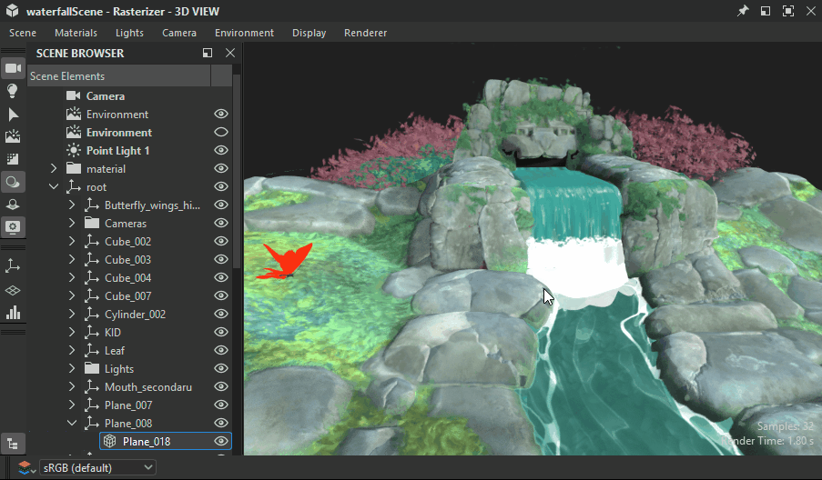
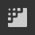
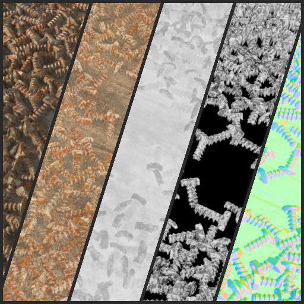

# 3D 视图

3D视图可帮助您使用自定义网格和渲染的PBR素材查看和了解素材。 与所有Substance 3D Designer Windows一样，它通过右键单击菜单选项和拖放操作与其他窗口协同工作。

3D视图还提供了两种在3D场景中渲染材质的主要方法：
* 使用&#x200B;**光栅器**&#x200B;和&#x200B;**OpenGL**&#x200B;渲染器快速实时可视化
* 具有&#x200B;**GPU 路径追踪**&#x200B;渲染器的高质量光线追踪渲染

在此处了解详情： [3D渲染器](3d-renderers/3d-renderers.md)

+++ 3D视图停放

+++

## 视区交互

下面一节将简要介绍如何执行常见操作，同时附上动画GIF以说明这一过程。

### 导航

可通过三种方式操作3D视图相机和环境：

* <b>轨道：</b> LMB +拖动
* <b>平移</b>： MMB+拖动/ Ctrl+RMB+拖动
* <b>缩放</b>：使用MouseWheel滚动/人民币并拖动
* <b>旋转环境：</b> ⇧+人民币+拖动
* <b>聚焦所选网格：</b> F（如果没有选择，则聚焦整个场景）
* <b>轨道点光1：</b> Ctrl+⇧+LMB+拖动
* <b>将点光1移近/远离原点：</b> Ctrl+⇧+RMB+拖动
* <b>重置相机轨道位置：</b> R
* <b>重置相机轨道位置和属性：</b> ⇧+R

使用触控板（仅限macOS）

* <b>轨道：</b>双指轻扫
* <b>平移：</b>⇧+双指轻扫
* <b>缩放： </b>双指捏合/⌘+双指轻扫
* <b>旋转环境：</b>⇧+双指轻扫

>[!NOTE]
>
> 缩放方向
> 
> 每种缩放方法都会与另一种方法反转：
> 
> * 鼠标滚轮&#x200B;*拉近*&#x200B;场景的距离
> * 用人民币将场景向上拖动&#x200B;*推*
> 
> 可在[首选项](../../interface/preferences-window/preferences-window.md)中反转缩放方向。

### 选择并聚焦

您可以直接在视区中与网格交互：

<b>按住⇧并单击网格上的LMB以选择网格。</b> 所选网格具有蓝色轮廓。

<b>按F键可专注于选定的网格</b>。 聚焦网格可移动相机以框住网格并围绕网格运行。

<b>在选择网格时单击“人民币”</b>以在上下文菜单中访问其[素材操作](#material-actions)。

<b>按Esc键取消选择。</b> 光标不需要位于网格上。

{zoomable="yes"}

*选择、聚焦、取消选择*

{zoomable="yes"}

*选择，上下文菜单*

>[!NOTE]
>
> 这些操作不适用于已弃用的[OpenGL](../../interface/3d-view/3d-renderers/3d-renderers.md)渲染器。

### 更改环境光照(IBL)

默认情况下，Designer使用基于图像的光照(IBL)。 高动态范围位图用于渲染环境光照。

您可以围绕3D对象旋转此环境，也可以加载预设或自定义HDR光照环境。 请注意，HDR图像应使用等距柱状投影，并且具有32位浮点的精度。

⇧+人民币+拖动<b>在3D视图中旋转环境</b>。

要设置精确的旋转，请使用顶部3D视图工具栏中的<b>环境>编辑</b>，并在属性窗口中更改<b>旋转角度</b>滑块。

要使用预设HDR光照环境，请单击[库](../../interface/the-library/the-library.md)中<b>3D视图类别</b>的<b>HDRI环境</b>部分，然后将任意图标拖放到3D视图。

要使用您自己的自定义HDR光照环境，请通过将文件拖放到资源管理器窗口中的包中来导入HDR图像（<b>出现提示时链接</b>该文件）。 然后拖放该资源，选择<b>Latitude/Longtitude全景图</b>作为目标。

### 点光

转到<b>光线>编辑属性</b>以在场景中切换点光。

在“光照”模式下按住LMB或RMB并在视窗中拖动，可在场景原点周围移动点光1。 

处于摄像机模式时  ，也可以通过按住Ctrl+⇧键并结合使用鼠标按钮来临时切换到光照模式。

## 以3D视图查看数据

### Substance 图形

您可以在3D视图中查看作为完整素材的整个素材。 这是最常用的工作方式，并且会将[输出节点上的使用属性](../../compositing-graphs/nodes-reference-for-com/atomic-nodes/output/output.md)与3D视图素材的相关纹理槽进行匹配。 这意味着需要正确设置输出（使用“模板”可确保这一点），并且您选择了素材/视口着色器支持

要查看图形的所有输出，请单击[图形视图](../../interface/the-graph-view/the-graph-view.md)中的空白区域&#x200B;*人民币*，然后在上下文菜单中选择&#x200B;**在3D视图中查看输出**&#x200B;选项。

您还可以在无需打开图表的情况下查看图表的输出，方法是单击[资源管理器](../the-explorer-window/the-explorer-window.md)停靠区中的图表资源的RMB，然后在上下文菜单中选择&#x200B;**在3D视图中查看输出**&#x200B;选项。

作为图形上下文菜单的替代方法，可以通过将图形从[资源管理器](../the-explorer-window/the-explorer-window.md)停靠区拖动到3D 视图来获得相同结果。

在&#x200B;*加载图形*&#x200B;时，其输出默认自动应用于3D视图。 您可以在[首选项](../../interface/preferences-window/preferences-window.md)中禁用此行为。 转到&#x200B;**编辑>首选项>图形>常用**&#x200B;并取消选中&#x200B;**打开图形时在3D视图中查看输出**&#x200B;选项。

>[!NOTE]
>
> **多个材质槽**
> 
> 如果您将自定网格用于多个单一材质，系统将要求您选择要将材质指定给哪个材质槽。 使用上述任一方法，单击插槽以确认您的选择。 有关材料和任务的更多信息，请阅读下面的详细部分。

### 单个节点/图形输出

您可以在[3D视图](https://substance3d.adobe.com/)中的任何可用素材通道中仅查看单个输出。 此选项卡不太常用，但适用于预览快速测试或无输出的单个节点。

在[图形视图](../../interface/the-graph-view/the-graph-view.md)中右键单击任何节点，然后选择<b>在3D视图中查看</b>，即可查看任何节点，而不仅仅是输出节点。 您会看到一个列表，其中包含可分配节点的可用通道。 单击“任意”以确认。

您还可以使用&#x200B;*人民币*&#x200B;将任何节点从“图形”视图拖放到3D视图。 您会看到一个列表，其中包含可分配节点的可用通道。 单击“任意”以确认。

您可以通过在[资源管理器](../the-explorer-window/the-explorer-window.md)停靠中展开图形资源，并使用&#x200B;*LMB*&#x200B;将该输出拖到3D视图来查看任何单独的图形输出。 您会看到一个列表，其中包含要分配节点的可用通道。 单击“任意”以确认。

## 查看（自定义）3D场景

Designer提供了十几个预设网格。 这些网格具有统一、可用的UV坐标，可用于拼贴纹理的大多数场景。 也可以导入和查看自己的3D网格。\
通过顶栏中的<b>场景</b>下拉菜单选取任意默认网格。

对于自定义3D场景，请转至[使用3D场景](../../working-with-3d-scenes/working-with-3d-scenes.md)部分。

## 更改着色器属性

Designer中默认提供了几种不同的[着色器](../../glossary/glossary.md)，并且每个着色器都提供了超出纹理通道以外的选项。 可以单独配置它们。

请记住，在Designer的[3D渲染器](../../interface/3d-view/3d-renderers/3d-renderers.md)中，着色器是不同的，当切换渲染器时，只有标有“通用”标签的设置才会延续下去。

若要更改当前着色器，请转到<b> “</b>材质”菜单，然后打开要编辑的材质的子菜单。

例如，要调整“平面（高分辨率）”场景中“默认”素材的“Height缩放”属性，请转到“素材”>“默认”>“编辑属性”。 然后在“Properties”（属性）停放中找到“Height比例”属性

您可以使用子菜单中的“重置材质”或“重置为场景状态”操作重置着色器。 如果要在3D视图中查看Substance图形输出，则需要重新应用它们。

>[!NOTE]
>
> 关于镶嵌
> 
> “镶嵌因子”属性因选定的3D渲染器而异：
> 
> * <b>光栅器/GPU 路径追踪：</b>位于渲染器设置（“渲染器”>“编辑设置”）中，会影响&#x200B;*整个场景*。
> * <b>OpenGL：</b>位于素材属性中，影响素材。

## 导出场景

了解如何在[此页面](../../working-with-3d-scenes/exporting-scenes/exporting-scenes.md)中导出3D场景。

### 导出网格化（仅限OpenGL渲染器）

您可以将网格从<b>3D视图</b>导出为<b>OBJ</b>、<b>FBX</b>或<b>PLY</b>格式的文件。 如果启用&#x200B;*镶嵌*&#x200B;位移，则几何的细分将嵌入到导出的网格中。

但是，原始网格的顶点法线可能与其新的位移形状不匹配，这意味着位移的网格可能无法正确渲染。 您可以通过两种方式管理这种情况：

* 使用网格&#x200B;*法线图*&#x200B;可提供正确的法线
* 使用网格法线图导出时&#x200B;*重新计算网格法线*，这意味着这些法线将烘焙到导出的网格中，不再需要法线图

要导出网格，请转到<b>场景>导出镶嵌网格...</b>，设置有关法线重新计算的选择，然后为导出的网格选择位置、名称和文件格式。

>[!NOTE]
>
> 此功能在&#x200B;**macOS**&#x200B;上&#x200B;*不可用*。

>[!IMPORTANT]
>
> 一些注意事项
> 
> 如果原始网格有多个材料和/或UV 集，则这些将&#x200B;*合并为一个*。
> 
> 导出过程的持续时间及生成的文件大小取决于网格三角形计数和&#x200B;*曲面细分因数*。 较高的曲面细分因数值可能导致不稳定，具体取决于GPU的板载内存池。
> 
> 尽管如此，镶嵌网格的顶点计数应与&#x200B;*Height*&#x200B;映射的像素计数在&#x200B;*相同的范围*&#x200B;内。
> 
> 使用<b>通</b>曲面细分时，网格比高度图密集可以使网格略为平滑，但您应该着眼于先可靠地导出包含所需高度图详细信息的网格，然后根据需要在其他软件中优化导出的网格。

>[!WARNING]
>
> **TDR（仅限Windows）**
> 
> 此功能要求<b>超时检测和恢复(TDR)</b>与我们的文档的[本页](https://experienceleague.adobe.com/en/docs/substance-3d-painter/using/technical-support/technical-issues/gpu-issues/gpu-drivers-crash-with-long-computations-tdr-crash)中的建议值匹配，如Designer的[技术要求](../../getting-started/system-requirements/system-requirements.md)中所述。

## 菜单栏

菜单栏提供了7个菜单，其中包含与3D 视图相关的选项。 下面是所有可用选项的概述。

+++场景
<b>场景</b>菜单用于处理显示的几何（3D资源）和3D视图状态。 3D资源仅共享网格，场景状态包括光源、相机和相关设置，并且还可将该网格与之一起包含。

<b>编辑： </b>在[属性](../../interface/properties/properties.md)面板中加载场景选项。 用于切换3D 网格的可见性。

<b>标准基元：</b>显示3D 视图中以下任何简单3D网格。

* 立方体

* 圆柱体

* 空心框

* 内框

* 平面

* 平面 (hi-res)

* 球体

<b>扩展基元：</b>显示3D 视图中的以下任何3D网格。

* 布料

* 材质球

* 圆角立方体

* 圆角圆柱体

* 球体 2 平铺

* 圆环体

<b>在2D 视图中显示UV：</b>允许将当前所选网格的UV显示为[2D 视图](../2d-view/2d-view.md)中的叠加。

<b>从当前场景创建3D资源……：</b>在当前场景之外的包中创建新的[3D 场景资源](../../resources/3d-scene-resource/3d-scene-resource.md)。

<b>加载状态文件……： </b>加载外部保存的[场景状态文件](../../working-with-3d-scenes/working-with-3d-scenes.md) (\*.sbsscn)。 不替换3D网格，仅加载3D渲染器、相机和光照的设置。

<b>加载带网格的状态文件……：</b>加载外部保存的[场景状态文件](../../working-with-3d-scenes/working-with-3d-scenes.md) (\*.sbsscn)。 载入3D渲染器、相机、光源及其引用3D场景的设置。 .

<b>保存状态文件……： </b>将3D视图的当前状态保存到[场景状态文件](../../working-with-3d-scenes/working-with-3d-scenes.md) (\*.sbsscn)。

<b>将当前状态保存为默认值： </b>将3D视图的当前状态设置为[场景状态文件](../../working-with-3d-scenes/working-with-3d-scenes.md)，以便在创建新的3D视图时默认使用。 每次重置或初始化3D视图时都会加载此文件，并且可以在[项目设置](../../interface/preferences-window/project-settings/project-settings.md)中进行设置。

<b>导出场景：</b> *（仅限栅格化程序/GPU 路径追踪渲染器）*&#x200B;将当前场景导出为[拼合的场景](../../working-with-3d-scenes/exporting-scenes/exporting-scenes.md)，只写入结果场景，并且丢失对原始场景的任何引用。 导出场景的内容取决于所选导出格式支持的功能。\
可用格式：STL、FBX、GLB、GLTF、PLY、USDC、USD、USDA、USDZ、OBJ。

<b>导出带有图层的场景：</b> *（仅栅格化器/GPU 路径追踪渲染器）*将当前场景导出为[分层场景](../../working-with-3d-scenes/exporting-scenes/exporting-scenes.md)，其中对原始场景的所有编辑将以非破坏性的工作流程存储到单独的文件中。 这仅适用于美元文件格式。\
可用格式包括：USDC、USD、USDA。

<b>导出镶嵌几何：</b> *（仅限OpenGL渲染器）*&#x200B;将带有镶嵌的当前场景导出为原始几何形状，请参阅导出场景部分。

<b>重置场景： </b>将3D视图重置为默认值。

某些软件更新可能会更改场景状态文件的保存/加载方式。

如果从文件&#x200B;*未正确还原场景*，建议手动设置场景的所需状态，并&#x200B;*重新导出*&#x200B;场景状态文件。

+++

+++材质
<b>材质</b>菜单会根据加载的3D网格和所使用的渲染器而发生变化。

“材质”菜单包含分配给场景中的网格的所有材质列表。 “材质”菜单中列出的每种材质都有一个材质操作子菜单：

<b>编辑</b> — 在属性窗口中编辑当前素材的设置。

<b>着色器列表</b> — 当前[3D渲染器](../../interface/3d-view/3d-renderers/3d-renderers.md)可用的所有[着色器](../../glossary/glossary.md)。

<b>加载定义……： </b>（仅限OpenGL渲染器）允许您加载自己的自定义[着色器。](../../interface/3d-view/glslfx-shaders/glslfx-shaders.md) 该着色器即被添加到上述列表中。

<b>重置公共参数：</b>重置所有着色器上公共的参数。 例如，在栅格化器/GPU 路径追踪和OpenGL渲染器之间切换时，[Adobe Standard Material](https://experienceleague.adobe.com/en/docs/substance-3d/general-knowledge/asm/adobe-standard-material)中的几个参数值将传递过去。

<b>重命名：</b>更改此材料的标签。

<b>重置材料：</b>将所有着色器参数重置为默认值。 如果纹理已连接到着色器的任意一个取样器，则这些取样器会断开连接。

<b>将材料重置为场景状态： </b>*（仅限栅格化程序/GPU 路径追踪渲染器）*&#x200B;将[已覆盖材料](../../working-with-3d-scenes/overriding-scene-mat/overriding-scene-materials.md)的所有属性重置为场景中的原始值，包括原始纹理（如果有）。

<b>添加： </b>将新材料添加到列表。 默认情况下，未使用它，并且可能已[&#128279;](../../working-with-3d-scenes/overriding-scene-mat/overriding-scene-materials.md)使用[材料](../../interface/3d-view/scene-browser/scene-browser.md)连接到一个场景浏览器。

+++

+++光源
<b>光照</b>菜单仅处理较旧的旧环境光和点光。 这些光照不符合PBR标准，并且无法提供与基于HDR图像的渲染相同的高品质结果。

<b>编辑：</b>编辑环境光和两点光的个别设置。

<b>重置光源：</b>将光源属性重置为默认状态。

+++

+++相机
使用<b>相机</b>菜单，可以更改相机设置、转到预定义角度并加载存储在自定义相机文件中的3D 网格角度。

<b>编辑属性：</b>在“属性”停靠区中打开默认相机的设置。

<b>焦点： </b>(F)将默认相机聚焦到当前所选网格。 即，网格并将相机透视与其对齐。 如果没有现用选区，则使用场景的全局定界框。

<b>相机：</b>如果场景包含一个或多个相机，则它们在此处列出，它们的设置用作预设，可应用于场景的默认相机。

<b>视点：</b>默认相机的预配置视点。 这些仅影响相机的变换（位置和旋转）。

* 默认：从对象的前左拍摄高角度照片。

* 返回

* 底部

* 前

* 左

* 右

* 顶部

<b>保存渲染……：</b> (Alt+S)将当前渲染的图像以渲染器属性中指定的分辨率或默认相机属性（如果已设置覆盖分辨率）保存到磁盘。

<b>将渲染复制到剪贴板：</b> (Alt+C)将当前渲染的图像复制到剪贴板，以便在外部图像编辑器中粘贴。

<b>重置位置：</b> (R)重置相机的位置。

<b>重置选定项：</b> (Shift+R)重置相机的位置和属性。

+++

+++环境
使用<b>环境</b>菜单可修改用于照明PBR正确素材的HDRI环境相关设置。

<b>编辑属性：</b>提供对HDR环境设置的访问权限，用于在PBR中进行光照。 具体来说，您可以使用预览切换可见性、更改曝光度并使用精确滑块设置旋转。

<b>重置环境：</b>将所有环境属性重置为默认值。

+++

+++显示
使用显示菜单，您可以切换所渲染场景的视图模式、帮助程序和信息：

<b>轴：</b>切换视口中3D轴的显示。

<b>网格：</b>切换显示World Frid。

<b>分辨率：</b>切换小分辨率计数器的显示。

<b>场景统计：</b>切换场景统计信息的显示，如多边形计数、素材计数、静态网格计数等。

<b>渲染时间：</b>为完整图像计算一个示例的时间。

<b>样本：</b>为累积消除锯齿（光栅器）或路径跟踪（GPU路径跟踪器）计算的像素样本量。

<b>背面剔除：</b>禁用此选项后，您可以从&#x200B;*两侧*&#x200B;看到网格表面。 该选项可与线框结合使用

<b>定界框：</b>切换网格定界框的显示。

<b>线框：</b>切换网格线框的显示。

<b>光源：</b>切换点光源的帮助线显示。

<b>顶点切空间：</b>将所有顶点的切向量、双正规向量和法向量显示为彩色小工具

其中有些选项在“场景”工具栏中的按钮切换中可用。

+++

+++渲染器
使用<b>渲染器</b>菜单，您可以切换3D渲染器，并通过<b>编辑属性</b>操作访问当前3D渲染器的属性。

可用的渲染器及其设置记录在[此专用页面](../../interface/3d-view/3d-renderers/3d-renderers.md)中。

+++

## 场景工具栏

默认情况下，**场景**&#x200B;工具栏位于3D视图的左边框，提供查看场景以及与场景交互的控件。

还允许您访问[位移弹出窗口](displacement/displacement.md)和[场景浏览器](scene-browser/scene-browser.md)程序坞。

>[!NOTE]
>
> 可以使用以三条平行线表示的最左侧&#x200B;*手柄*，围绕&#x200B;**3D视图**&#x200B;停放区&#x200B;*重新定位工具栏*。

### 显示选项

#### 顶部

 

 <b>场景浏览器</b>

显示3D场景中所有元素的层次结构。

>[!INFO]
>
>[专用页面](../../interface/3d-view/scene-browser/scene-browser.md)中广泛涵盖了场景浏览器及其功能。

 <b>选择</b>

允许在场景中直接选择网格。

<code>LMB</code> 选择场景中的网格。

选择场景中的各个网格。 所选网格在视区中具有蓝色轮廓，并在[场景浏览器](../../interface/3d-view/scene-browser/scene-browser.md)中突出显示。

上下文菜单可用于选定的网格，可通过单击<code>人民币来显示</code>.

也可以在“相机”或“亮度”模式下通过按<code>Shift+LMB来选择网格</code>.

 

 <b>相机</b>

启用对场景中摄像机的直接控制。

<code>LMB</code> 围绕相机目标运行相机。 <code>RMB</code> 将相机移近或远离其目标。

 

 <b>显示环境</b>

此按钮可切换场景环境的显示。 转到3D视图菜单栏中的<b>环境>编辑</b>后，可在“属性”停放中找到相同的设置。

 

 <b>亮度</b>

启用对场景中的点光1的直接控制。

<code>LMB</code> 围绕场景的原点围绕相机运行。 <code>人民币</code> 将光源移近或远离场景的原点。

 

 <b>渲染器设置</b>

在[属性](../properties/properties.md)停靠区中显示当前渲染器的设置。

 

 <b>启用路径跟踪器</b>

切换[GPU 路径追踪](3d-renderers/3d-renderers.md#gpu-pathtracer)渲染器的选择。

 

 <b>启用阴影</b>

在[光栅器](3d-renderers/3d-renderers.md#rasterizer)渲染器中切换实时阴影的渲染。

 

 <b>启用地平面</b>

在[光栅器](3d-renderers/3d-renderers.md#rasterizer)和[GPU 路径追踪](3d-renderers/3d-renderers.md#gpu-pathtracer)渲染器中切换地平面的渲染。

 

 <b>位移</b>

显示[位移弹出窗口](displacement/displacement.md)。

 

#### 底部

 

 <b>网格</b>

切换世界网格的显示。

 

 <b>场景统计</b>

切换场景统计信息的显示，如多边形计数、素材计数、静态网格计数等。

 

 <b>轴</b>

切换视区中3D轴的显示。

 

#### 仅限OpenGL渲染器

 

 <b>背面剔除</b>

禁用此选项后，您可以从&#x200B;*两侧*&#x200B;看到网格表面。 该选项可与线框结合使用。

 

 <b>定界框</b>

切换网格定界框的显示。

 

 <b>顶点相切空间</b>

将所有顶点的切向量、双正规向量和法向向量显示为彩色小工具。

 

 <b>线框</b>

将网格显示切换为线框。

## 显示工具栏

默认情况下，<b>显示</b>工具栏位于<b>3D视图</b>面板的&#x200B;*底部*，可让您控制如何在视区中显示渲染的图像。

>[!NOTE]
>
> 可以使用以三条平行线表示的最左侧&#x200B;*手柄*，围绕&#x200B;**3D视图**&#x200B;停放区&#x200B;*重新定位工具栏*。

### 3D 渲染 AOV

<table style="margin-top: 32px; margin-bottom: 32px">
    <tr style="border: 0; vertical-align: top">
        <td style="border: 0">
            
您可以使用 <b>3D渲染AOV</b>按钮显示不同的<a href="../../glossary/glossary.md#aov">AOV</a>。

            
使用AOV，可以单独检查网格和材质信息，以便进行重点工作和调试。

            
某些AOV包括视区中固定为1（纯白）或0（纯黑）的<i>HDR值</i>。 要检查整个范围的值，可以将AOV的3D渲染导出为支持HDR值的图像文件格式，如<code>.exr</code>。 使用“<code>Camera > Save render...</code>”菜单选项导出当前AOV。

            
<i>注意：</i>只有在使用栅格化器和GPU 路径追踪<a href="./3d-renderers/3d-renderers.md">3D渲染器</a>时，AOV才可用。

        </td>
        <td style="width: 33%; border: 0">
            
        </td>
    </tr>
</table>

### 颜色通道

可以使用 <b>颜色通道</b>按钮显示图像的单个通道。 这将打开一个组合框，允许您选择应显示<b>红色</b>、<b>绿色</b>和<b>蓝色</b>通道中的哪一个。 通过选择<b>RGB</b>选项，可以恢复包含所有通道的图像的正常外观。

<b>颜色通道</b>按钮&#x200B;*的*&#x200B;图标&#x200B;*会根据当前显示通道而更改*。

### 色彩空间

为了最准确地呈现颜色，默认情况下，图像以&#x200B;*色彩空间*&#x200B;显示，与&#x200B;*监视器*&#x200B;使用的色彩空间相匹配。

可用控件将取决于[项目设置](../../interface/preferences-window/project-settings/project-settings.md)中设置的色彩管理模式。 在本页的[色彩管理](../../color-management/color-management.md)部分中了解有关这些控件的更多信息。
