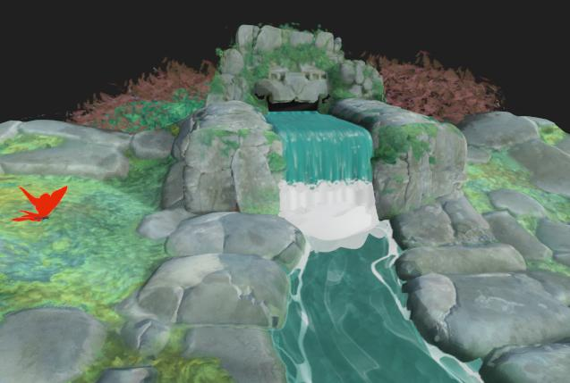
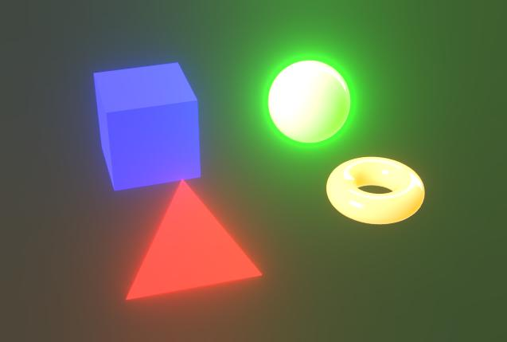
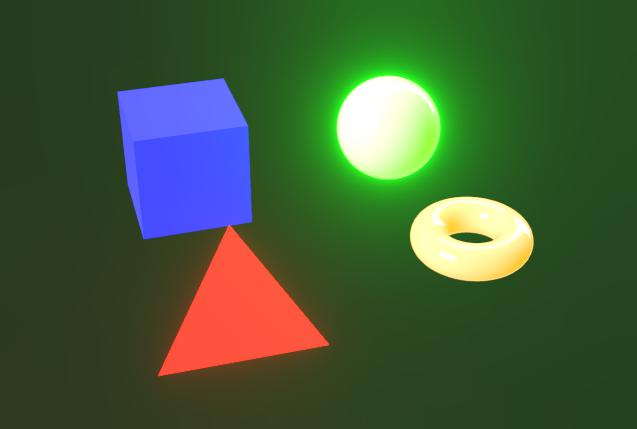

# 后期效果

{zoomable="yes"}

在摄像机属性中，您可以启用后期效果以增强渲染或检查特定的素材属性。

这些效果在内部开发，仅适用于光栅化器和GPU 路径追踪[渲染器](../../../../interface/3d-view/3d-renderers/3d-renderers.md)。

在保存[3D场景资源](../../../../resources/3d-scene-resource/3d-scene-resource.md)或[场景状态文件](../../../../working-with-3d-scenes/working-with-3d-scenes.md)时启用的任何后期效果都将作为场景状态的一部分保存。

<table>
<tr style="border: 0;">
<td style="border: 0;" valign="top">

## 色调映射

</td>
<td style="border: 0;" valign="top">

### 光华

</td>
<td style="border: 0;" valign="top">

### 景深

</td>
<td style="border: 0;" valign="top">

</td>
</tr>
</table>

## 色调映射

根据特定算法和/或查找表(LUT)重新映射渲染的颜色。

这样可以改善应用程序之间的颜色一致性。 例如，AgX色调映射器也可用于Blender。

+++Reinhard

<table>
  <tr>
    <td>
      
       <i>之前</i>
    </td>
    <td>
      
       <i>之后</i>
    </td>
  </tr>
</table>

+++

+++反正切值

<table>
  <tr>
    <td>
      
       <i>之前</i>
    </td>
    <td>
      
       <i>之后</i>
    </td>
  </tr>
</table>

+++

+++Exp

<table>
  <tr>
    <td>
      
       <i>之前</i>
    </td>
    <td>
      
       <i>之后</i>
    </td>
  </tr>
</table>

+++

+++日志

<table>
  <tr>
    <td>
      
       <i>之前</i>
    </td>
    <td>
      
       <i>之后</i>
    </td>
  </tr>
</table>

+++

+++Aces

<table>
  <tr>
    <td>
      
       <i>之前</i>
    </td>
    <td>
      
       <i>之后</i>
    </td>
  </tr>
</table>

+++

+++Hejl

<table>
  <tr>
    <td>
      
       <i>之前</i>
    </td>
    <td>
      
       <i>之后</i>
    </td>
  </tr>
</table>

+++

+++中性色

<table>
  <tr>
    <td>
      
       <i>之前</i>
    </td>
    <td>
      
       <i>之后</i>
    </td>
  </tr>
</table>

+++

+++Agx

<table>
  <tr>
    <td>
      
       <i>之前</i>
    </td>
    <td>
      
       <i>之后</i>
    </td>
  </tr>
</table>

+++

+++Pbr中性

<table>
  <tr>
    <td>
      
       <i>之前</i>
    </td>
    <td>
      
       <i>之后</i>
    </td>
  </tr>
</table>

+++

## 光华

模拟从非常明亮的区域向接收较少光线的区域向外扩散的光条纹的相机内效果。

该效果受场景光照、相机曝光和emissive材料的影响。

+++阈值
应该可以看到高于其开花的明亮度值。

*左：1.0 /右：4.0*

<table>
  <tr>
    <td>
      
       <i>之前</i>
    </td>
    <td>
      
       <i>之后</i>
    </td>
  </tr>
</table>

+++

+++衰减
开花衰减斜坡，值越低，开花半径越短。

*左：1.0 /右：0.6*

<table>
  <tr>
    <td>
      
       <i>之前</i>
    </td>
    <td>
      
       <i>之后</i>
    </td>
  </tr>
</table>

+++

+++色阶
开花的强度。 较高的值会产生更明亮、更显着的光条纹。

*左：8.0 /右：2.0*

<table>
  <tr>
    <td>
      
       <i>之前</i>
    </td>
    <td>
      
       <i>之后</i>
    </td>
  </tr>
</table>

+++

+++颜色偏移
使受华丽效果影响的区域的色相偏向更暖的颜色。

*左：0.0 /右：0.8*

<table>
  <tr>
    <td>
      
       <i>之前</i>
    </td>
    <td>
      
       <i>之后</i>
    </td>
  </tr>
</table>

+++

## 景深

模拟距离焦距100m和100m的物体被模糊时由相机镜头引起的光学现象。

效果同时受到摄像机的“光圈大小”和“焦距”参数的影响。

>[!TIP]
>
> 要快速调整相机的焦距，请将光标置于要聚焦的场景位置，然后按Ctrl+LMB (Windows)或Cmd+LMB (macOS)以自动设置到该位置的焦距。

+++最大半径
模糊效果的最大半径。

*左：32.0 /右：4.0*

<table>
  <tr>
    <td>
      
       <i>之前</i>
    </td>
    <td>
      
       <i>之后</i>
    </td>
  </tr>
</table>

+++

+++复合强度
从焦点距离向外模糊效果的量值。

*左：0.2 /右：0.05*

<table>
  <tr>
    <td>
      
       <i>之前</i>
    </td>
    <td>
      
       <i>之后</i>
    </td>
  </tr>
</table>

+++

+++纵向色差
远离焦距发生的像差强度。

色差模拟不同波长的光的焦距略有不同，导致颜色看起来发生偏移，并对焦有细微差别。

*左侧：0.0/右侧：1.0*

<table>
  <tr>
    <td>
      
       <i>之前</i>
    </td>
    <td>
      
       <i>之后</i>
    </td>
  </tr>
</table>

+++

+++消色差
指定色差是否应为无色差，这意味着某些颜色或所有颜色具有相同的焦距。

这使模糊效果看起来分布更均匀。

*左侧：True/右侧：False*

<table>
  <tr>
    <td>
      
       <i>之前</i>
    </td>
    <td>
      
       <i>之后</i>
    </td>
  </tr>
</table>

+++

+++猫眼
在场景中启用猫的眼睛效果，该效果模拟以斜角进入的光线如何不进入光盘而是进入不平整的椭圆形，从而导致扭曲。

在较高的光圈（即，较低的F-Stop值）时，该效果更显着。

*左侧：True/右侧：False*

<table>
  <tr>
    <td>
      
       <i>之前</i>
    </td>
    <td>
      
       <i>之后</i>
    </td>
  </tr>
</table>

+++
