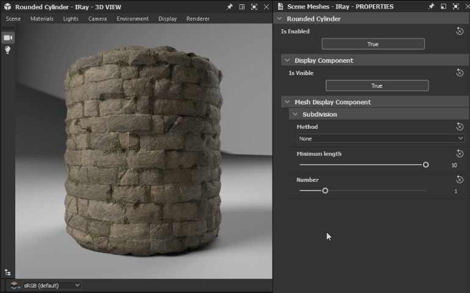
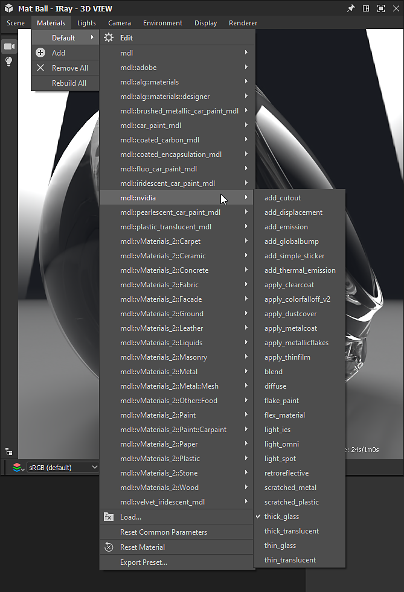
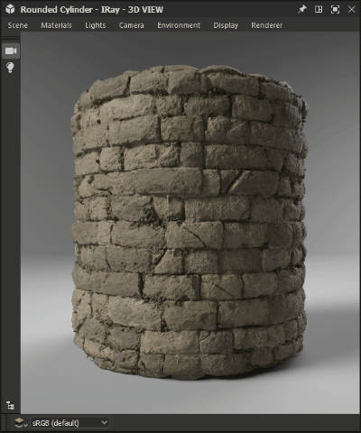

# Iray

本页介绍了[Substance 3D Designer](https://www.adobe.com/cn/products/substance3d-designer.html)的3D视图面板中提供的Iray渲染器，该渲染器提供了交互式路径跟踪，可帮助使用CPU和/或GPU加速（仅限Nvidia GPU）进行逼真的渲染。

>[!WARNING]
> 
> Iray渲染器以及所有相关功能已从Designer 16.0.0版中移除。
> 
> 在此处了解详情： [MDL图表和Iray生命周期结束](../../../technical-issues/mdl-graph-iray-eol/mdl-graph-iray-eol.md)

<table>
<tr style="border: 0;">
<td style="border: 0;" valign="top">

## 概述

<b>Iray</b>是一种高度&#x200B;*交互式*&#x200B;且基于物理的直观渲染技术，它通过模拟光线和材料的物理行为来生成&#x200B;*照片级逼真图像*。 在[NvidiaIray](https://www.nvidia.com/en-us/design-visualization/iray/)网页上了解更多信息。

</td>
<td style="border: 0;" valign="top">

</td>
</tr>

<tr style="border: 0;">
<td style="border: 0;" valign="top">

由于3D 视图使用Iray的&#x200B;*逐行渲染器*，因此只要对每个像素执行了至少一个样本，就会生成图像。 在执行取样迭代时，图像会&#x200B;*自动更新*，从而使初始粗糙图像在每个迭代上&#x200B;*变得更干净*。

渲染器在[3D视图](../../../interface/3d-view/3d-view.md)面板中可用：打开<b>渲染器</b>菜单，然后选择<b>Iray</b>选项以将该3D视图面板中使用的渲染器切换为Iray。\
切换到Iray渲染器&#x200B;*会更改某些3D视图菜单中的可用选项*。 这些更改将在下面的<b>3D视图</b>部分中说明。

默认情况下，选定Iray渲染器后即会开始渐进式渲染。 渲染进程将一直运行，直到满足下列条件中的&#x200B;*一个*：

* 执行的最大样本数&#x200B;**
* 符合&#x200B;*渲染时间限制*

请参阅此页面的<b>渲染器</b>部分，了解有关调整这些条件的更多信息。

</td>
<td style="border: 0;" valign="top">

*材质：[中世纪城堡](https://oggyart.artstation.com/projects/Xnzx0a)**，作者[Mark Foreman](https://www.artstation.com/oggyart)**，可在我们的[Substance 3D资源](https://substance3d.adobe.com/assets)**库*&#x200B;中使用

</td>
</tr>
</table>

>[!WARNING]
>
> 任何时间只能运行&#x200B;*一个* Iray渲染实例。\
> 这意味着当3D视图面板使用此渲染器时，**渲染器**&#x200B;菜单在其他3D视图面板中&#x200B;*处于禁用状态*，并且这些菜单默认为&#x200B;**OpenGL**&#x200B;渲染器。

## 3D视图选项

### 场景

在<b>场景</b>菜单中选择<b>编辑</b>选项，以在<b>属性</b>面板中查找特定于Iray的场景属性。

* <b>已启用：</b>当设置为&#x200B;*False*&#x200B;时，将隐藏该对象，并且&#x200B;*不再向场景提供*

显示组件

* <b>可见</b>：设置为&#x200B;*False*&#x200B;时，对象处于隐藏状态，但&#x200B;*仍对场景有贡献*，即反射光线、吸收光线和投影阴影

网格显示组件

* 细分
  * <b>方法</b>：用于在程序上将网格细分为更精细的几何形状的方法
    * *无*：未应用细分
    * *参数*：将网格细分为`4^x`个三角形，其中`x`是此参数指定的值
    * *长度*：细分网格，直到所有边缘的长度（在对象空间中）都小于“最小长度”参数指定的值
  * <b>最小长度</b>：细分网格，直到所有边的长度都低于对象空间中的此指定值（仅适用于&#x200B;*Length*&#x200B;方法）
  * <b>数字</b>：应该应用于网格的细分迭代次数（仅适用于&#x200B;*参数*&#x200B;方法）

>[!WARNING]
>
> 在渲染之前和期间，细分网格&#x200B;*会以指数方式增加其处理时间*。 我们建议在输入值时保持&#x200B;*保守*。\
> 请注意在Parameter方法中使用&#x200B;*高* **数字**&#x200B;值，在Length方法中使用&#x200B;*低* **最小长度**&#x200B;值。

### 材质

由于Iray依赖于NVIDIA开发的[MDL着色模型](https://www.nvidia.com/en-us/design-visualization/technologies/material-definition-language/)，因此可用于场景素材的素材将替换为Designer加载的MDL库。 此库使用以下源生成：

* Designer安装中包含的MDL文件
* 在加载的[项目文件](../../../pipeline-and-project-con/project-configuration-fil/project-configuration-files-sbsprj.md)中由用户[&#128279;](../../../interface/preferences-window/project-settings/project-settings.md)列出的目录中找到了MDL文件
* [NVIDIA vMaterials](https://developer.nvidia.com/vmaterials)库（如果已安装）

>[!NOTE]
>
> 要更深入地了解MDL着色模型，请查看由NVIDIA编写和维护的[MDL手册](http://mdlhandbook.com/)。

<table>
<tr style="border: 0;">
<td style="border: 0;" valign="top">

已加载MDL 材质的累积列表位于<b>材料</b>菜单的任一已列出材料的子菜单下，如右图所示。

此外，如果在Designer中加载了[MDL 图](../../../mdl-graphs/creating-an-mdl-graph/creating-an-mdl-graph.md)，则它可以应用于场景中的任何材料。 此时，它将被添加到可用的MDL材料列表中。

此菜单中的其他重要选项包括：

* 选择<b>编辑</b>选项以访问<b>属性</b>面板中MDL的&#x200B;*公开输入*，并根据需要调整素材
* 使用<b>加载……</b>选项，您可以&#x200B;*手动加载任何MDL文件*，这些文件将添加到累积列表中并应用于场景
* <b>导出预设……</b>选项可打开<b>导出MDL材质预设</b>对话框，使用此对话框可使用3D视图中应用的当前设置导出预设MDL文件

</td>
<td style="border: 0;" valign="top">

</td>
</tr>
</table>

>[!NOTE]
>
> 加载&#x200B;**MDL图形**&#x200B;时，3D视图渲染器将&#x200B;*自动切换到&#x200B;**Iray***以加载并应用它。

### 相机

关于相机设置，OpenGL和Iray之间的主要区别在于如何管理&#x200B;*字段深度*。 实际上，Iray作为物理上精确的渲染器，视相机的&#x200B;*光圈*&#x200B;而定，场地深度会“自然”发生。

选择“光线渲染器”后，摄像机属性中会显示下列参数：

* <b>焦距</b>：离焦点的相机的距离 — 即图像最清晰的地方
* <b>光圈直径</b>：驱动相机光圈的值。 此值越低，图像元素在焦点之前和之后就越锐利 — 用更简单的术语来说，此值控制场效果深度的强度

### 环境

打开<b>环境</b>菜单并选择<b>编辑</b>选项，以在<b>属性</b>面板中显示环境属性。

可使用以下属性：

圆顶

* <b>圆顶类型</b>：设置场景周围的对象，环境纹理投影在该对象上
  * *无限球体*：无限球形环境
  * *地面*：无限球形环境，但具有纹理化的地面平面
  * *球形*：自定义半径的有限大小球形圆顶
  * *带地面的球体*：具有自定义半径的有限大小的球形圆顶，其中环境下半部投影到分割球体上部和下部的平面上
  * *带地面的方框*：自定义宽度、Height和长度的有限大小的方框圆顶，其中环境下半部投影到分割方框上下部分的平面上
* <b>旋转角度</b>：控制圆顶绕&#x200B;*Y轴*&#x200B;旋转的角度
* <b>半径</b>：球体的半径（仅适用于&#x200B;*球体*&#x200B;和&#x200B;*带地面的球体*&#x200B;圆顶类型）
* <b>宽度</b>：框的宽度（仅适用于具有地面&#x200B;*圆顶类型的*&#x200B;框）
* <b>Height</b>：框的Height（仅适用于具有地面&#x200B;*圆顶类型的*&#x200B;框）
* <b>长度</b>：框的长度（仅适用于具有地面&#x200B;*圆顶类型的*&#x200B;框）
* <b>可视化</b>：启用有限大小环境几何的假颜色叠加。 这可用于将几何图形与捕获的环境图的投影对齐（仅适用于&#x200B;*球体*、*带地面的球体*&#x200B;和&#x200B;*具有地面*&#x200B;圆顶类型的Box）

>[!NOTE]
>
> 对于有限大小的圆顶，所有场景几何形状都应在&#x200B;*圆顶*&#x200B;内封闭。

地面\
以下参数适用于地面类型为&#x200B;*的*&#x200B;地面&#x200B;*、*&#x200B;带地面的球体&#x200B;*和* Box圆顶：

* **地面**：启用地面平面
* **位置**：有限圆顶原点的位置（也适用于&#x200B;*球体*&#x200B;圆顶类型）
* **反射率**：地面反射的不透明度和色调，其中黑色表示反射不可见
* **光泽度**：地面反射的光泽度
* **阴影强度**：阴影的不透明度地面上
* **纹理比例**：控制地面上环境纹理投影的大小（也适用于&#x200B;*球体*&#x200B;圆顶类型）

其中一些设置的影响说明如下：

+++显示环境

<table>
  <tr>
    <td>
      
       <i>之前</i>
    </td>
    <td>
      
       <i>之后</i>
    </td>
  </tr>
</table>

+++

+++启用地平面

<table>
  <tr>
    <td>
      
       <i>之前</i>
    </td>
    <td>
      
       <i>之后</i>
    </td>
  </tr>
</table>

+++

+++旋转环境

+++

+++调整地面平面

+++

+++调整无限球体

+++

+++调整封闭框

+++

### 显示

这些选项在渲染的图像顶部显示&#x200B;*文本叠加*，其中包含有关渲染的有用信息。

* <b>已用时间</b>：渲染的持续时间（秒）。 满足任一结束条件时，此计时器和渲染进程都将停止
* <b>迭代</b>：执行的取样迭代数。 当满足任一结束条件时，此计数器和渲染进程都将停止
* <b>渲染方法</b>：使用的渲染路径。 在本地计算机上的大多数用途是使用Photoreal
* <b>分辨率</b>：有效的渲染分辨率。 如果相机属性中的“使用窗口分辨率”选项设置为“假”，则会自动调整图像的比例以匹配分辨率比例
* <b>场景统计信息</b>：与呈现的场景相关的统计信息列表，其中包括三角形计数和材料计数以及其他数据

{width="512px"}

### 渲染器

打开<b>渲染器</b>菜单并选择<b>编辑</b>选项，以在<b>属性</b>面板中显示渲染器属性。

渐进渲染

* <b>最小采样数</b>：在考虑停止逐行渲染的条件之前，要计算的每个像素的最小采样数
* <b>最大采样数</b>：如果已经渲染了每个像素的此样本数，则自动停止逐行渲染
* <b>最大时间（秒）</b>：渐进渲染应在秒后自动终止
* <b>已启用焦散取样器</b>：通过专用焦散取样器增加默认取样器。 焦散线是光线通过不透明对象的结果，因此只有在场景中的任何对象上应用了[MDL](../../../mdl-graphs/creating-an-mdl-graph/creating-an-mdl-graph.md)材料支持translucency时才需要
* <b>已启用Firefly滤镜</b>：启用萤火虫滤镜，该滤镜使用预定义的算法，在渲染过程中移除计算图像中的萤火虫。 Firefly是视觉伪影，图像中的&#x200B;*孤立像素*&#x200B;比其相邻像素明显亮&#x200B;**，并且是光线样本不足，无法准确确定光线分布的结果
* 帖子降噪器\
  Iray渲染器使用[NVIDIA Optix AI-Accelerated Denoiser](https://developer.nvidia.com/optix-denoiser)算法对正在渲染的图像进行迭代的高质量去噪。

  * <b>已启用</b>：允许在设置的渲染迭代触发预定义的&#x200B;*降噪算法*，并在渲染的&#x200B;*末尾*&#x200B;之前保持活动状态
  * <b>启动迭代</b>：如果启用降噪器，则此选项会设置降噪过程开始的迭代。 这可以防止降噪器的性能开销影响交互性，例如在移动相机时。 此外，由于前几个迭代的收敛性不强，往往不适合作为降噪器的输入，导致效果不理想。

以下图像比较演示了其中一些设置的影响：

+++焦散取样器

<table>
  <tr>
    <td>
      
       <i>之前</i>
    </td>
    <td>
      
       <i>之后</i>
    </td>
  </tr>
</table>

+++

+++Firefly过滤器

<table>
  <tr>
    <td>
      
       <i>之前</i>
    </td>
    <td>
      
       <i>之后</i>
    </td>
  </tr>
</table>

+++

+++后降噪器

<table>
  <tr>
    <td>
      
       <i>之前</i>
    </td>
    <td>
      
       <i>之后</i>
    </td>
  </tr>
</table>

+++

*材料：厚玻璃MDL* *在NVIDIA的MDL核心定义中可用* **

## 硬件加速

Iray渲染器专门在NVIDIA GPU上提供硬件加速，具有下列优势：

* 显着提升渲染速度
* [Optix AI加速去噪](https://developer.nvidia.com/optix-denoiser)（请参阅本页<b>渲染器</b>部分中的“Post-denoiser”）

您可以在[首选项](../../../interface/preferences-window/preferences-window.md)窗口的<b>3D 视图</b>部分中选择Iray应该用于渲染的硬件，如右侧的图像所示。

检测到支持的GPU时，将列在此部分中，默认情况下为&#x200B;*自动选择*，并且未选择CPU。 任何手动更改都会覆盖此自动行为，因此您的自定义更改将保存以供将来会话使用。

>[!NOTE]
>
> 如果检测到并列出了支持的GPU，我们强烈建议&#x200B;*将CPU保留为未选择*，因为使用CPU进行Iray渲染会对应用程序的整体性能和响应产生&#x200B;*显着影响*。

>[!WARNING]
>
> GPU硬件加速使用[NVIDIA CUDA](https://developer.nvidia.com/cuda-zone)技术。 确保您的&#x200B;*图形驱动程序是最新的*，以实现最佳兼容性和可靠性。 在[此处](https://www.nvidia.com/Download/index.aspx?lang=en-us)查找您的NVIDIA GPU的最新驱动程序。\
> 对于多GPU配置，建议&#x200B;*禁用SLI*，并仅选择一个GPU以获得最佳可靠性。

