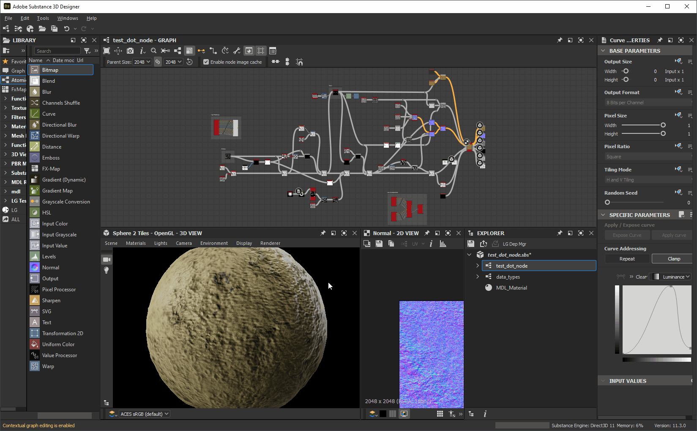
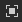
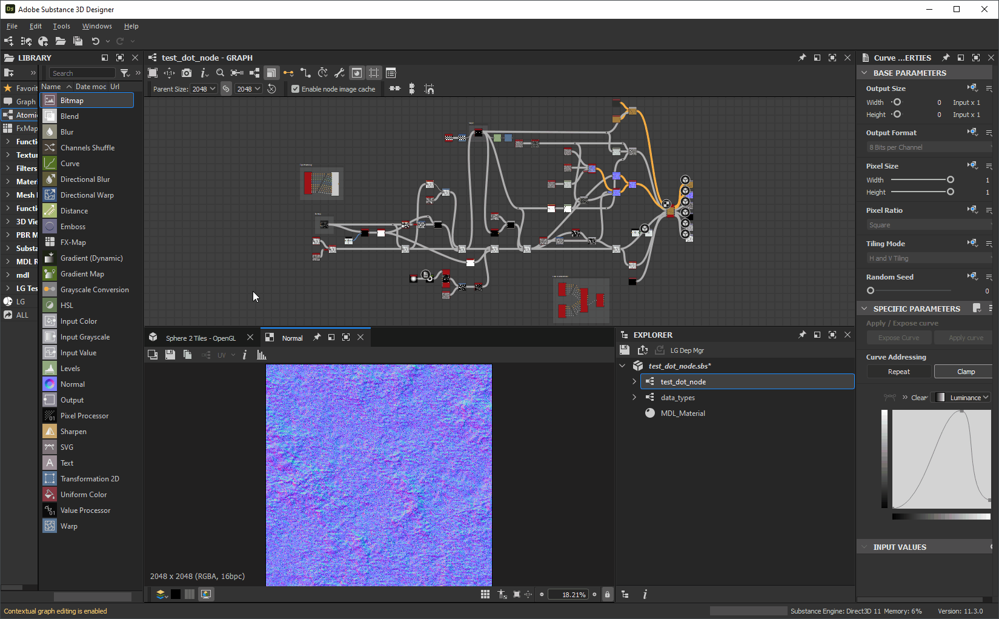

# 自定义工作区

此页面介绍了在[Adobe Substance 3D Designer](https://www.adobe.com/cn/products/substance3d-designer.html)用户界面中排列面板，并利用其功能增强您的工作流程的方法。

<table>
<tr style="border: 0;">
<td width="100.00%" style="border: 0;" valign="top">

## Windows菜单

此菜单允许您管理Designer的主要用户界面元素。 每个选项在[此页面](../the-main-toolbar/the-main-toolbar.md)的<b>Windows</b>部分中关于主工具栏进行了介绍。 在这里，我们将提供与这个菜单相关的其他概念。

### 显示/隐藏视图

要显示或隐藏特定接口项，请在&#x200B;*Windows*&#x200B;菜单中单击其名称。 显示的项目具有个复选标记。

### 使用视图填充停放区

在Designer中，停放是一个&#x200B;*容器，它与它的内容分开*。 这意味着<b>库</b>停靠区可以存在且为空，因为它不包含库&#x200B;*视图*。

<b>新建资源管理器</b>、<b>新建3D视图</b>和<b>新建库视图</b>选项可创建视图，这些视图将根据用户界面的当前状态放置：

* 如果有空停放可用，则会在其中创建新视图&#x200B;**
* 如果空停放区&#x200B;*不可用*，则会创建一个&#x200B;*新停放区*&#x200B;以容纳新视图

</td>
<td width="33.33%" style="border: 0;" valign="top">

</td>
</tr>
</table>

## 调整坞站大小

可通过移动坞站的任何边缘来调整其大小。 其他坞站将动态调整大小以适合。

## 移动坞站

可以使用其&#x200B;*标题栏*&#x200B;在主窗口周围移动任何停放。 根据停放的位置，停放将调整大小以适合。

## Tab键切换坞站

坞站可能会栈叠成选项卡。 这对于以某种方式保存彼此相关的屏幕不动产或聚合视图非常有用。

您可以通过将停放区的标题栏&#x200B;*移动到现有停放区*&#x200B;来定位停放区，例如停放区不会调整大小或移动，但目标停放区周围会显示&#x200B;*帧*。

## 取消停靠

停放可以取消停放到&#x200B;*浮动窗口*&#x200B;中，该浮动窗口可以调整大小并移出主窗口，包括移出到另一个显示器。

这可以通过两种方式实现：

* 使用其&#x200B;*标题栏*&#x200B;移动停放区，然后将其&#x200B;*放在主窗口之外*，或放在主窗口的&#x200B;*不是停放区*&#x200B;的区域上。 您可以重新停放此停放，方法是：在主窗口&#x200B;*中将它移动到另一个停放*&#x200B;上，或者单击“<b>重新停放</b>”按钮；
* 单击<b>取消停靠</b>按钮。 使用此方法取消停靠的停靠可以通过<b>重新停靠</b>按钮来&#x200B;*仅*&#x200B;重新停靠。

## 最大化坞站

可以最大化任何停放区以适合该区域或其&#x200B;*父窗口*：

* 停靠坞站将分布在&#x200B;*主窗口*&#x200B;的整个区域，不包括标题栏、主工具栏和状态栏
* 未停靠的停靠区将分散在&#x200B;*整个显示器*&#x200B;上

可通过两种方式最大化坞站：

* 将&#x200B;*光标放在停放区上*，然后按<b>Shift+空格键</b>击键
* 单击其<b>最大化</b>按钮

最大化的坞站可以在最大化&#x200B;*之前最小化到它们保持的*&#x200B;的大小和位置。 这可以通过三种方式实现：

* 将&#x200B;*光标放在停放区上*，然后按<b>Shift+空格键</b>击键
* 单击其<b>“最小化”</b>按钮
* 打开<b>窗口</b>菜单并选择<b>取消最大化窗口</b>选项

>[!NOTE]
>
> 一次只能将&#x200B;*一个*&#x200B;程序坞最大化。

>[!IMPORTANT]
>
> 最大化停放区时，某些界面行为可能会有所不同：
> 
> * 自动显示/更新的停放将在后台执行此操作（例如，属性、2D视图）
> * **Windows**&#x200B;菜单中的菜单项是&#x200B;*禁用的*
> * 停靠标题栏中的按钮&#x200B;*已禁用*
> * 主窗口&#x200B;*中最大化的停放区不能使用其标题栏移动*

## 固定坞站

固定停放区&#x200B;*可防止它与其他内容或其他视图一起填充*。

固定停放区时，任何将来应在其意愿中显示的内容都应&#x200B;*创建一个新停放区*&#x200B;来托管它。 此新停放区将不会固定，因此可以更新和托管新内容。

要固定停放，请单击其 <b>固定</b>按钮。 然后，您可以使用 <b>取消固定</b>按钮&#x200B;*取消固定*&#x200B;该文档，以使其再次&#x200B;*可用*&#x200B;来承载任何新内容。

可以一次固定多个&#x200B;*停放，包括*&#x200B;相同类型&#x200B;*的多个停放。*

固定坞站使您具备以下功能：

* 同时显示和调整多个节点的属性
* 同时显示两个或更多位图
* 同时处理多个图表

## 关闭坞站

通过单击其 <b>关闭</b>按钮，可以关闭任何停靠区。

## 重置界面布局

通过打开<b>Windows</b>菜单并选择<b>重置布局</b>选项，可以将整个用户界面重置为其默认布局。

其显示状态也会重置，这意味着已关闭的停放可能为&#x200B;*重新打开*（例如3D视图），而已显示的停放可能为&#x200B;*已关闭*（例如，控制台、依赖关系管理器、插件创建的停放）。

