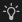

# 主屏幕

<b>主屏幕<b> </b></b>欢迎您启动Substance 3D Designer。 它可以帮助您开始使用项目并访问有用的链接。

<table>
<tr style="border: 0;">
<td width="100.00%" style="border: 0;" valign="top">

要关闭主屏幕，请使用左上角的<b>返回</b>按钮或左下角的<b>关闭主屏幕</b>按钮。 借助下方的一个复选框，您可以在启动Designer后切换主屏幕的自动显示。

</td>
<td width="16.67%" style="border: 0;" valign="top">

</td>
</tr>
</table>

{width="512px"}

## 主屏幕

 <b>主页</b>部分提供了一个横幅，其中突出显示了进一步使用Designer的建议。\
可使用右侧的 <b>“隐藏建议”</b>按钮折叠此横幅。

在下方，<b>最近</b>标题下方的最近文件列表可快速访问最近加载的项目（从最近到最旧）。

可以使用列表右上角的<b>筛选器</b>输入字段筛选最近打开的文件。 筛选将匹配项目文件名中的任何字符串。

>[!TIP]
>
> 将光标置于某个条目上几秒钟，以显示文件的完整路径。

{width="512px"}

## 学习

 <b>学习</b>部分提供了有用的学习资源，可增进您对Substance 3D Designer的了解。

这些资源作为卡链接列出，并按如下所示分组：

* <b>实操教程</b>涵盖最新功能；
* <b>更多资源</b>收集您可能会发现有用的资源，以便定期返回：
  * [Designer中的第一步](https://substance3d.adobe.com/tutorials/courses/First-Steps-with-Substance-3D-Designer/youtube-VyFgpitTsYg)是面向初学者的参考教程；
  * [Quicktips](https://substance3d.adobe.com/tutorials/courses/Designer-Quicktips/youtube-Q9mEcCWsOQc)是一个精选的播放列表，其中包含用于创建材料、图案、滤镜等的方法；
  * [联机文档](../../home/home.md)将您带到此文档。

{width="512px"}

## 新增功能

屏幕右上角的 <b>“新增功能”</b>按钮会显示一个屏幕，其中列出了Designer版本中添加的主要功能，以及指向该版本的完整[发行说明](../../release-notes/release-notes.md)的链接。

## 启动项目

在屏幕的左侧，您可以找到用于在新包中创建新图形的快捷键列表：

* <b>新图形：</b>打开[新Substance图形](../../compositing-graphs/creating-compositing-gra/creating-a-substance-compositing-graph.md)窗口；
* <b>打开包：</b>允许您加载现有包；
* <b>导入AxF：</b>启动[AxF导入工作流](../../resources/axf-appearance-exchange/axf-appearance-exchange-format.md)。

{width="256px"}

## 链接

在屏幕的左下角，有用的链接如下所示：

* <b>关于Designer：</b>显示“关于Designer”屏幕（请参阅上文）；
* <b>联机文档：</b>打开[此文档](../../home/home.md)的网页；
* <b>网站：</b>打开一个网页以访问Substance 3D Designer [产品页面](https://www.adobe.com/cn/products/substance3d-designer.html)；
* <b>论坛：</b>打开一个网页以访问Substance 3D Designer的[支持社区](https://community.adobe.com/t5/substance-3d-designer/ct-p/ct-substance-3d-designer?page=1&sort=latest_replies&filter=all&lang=all&tabid=discussions)；
* <b>社区资源：</b>打开Substance 3D [社区资源](https://substance3d.adobe.com/community-assets/)的网页。
