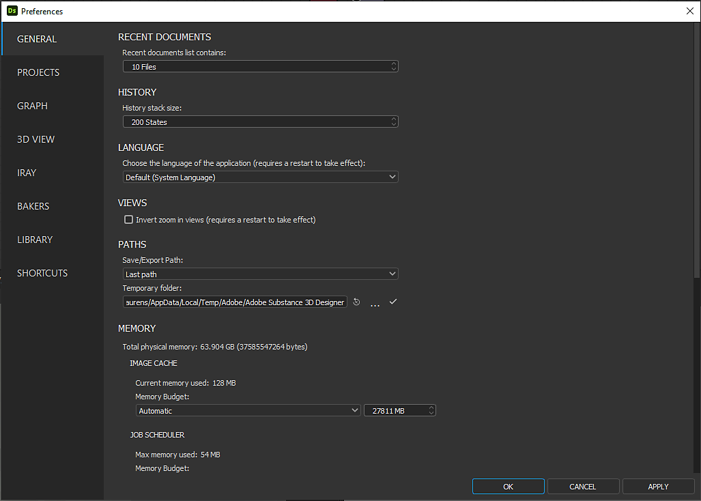

# “首选项”窗口

此页面显示<b>首选项</b>窗口及其所有设置。

可通过应用程序顶部主栏中的<b>编辑</b>菜单找到“首选项”窗口。 通过此对话框，您可以调整许多设置。 它以选项卡的形式组织，涵盖了不同的行为和功能区域。\
我们建议查看所有这些设置，以更好地了解应用程序如何运行以及如何根据您的工作流程对其进行定制。

>[!NOTE]
>
> 有关如何存储这些首选项以及如何在生产环境中集成这些首选项的详细信息，请参阅文档的[用户首选项 — 自动设置](../../pipeline-and-project-con/user-preferences-aut/user-preferences-automating-setup.md)页面。

## 常规

### 最近文档

|  |                                                                                                                                         |
| --- |-----------------------------------------------------------------------------------------------------------------------------------------|
| <b>最近的文档列表包含</b>  *默认值： 10* | 这样，您就可以在[主菜单](../the-main-toolbar/the-main-toolbar.md)中<b>文件</b>项的<b>最近使用的包</b>项中选择要列出的文档数。 |

### 历史记录

|  |  |
| --- | --- |
| **历史记录栈栈大小** *默认值： 200* | 这指示了[主菜单](../the-main-toolbar/the-main-toolbar.md)的<b>编辑>撤消</b>项中任何给定时间可用的撤消操作数。  **注意：**&#x200B;所需的撤消操作越多，应用程序所需的内存就越多。 |

### 语言

|  |  |
| --- | --- |
| **选择应用程序的语言** *默认值：系统* | 此设置定义应用程序界面中使用的语言。 “*系统*”选项会自动从系统语言设置中检测语言。 可用语言列在我们的[系统要求](../../getting-started/system-requirements/system-requirements.md)中。  **注意：**&#x200B;只有在重新启动应用程序后，对此设置的更改才会生效。 |

### 视图

|  |  |
| --- | --- |
| <b>反转放大视图</b>  *默认：未选中* | 如果选中，缩放控件将在[2D视图](../../interface/2d-view/2d-view.md)、[3D视图](../../interface/3d-view/3d-view.md)和[图形](../../interface/the-graph-view/the-graph-view.md)中反转。 |

### 路径

|  |  |
| --- | --- |
| <b>保存/导出路径</b>  *默认：最后路径* | 确定建议的保存/导出路径是您上次选择的路径，还是[SBS包](../../getting-started/overview/overview.md)的路径。 最后选定的路径将在各个会话中保存。 |
| <b>临时文件夹</b>  *默认：路径取决于系统OS* | 当图形的图像数据超过分配的内存池（请参阅下面的<b>内存>图像缓存</b>）时，溢出数据将写入磁盘。 通过此设置，可以定义溢出图像缓存数据被写入的位置。   此位置还用于存储当前打开的SBS包的副本，其中包含自上次手动保存以来的最新修改。 |

### 内存

#### 图像缓存

对于当前图形中的每个渲染节点，应用程序在缓存中保留一个&#x200B;*全分辨率、未压缩的图像*。\
实例节点将为它们引用的图表的所有节点生成这些图像，并在计算其[输出](../../compositing-graphs/nodes-reference-for-com/atomic-nodes/output/output.md)后删除这些图像。 此时，只有输出会保留在内存中。

您可以设置分配给系统内存中的缩览图和图像的最大缓存大小，并查看当前使用情况。 如果缓存数据溢出其分配的池，则超出的数据将写入<b>临时文件夹</b>（请参阅上面的<b>路径>临时文件夹</b>）。

|  |  |
| --- | --- |
| <b>内存预算</b>  *默认：自动* | 此分配会自动计算到总系统内存池的大约75%。 若要手动设置此值，请选择“*自定义*”选项，然后在相邻的输入字段中设置一个值。 |

请注意，写入磁盘比写入系统内存慢&#x200B;*个数量级*。 因此，图形渲染时间将&#x200B;*指数增长*，因为溢出数据需要写入临时文件夹。\
为防止发生这种情况，我们建议在文档的[性能优化准则](../../best-practices/performance-optimization/performance-optimization-guidelines.md)部分中查看关于减少图形内存占用量的建议。

#### 作业调度程序

在特定任务期间（例如缩略图或[2D视图](../../interface/2d-view/2d-view.md)的图像转换），将创建单独的作业并将其分布到系统处理核心以提高效率。 每个作业都会将数据写入系统内存以执行其操作。\
此设置允许您为&#x200B;*所有并发作业*&#x200B;定义分配的内存池。 完全使用此池时，新作业将排队，直到当前作业完成。

|  |  |
| --- | --- |
| <b>内存预算</b>  *默认：自动* | 此分配会自动计算为总系统内存池的大约10%。 若要手动设置此值，请选择“*自定义*”选项，然后在相邻的输入字段中设置一个值。 |

### 用户界面

|  |  |
| --- | --- |
| **禁用高DPI** *默认：未选中* | <b>高DPI</b>模式将&#x200B;*独立*&#x200B;保持文本和用户界面元素对系统显示和缩放设置的一致缩放。   禁用（即复选框&#x200B;*填充*）此设置将允许缩放界面，这会导致在某些显示器上显示更大、更易读的文本，但也会导致文本大小不一致，以及其他布局问题。  **注意：** Designer从OS *获取用户界面元素*&#x200B;的特定比例。 因此，对用户界面缩放比例的任何调整都应在操作系统的显示设置中完成。 为确保在Designer中正确应用显示设置，请在更改这些设置后&#x200B;*注销您的OS用户会话*&#x200B;并重新登录。  **注意：**&#x200B;只有在重新启动应用程序后，对此设置的更改才会生效。 |

### 自动备份

默认情况下包括自动保存功能，该功能在设定的时间段创建打开的[SBS包](https://docs.substance3d.com/display/DRAFTDESIGNER/.Overview+vDraftVersion)的当前状态的副本。 自动保存将被放置在SBS包位置的<b>.autosave</b>文件夹中。

|  |  |
| --- | --- |
| <b>每#分钟自动备份一次</b>  *默认值： 5* | 每次自动保存之间的时间段。 |
| <b>保持使用#个版本</b>  *默认值： 6* | 在任何给定时间可保留的最大自动保存次数。 |

当达到最大版本数时，较新的备份将删除最旧的备份。\
另请注意，在将自动保存文件移动到原始SBS包位置&#x200B;*后，*&#x200B;应打开自动保存文件。 应该&#x200B;*不*&#x200B;在其当前位置打开它们。

### 发布和发送SBSAR文件

|  |  |
| --- | --- |
| <b>在发布到.sbsar或发送到其他应用程序时，始终保存.sbs文件</b>  *默认值： True* | 在[发布SBS包](../../compositing-graphs/publishing-asset-files/publishing-substance-3d-asset-files-sbsar.md)或将其发送到其他应用程序时，控制自动保存该包。 |

### 编译器

|  |                                                                                                                                                                                                                                                                                                 |
| --- |-------------------------------------------------------------------------------------------------------------------------------------------------------------------------------------------------------------------------------------------------------------------------------------------------|
| <b>烹饪大小限制</b>  *默认值： 8192像素* | 定义任何Substance[图形](../../compositing-graphs/substance-compositing-graphs.md)中所有节点允许的最大像素分辨率。 由于图形输出始终是分辨率为2的次方的方形图像，因此此处设置的值定义了最大宽度和Height（以像素为单位）。 |

### 引擎

|  |  |
| --- | --- |
| <b>GPU缓存限制</b>  *默认值： 2048 MB* | 通过此设置，可以定义应该为缓存渲染阶段保留多少内存。 通常，Substance 引擎会将每个节点的输出缓存到一个Substance图中。 |

>[!NOTE]
>
> 我们建议在文档的[性能优化准则](../../best-practices/performance-optimization/performance-optimization-guidelines.md)部分中查看关于减少图形内存占用量的建议。

## 项目

请参阅[项目设置](../../interface/preferences-window/project-settings/project-settings.md)页面。

## 图形

### 通用

|  |  |
| --- | --- |
| <b>Tab键显示节点菜单</b>  *默认值：已选中* | 如果选中，“Tab”键将打开<b>节点菜单</b>，并复制“空间”键的功能。 |
| <b>通过单击拖动连接器启用节点创建</b>  *默认值：已选中* | 如果选中，当您单击任意连接器时，拖动光标并在图形空白空间中释放创建的链接以显示<b>节点菜单</b>。   菜单也将根据单击的连接器类型&#x200B;*过滤*。 这意味着只会显示与单击的连接器兼容的节点。 |
| <b>打开图表时以3D视图查看输出</b>  *默认值：已选中* | 如果选中此选项，当打开图形时，所有图形输出都将自动应用于[3D视图](../../interface/3d-view/3d-view.md)。   这还具有渲染所有节点的效果，这些节点是通向[输出](../../compositing-graphs/nodes-reference-for-com/atomic-nodes/output/output.md)节点的流的一部分。 |

### Substance 合成图形

|  |  |
| --- | --- |
| <b>打开图表时自动计算所有节点的缩略图</b>  *默认值：已选中* | 如果选中此选项，则在加载图形时自动呈现所有节点缩略图。 |
| <b>打开图表时以2D视图查看输出</b>  *默认值：已选中* | 如果选中此选项，当第一个图形输出打开时，该图形会自动显示在[2D视图](../../interface/2d-view/2d-view.md)中。 这还具有渲染所有节点的效果，这些节点是通向该[输出](../../compositing-graphs/nodes-reference-for-com/atomic-nodes/output/output.md)节点的流的一部分。 |
| <b>自动显示新创建的合成节点</b>  *默认值：已选中* | 如果选中此选项，[2D视图](../../interface/2d-view/2d-view.md)将自动更新，以显示新创建节点的输出。 |
| <b>自动插入彩色/灰度转换节点</b>  *默认：未选中* | 如果选中此选项，则通过&#x200B;*放置特定节点*&#x200B;执行相应的转换来自动解决彩色/灰度连接类型不匹配问题。   当&#x200B;*灰度*&#x200B;输出（灰色连接器）连接到&#x200B;*颜色*&#x200B;输入（黄色连接器）时，[渐变映射](../../compositing-graphs/nodes-reference-for-com/atomic-nodes/gradient-map/gradient-map.md)节点自动放置在这两个连接器之间。   当&#x200B;*彩色*&#x200B;输出（黄色连接器）连接到&#x200B;*灰度*&#x200B;输入（灰色连接器）时，[灰度转换](../../compositing-graphs/nodes-reference-for-com/atomic-nodes/grayscale-conversion/grayscale-conversion.md)节点会自动放置在这两个连接器之间。 |
| <b>在上下文中启用图形编辑</b>  *默认：未选中* | 默认情况下，在打开[实例节点](../../compositing-graphs/creating-compositing-gra/graph-instances-sub-gra/graph-instances-sub-graphs.md)引用的图形时右键单击该节点，然后选择<b>打开引用</b>，将单独加载和编辑该图形&#x200B;**。   如果选中，则可以使用当前图形在实例&#x200B;*中传递的信息来编辑实例*&#x200B;引用的图形。 为此，请右键单击实例节点并选择<b>在上下文中打开引用</b>，或使用Ctrl+E击键。   这意味着实例化图形可以在实例化图形的上下文中编辑。 这对于查看您正在处理的图表上的编辑效果非常有用。 请参阅以下示例。  &#x200B;** 注意：**&#x200B;使用上下文编辑时，[图形属性](../../compositing-graphs/graph-parameters/graph-parameters.md)中的<b>预览</b>和<b>预设</b>选项卡处于&#x200B;*禁用*&#x200B;状态。 |

<table>
<tr style="border: 0;">
<td style="border: 0;" valign="top">

*打开引用*

</td>
<td style="border: 0;" valign="top">

*在上下文中打开引用*

</td>
</tr>
</table>

## 3D 视图

### 杂项

|  |  |
| --- | --- |
| <b>默认情况下隐藏环境</b>  *默认值：已选中* | 确定[环境](../../interface/3d-view/3d-view.md)默认可见性设置。 隐藏后，3D视图的背景将替换为&#x200B;*纯色*。 |
| <b>视区缩放</b>  *默认：自动* | 当系统使用显示缩放时，控制3D视图的渲染分辨率的缩放。<ul data-preserve-html="true"> <li data-preserve-html="true"><i>自动</i>：渲染分辨率基于<i>缩放</i>显示分辨率</li> <li data-preserve-html="true"><i>无</i>：渲染分辨率基于<i>本机</i>显示分辨率</li> </ul> |

### OpenGL

|  |  |
| --- | --- |
| <b>样本计数</b>  *默认值： 64* | 影响3D视图着色器样本表的大小。 值越高图像质量越高，但性能越低。  **注意：**&#x200B;着色器的示例表也受到系统的GPU和操作系统的影响。 |

## 烘焙

|  |  |
| --- | --- |
| <b>GPU 射线追踪</b>  *默认值：已选中* | 如果选中，将在GPU上对[兼容的烘焙器](https://experienceleague.adobe.com/en/docs/substance-3d/bakers/features/gpu-raytracing)执行光线追踪。   根据NVIDIA GPU体系结构，以下GPU 射线追踪后端将是默认的：<ul data-preserve-html="true"> <li data-preserve-html="true"><i>DXR</i>：图灵及更新版本</li> <li data-preserve-html="true"><i>Optix</i>：Pascal和Maxwell</li> </ul>  **注意：**&#x200B;有关GPU驱动的烘焙工具的更多信息可在[Substance Bakers](https://experienceleague.adobe.com/en/docs/substance-3d/bakers/home)文档的[GPU 射线追踪](https://experienceleague.adobe.com/en/docs/substance-3d/bakers/features/gpu-raytracing)部分中找到。  **提示：**&#x200B;启动应用程序时，可以使用以下&#x200B;*命令行参数*&#x200B;以&#x200B;*强制*&#x200B;使用其他GPU 射线追踪后端： <ul data-preserve-html="true"> <li data-preserve-html="true"><code>—force-optix</code> ：在Nvidia Turing或更新的GPU上强制使用Optix</li> <li data-preserve-html="true"><code>—force-dxr</code> ：在Nvidia Pascal GPU上强制使用DXR</li> </ul> |

## 库

|  |  |
| --- | --- |
| <b>重新生成缩略图</b> | 该选项将触发重新计算所有[库](../../interface/the-library/the-library.md)缩览图，这将自动替换以前的缩览图。 |

## 快捷键

您可以指定自定义键盘快捷键以在图形中创建节点。

可以为所有图形类型中的Substance分配快捷方式： [节点图表](../../compositing-graphs/substance-compositing-graphs.md)、[Substance函数图表](../../function-graphs/function-graphs.md)和[FX映射图表](../../function-graphs/fxmaps/fxmaps.md)。

可以为任何节点分配快捷方式，甚至可以为自定义库节点分配。 可以在不同的图形类型中分配相同的快捷键。 默认情况下，不会分配任何快捷键，您可以根据自己的喜好自由自定义快捷键。

如果与其他节点快捷键或内置程序快捷键发生冲突，则会突出显示条目，并显示警告。 在解决冲突之前，该快捷键将&#x200B;*无效*。

>[!IMPORTANT]
>
> Python增效工具覆盖的快捷键
> 
> 当Python插件定义分配给节点的键盘快捷键时，该插件将覆盖该快捷键。 这意味着该键将触发插件操作，而不是创建节点。
> 
> [节点对齐工具](../../interface/the-graph-view/node-alignment-tools/node-alignment-tools.md)所使用的H、S和V键已经出现这种情况。
