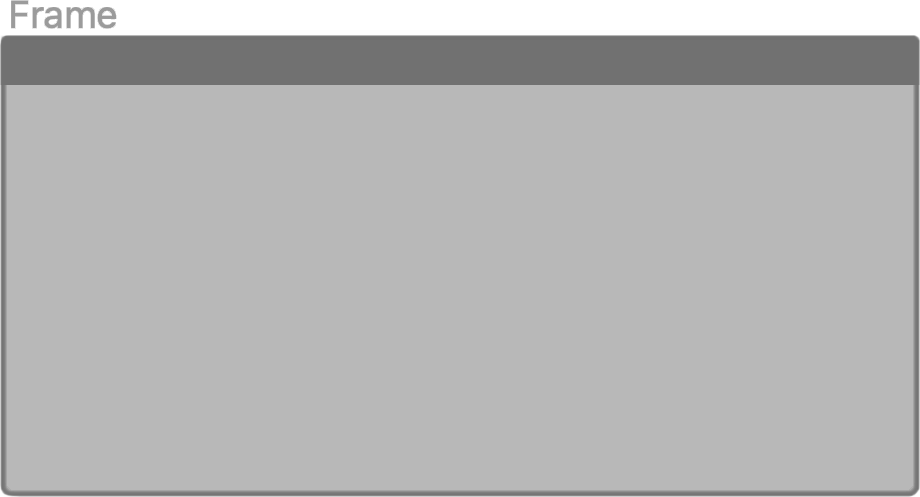
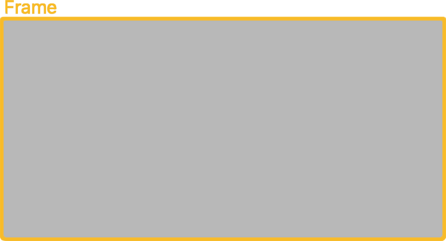
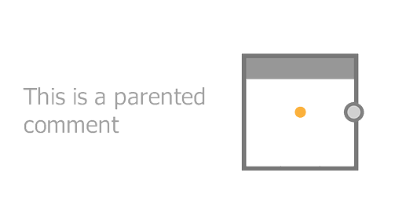
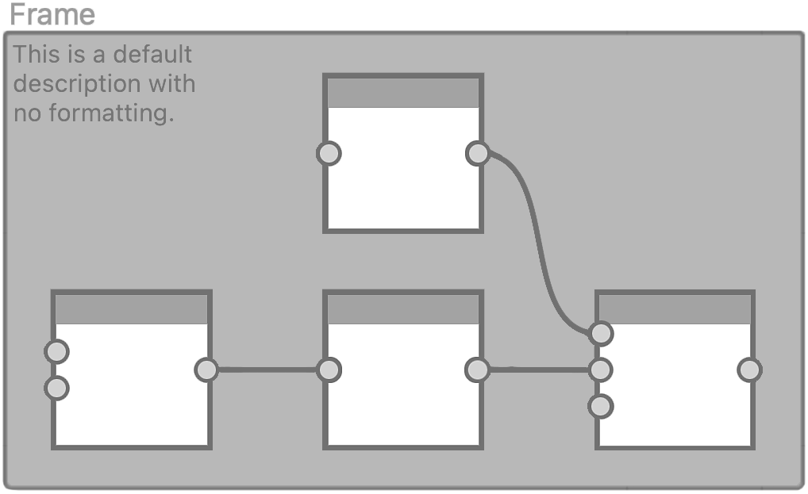
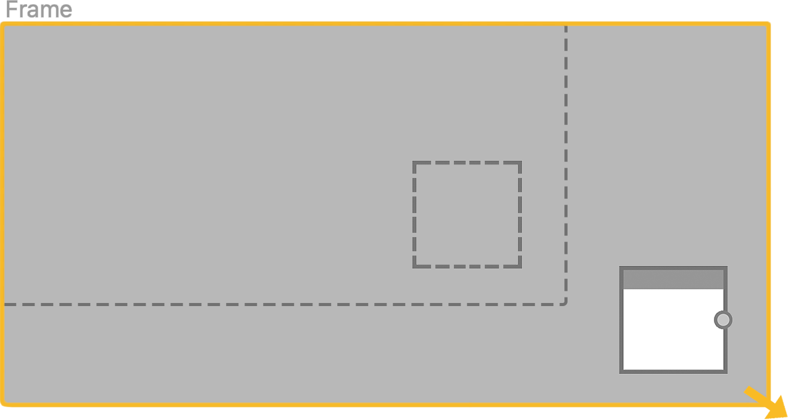

# 取景框

<table>
<tr style="border: 0;">
<td width="25.00%" style="border: 0;" valign="top">


</td>
<td width="100.00%" style="border: 0;" valign="top">

框架通过将对象以可视方式分组到图表中，简化了图表的可读性和版面，并且允许您轻松地同时移动所有这些对象。

例如，可以对框架进行命名和着色，以便在查看概览时清楚地展现图的结构随着图复杂度的增加而变得很有帮助。

它们还可以被加注，从而作为说明为什么某些节点以特定方式建立的文档工具。

</td>
</tr>
</table>

## 外观

根据鼠标光标的位置或帧是否为选区的一部分，帧会以不同的视觉样式显示自身，让您了解是否可以以及如何与其交互。

+++默认值
默认情况下，框架是一个矩形，其圆角填充了在其<b>框架颜色</b>属性中选择的颜色。 该颜色的较深阴影会应用于框架的轮廓。

在<b>标题</b>属性中设置的标题在框架的左上角呈灰色。


+++

+++标头悬停
将鼠标悬停在框架顶部时，会显示标题栏。

可以通过拖动标题栏或其标题来移动框架。




+++

+++选定项
选中后，框架的标题和轮廓以白色突出显示。 轮廓变得更粗。




+++

## 创建框架

可以通过以下任何方式以任意图形类型添加框架：

+++节点菜单
在图形视图中按<b>空格键</b>以打开<b>节点菜单</b>，然后在列表中选择“框架”项。

在搜索字段中键入“frame”以显示项目并更快地找到它。

+++

+++快捷键
如果键盘快捷键映射到[首选项](../../../../interface/preferences-window/preferences-window.md)中的“框架”项，请在图形视图具有焦点时按该快捷键。

+++

+++上下文菜单
在图形视图中，在任意对象上或空白空间中按<b>RMB</b>并选择<b>添加框架</b>选项。

+++

+++图形工具栏
在图形视图工具栏中，单击<b>节点调板</b>中的“帧”按钮。

+++

+++库
在“库”中，选择<b>图形项目</b>类别，然后将“帧”项目拖放到图形视图中。

+++

### 取景选择

如果在创建帧时图形中的选区处于活动状态，则该帧将自动调整为完全包括所选对象。

因此，使用键盘快捷键创建帧可以更快地将帧放在图形中。

{width="480px"}

>[!TIP]
>
> 创建帧后，其“标题”属性会自动获得焦点，以便您可以立即编辑帧的标题。

## 处理帧

<table>
<tr style="border: 0;">
<td style="border: 0;" valign="top">

可以通过拖动帧的标题栏或标题栏来<b>平移</b>，或通过拖动其任何边框或边角来<b>调整大小</b>。

该图突出显示用于平移（蓝色）和调整大小（黄色）的交互区域。

</td>
<td style="border: 0;" valign="top">


</td>
</tr>
</table>

<table>
<tr style="border: 0;">
<td style="border: 0;" valign="top">

### 捕捉

默认情况下，移动或调整大小时，帧会捕捉为中等网格。

按住<b>Ctrl</b> (Windows) / <b>Cmd</b> (macOS)键可将此捕捉转换为小网格以进行更精细的调整。

</td>
<td style="border: 0;" valign="top">


</td>
</tr>
</table>

## 属性

选择帧后，[属性](../../../../interface/properties/properties.md)停靠区中提供以下属性：

+++标题
<b>标题</b>位于帧的左上方。 可使用<b>标题可见性</b>属性打开或关闭标题的可见性。

可以将字幕的大小锁定为最小屏幕大小，以便在缩小图形时保持可读性。 您可以通过选中[帧](../../../../interface/the-graph-view/the-graph-view.md)工具栏的<b>信息</b>下拉列表中的“图形视图标题”选项来执行此操作。

{width="640px"}


+++

+++描述
<b>描述</b>是可选的附加文本，可用于对帧的内容进行批注。

可以使用HTML标记设置文本的格式。 通过单击 <b>HTML标记</b>按钮来切换此格式。

请在下面的“描述”部分中了解更多信息。

{width="640px"}


+++

+++颜色
<b>帧颜色</b>用于填充图形视图中的帧。 使用拾色器选择任意颜色。

颜色的Alpha 通道控制帧的&#x200B;*不透明度*，其中值为0表示帧完全透明。

{width="640px"}


+++

## 描述

可以使用将置入帧内的文本对帧进行批注。 文本与左侧对齐，从帧的左上角开始。 使用帧的[描述](#properties)属性编辑该文本。

<table>
<tr style="border: 0;">
<td style="border: 0;" valign="top">

### 标准

<b>Title</b>以粗体显示，位于帧的左上方。 可以打开或关闭字幕的可见性。

其大小可以锁定在最小屏幕大小下，因此在图形缩小时保持可读性。 您可以通过选中[帧](../../../../interface/the-graph-view/the-graph-view.md)工具栏的<b>信息</b>下拉列表中的“图形视图标题”选项来执行此操作。

</td>
<td style="border: 0;" valign="top">

{zoomable="yes"}

</td>
</tr>
</table>

<table>
<tr style="border: 0;">
<td style="border: 0;" valign="top">

### HTML格式设置

可以使用帧<b>Description</b>属性中的HTML标记来设置文本的格式。 必须在该属性中使用 <b>HTML标记</b>按钮启用格式设置。

</td>
<td style="border: 0;" valign="top">

{zoomable="yes"}

</td>
</tr>
</table>

您可以在帧的“描述”属性中复制并粘贴此示例，以为您自己测试此功能：

```
<h2>HTML formatting</h2>

<p>This is a description formatted using <b>HTML markup</b>.</p>

<p>Formattig text makes it more <i>pleasant</i>, <font color="#CC8822">impactful</font> and <code>clearly structured</code> for users.</p>

<p>  Images are also supported! <sup>How nice!</sup></p>
```


以下是设置文本格式的有用标记列表：

+++设置标签HTML

|  |  |
| --- | --- |
| 粗体 | &lt;b>...&lt;/b> |
| 斜体 | &lt;i>...&lt;/i> |
| 颜色 | &lt;font color=&quot;#4A567C&quot;>...&lt;/font> |
| 段落 | &lt;p>...&lt;/p> |
| 换行符 | &lt;br> |
| 标题 | &lt;h1>...&lt;/h1>、&lt;h2>...&lt;/h2>等。 |
| 图像 | &lt;img src=&quot;{path\_to\_image}&quot;> |
| 上标 | &lt;sub>...&lt;/sub> |
| 无序列表（项目符号） | &lt;ul> &lt;li>...&lt;/li> &lt;li>...&lt;/li> &lt;/ul> |
| 有序列表（数字） | &lt;ol>&lt;li>...&lt;/li>&lt;li>...&lt;/li> &lt;/ol> |
| 代码 | &lt;code>...&lt;/code> |


+++

## 包含规则

如果对象符合其包含规则，则将其视为帧中的包含对象。 这些规则因对象和特殊情况而异。 它们如下所示。

每个插图中的黄色符号表示一个点或区域，它们需要完全位于帧的边界内，对象才能包含在该帧中。

+++节点
已使用<b>中心点</b>。

节点下方显示的徽章、连接器和信息均被忽略。

节点可以是不同的Height，这取决于其输入或输出连接器的数量。

当连接器被显示或隐藏、添加或删除时，节点的Height会从其&#x200B;*中心*&#x200B;进行调整。

因此，在&#x200B;*有意移动*&#x200B;之前，不应更改节点中心点的位置。


已使用&#x200B;*主机*&#x200B;节点的<b>c</b><b>进入点</b>。

主机节点是节点停靠到的节点。

如果将多个节点停靠在一个链中，则整个链将使用最后一个停靠节点的主机节点。

节点下方显示的徽章、连接器和信息均被忽略。


+++

+++点节点
使用点的<b>中心点</b>。

连接器、门户图标和名称都将被忽略。


+++

+++注释
使用了注释的&#x200B;*定界框*（黄色轮廓）的<b>中心点</b>。

父注释不遵循注释的包含规则。

而是使用&#x200B;*父*&#x200B;节点的<b>中心点</b>。

节点下方显示的徽章、连接器和信息均被忽略。





+++

+++图钉
使用大头针图标的<b>提示</b>。


+++

+++帧
使用嵌套帧的<b>定界框</b>。

这意味着嵌套帧必须完全在其他帧的范围内才能包含在后者中。

标题将被忽略。


+++

## 使尺寸适合内容


在图形中进行调整时，帧可能无法再顺畅地适应其内容。 在这种情况下，可以自动调整帧的位置和大小，以便其通过填充一个中等网格单元而调整到其内容的范围。

为此，请单击帧标题栏或标题栏上的<b>人民币</b>（请参阅[外观](#appearance)），然后在上下文菜单中选择<b>适合内容大小</b>选项。

>[!NOTE]
>
> 如果至少&#x200B;*一个*&#x200B;图形对象符合帧的[包含规则](../../../../interface/the-graph-view/graph-items/frame/frame.md)，则该选项可用。

<table>
<tr style="border: 0;">
<td style="border: 0;" valign="top">

### 适合描述文本

如果帧有描述，则对其进行调整以使用描述旁边的任何空白区域（如果可能）。

如果没有包含对象能容纳在该空间内，则进一步调整帧的Height以容纳描述。

</td>
<td style="border: 0;" valign="top">



</td>
</tr>
</table>

+++示例
"){width="640px"}


+++

## 自动扩展



随着图形的增长，可能需要重新排列帧的内容。 节点可能会移动以便为添加留出空间，也可能需要将内容隔开更多以提高可读性。

为方便这些调整，在移动[包含的对象](#inclusion-rules)时，可能会自动扩展帧：在移动对象时随时按住<b>Shift</b>，以便自动调整帧边框来将该对象保留在其边界内。

这同样适用于可能包含多个对象的选区。 在这种情况下，将同时调整每个对象的主机帧。

如果对象未被帧的边界完全封闭，但仍满足其[包含规则](#inclusion-rules)，则只要按下<b>Shift</b>键，帧就会被调整为用一个中等网格单元格的额外填充来完全封闭。

>[!NOTE]
>
> 虽然在移动期间可随时按下或释放<b>Shift</b>键以触发或取消帧的自动调整，但在完成移动时必须按住&#x200B;*Shift*&#x200B;键以有效地应用调整。

+++示例
"){width="640px"}


+++
