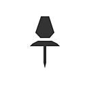

# 图形项目

图表项目是特殊对象，可帮助您组织图表、提高其可读性并加快浏览速度。

<table>
<tr style="border: 0;">
<td style="border: 0;" valign="top">

[{width="128px"}](../../../interface/the-graph-view/graph-items/dot-node/dot-node.md)

## 点节点（也称为门户）

</td>
<td style="border: 0;" valign="top">

[{width="128px"}](../../../interface/the-graph-view/graph-items/frame/frame.md)

## 取景框

</td>
</tr>
</table>

<table>
<tr style="border: 0;">
<td style="border: 0;" valign="top">

重新路由和合并连接，或将它们发送到另一个接收方Dot节点。

</td>
<td style="border: 0;" valign="top">

使用标签和颜色编码对节点进行分组，然后轻松移动它们。

</td>
</tr>
</table>

<table>
<tr style="border: 0;">
<td style="border: 0;" valign="top">

[{width="128px"}](../../../interface/the-graph-view/graph-items/comment/comment.md)

## 注释

</td>
<td style="border: 0;" valign="top">

[{width="128px"}](../../../interface/the-graph-view/graph-items/navigation-pin/navigation-pin.md)

## 固定

</td>
</tr>
</table>

<table>
<tr style="border: 0;">
<td style="border: 0;" valign="top">

为图表添加批注。

</td>
<td style="border: 0;" valign="top">

在图表中标记目标点，然后快速跳转到这些点。

</td>
</tr>
</table>
