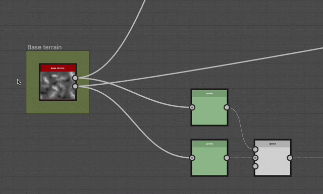

# 固定

<table>
<tr style="border: 0;">
<td width="25.00%" style="border: 0;" valign="top">

</td>
<td width="100.00%" style="border: 0;" valign="top">

大头针是一种助手，可让您在图形中的特定位置快速跳转。

您可以使用其<b>描述</b>属性设置自定义标签。

</td>
</tr>
</table>

## 创建大头针

可通过以下任一方式创建大头针：

+++节点菜单
按图形视图中的<b>空格键</b>打开<b>节点菜单</b>，然后在列表中选择“大头针”项。

在搜索字段中键入“大头针”，以显示项目并更快地找到它。

+++

+++快捷键
如果将键盘快捷键映射到[首选项](../../../../interface/preferences-window/preferences-window.md)中的“大头针”项，则在图形视图具有焦点时按该快捷键。

+++

+++上下文菜单
在图形视图中，在空白处按<b>RMB</b>并选择<b>添加大头针</b>选项。

+++

+++图形工具栏
在图形视图工具栏中，单击<b>节点调板</b>中的“大头针”按钮。

+++

+++库
在“库”中，选择<b>图形项目</b>类别，然后将“大头针”项目拖放到图形视图中。

+++

>[!TIP]
>
> 创建大头针后，其“描述”属性会自动获得焦点，以便您可以立即编辑大头针的文本。

## 跳转到大头针

在任何图形类型中，按<b>F2</b>键都会按创建顺序循环浏览该图形中的所有大头针。

大头针将在视口中以当前缩放级别取框。

