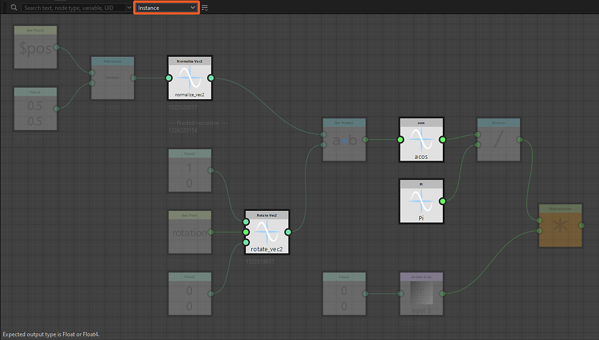
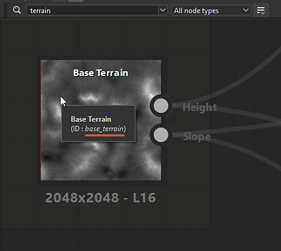

# 节点查找器

{zoomable="yes"}

节点查找器工具允许您使用文本查询执行<b>节点和变量</b>搜索。 所有与查询不匹配的节点将变暗，以使结果突出。

查询可以与以下任一条件匹配：

* 实例化引用的图形</b>的<b>标识符
* 在标识符参数函数中使用的公开参数或变量</b>的<b>节点
* 节点的<b>UID</b>（唯一标识符）
* 节点的<b>标签</b>

搜索可以递归遍历[图形实例](../../../compositing-graphs/creating-compositing-gra/graph-instances-sub-gra/graph-instances-sub-graphs.md)，以便可以在[子图](../../../compositing-graphs/creating-compositing-gra/graph-instances-sub-gra/graph-instances-sub-graphs.md)中找到节点和变量。 如果不确定需要搜索的确切术语，可使用模糊搜索选项将公差应用于查询。

## 界面

您可以通过两种方式访问Node Finder ：

在图形视图中，按<b>Ctrl+F</b> (Windows) / <b>Cmd+F</b> (macOS)以显示Node Finder工具栏并自动将焦点设置为查询字段。 这使您可以快速执行搜索。

在图形视图工具栏中，单击<b>“节点查找器”按钮</b>以显示“节点查找器”工具栏。 显示后，仅通过单击此按钮关闭工具栏。

<b>搜索遍历图形</b>。 换句话说，通过下列操作打开图形时，搜索将保持活动状态：

* 实例化：在上下文中打开引用(Ctrl+E / Cmd+E) （*注意：*&#x200B;需要在编辑>首选项>图形中启用在上下文中编辑图形功能）
* 像素处理器：编辑功能(Ctrl+E / Cmd+E)
* 值处理器：编辑功能(Ctrl+E / Cmd+E)
* FX-Map：编辑FX-Map图形(Ctrl+E / Cmd+E)
* 节点参数：编辑函数

{zoomable="yes"}

### 搜索查询

{zoomable="yes"}

可将搜索词键入此字段，箭头按钮可打开查询建议列表，其中包含当前上下文中可用的一些变量。

详细了解您可以在下面的[搜索查询](#search-query)部分中执行的查询。

### 节点类型

{zoomable="yes"}

使用此组合框可以筛选搜索结果，以便仅保留特定类型的节点。

请注意，所有实例节点都是&#x200B;*相同的节点类型*，实际上，是“实例”类型，而原子节点都是其自己的类型。

+++节点类型列表
该列表与当前图形类型相关联。

{zoomable="yes"}

*合成图形的节点类型*

{zoomable="yes"}

*函数图表的节点类型*

+++

+++搜索原子节点
{zoomable="yes"}

*在Substance图表中搜索“级别”节点类型*

+++

+++搜索实例节点
{zoomable="yes"}

*在Substance图形中搜索“实例”节点类型*

{zoomable="yes"}

*在Substance函数图中搜索“实例”节点类型*

+++

### 搜索选项

<table>
<tr style="border: 0;">
<td width="100.00%" style="border: 0;" valign="top">

使用<b>搜索选项按钮</b>可打开用于搜索的可打开和关闭设置的列表。

可在下面的搜索选项部分中了解有关这些选项的更多信息。

</td>
<td width="33.33%" style="border: 0;" valign="top">

{zoomable="yes"}

</td>
</tr>
</table>

## 搜索查询

要查找节点，文本查询与下面列出的节点属性进行匹配。

>[!NOTE]
>
> 键入查询时应注意以下注意事项：
> 
> * 搜索不区分大小写。 例如，“my node label”和“My Node Label”返回相同的结果。
> * 查询前后的空格将被忽略。
> * 无法在同一个图形中同时执行多个查询。 例如，“色阶模糊”不会同时匹配“色阶”和“模糊”节点。 同样，也不支持逻辑运算符。

<table>
<tr style="border: 0;">
<td width="100.00%" style="border: 0;" valign="top">

### 实例图形标识符

可以使用它们引用的图形的<b>标识符</b>找到[实例节点](../../../compositing-graphs/creating-compositing-gra/graph-instances-sub-gra/graph-instances-sub-graphs.md)。

</td>
<td width="33.33%" style="border: 0;" valign="top">

{zoomable="yes"}

*单击图像可放大*

</td>
</tr>
</table>

+++资源管理器中的标识符
图形在资源管理器中按其标识符列出。

{zoomable="yes"}

+++

+++实例节点的工具提示中的标识符
实例节点的工具提示包括它们参照图形的标识符。

{zoomable="yes"}

+++

<table>
<tr style="border: 0;">
<td width="100.00%" style="border: 0;" valign="top">

### 公开的参数和变量

可以直接搜索[公开参数](../../../compositing-graphs/manage-parameters/exposing-a-parameter/exposing-a-parameter.md)的标识符或任何其他变量。

</td>
<td width="33.33%" style="border: 0;" valign="top">

{zoomable="yes"}

*单击图像可放大*

</td>
</tr>
</table>

+++查询建议
查询字段可以展开，以显示建议列表。

其中包括可用于当前图形类型的[内置变量](../../../function-graphs/variables/system-variables/system-variables.md)，以及图形公开参数的标识符。

{zoomable="yes"}

也可以在[Substance图形属性](../../../compositing-graphs/graph-parameters/graph-parameters.md)中直接复制或编辑公开参数的标识符。

{zoomable="yes"}

*单击图像可放大*

+++

+++从控制台警告/错误中搜索变量
当某个图形具有由某个节点使用的<b>变量</b>引发的错误或警告时，请转到<b>Windows > Console</b>以显示完整的错误/警告消息，其中包含该变量。 然后，您可以将此变量复制并粘贴到Node Finder查询字段中，以快速找到导致问题的节点。

还可以使用任意文本编辑器直接从SBS文件中的XML数据复制变量。

{zoomable="yes"}

+++

+++获取/设置节点
在图形中搜索变量（包括公开的参数）时，搜索将突出显示所有节点，其中[Get](../../../function-graphs/nodes-reference-for-fun/atomic-function-nodes/get-nodes/get-nodes.md)或[Set](../../../function-graphs/fxmaps/using-functions-in-fxmaps/using-the-set-sequence/using-the-set-sequence-nodes.md)节点在任何节点的参数函数中使用该变量。

{zoomable="yes"}

+++

<table>
<tr style="border: 0;">
<td width="100.00%" style="border: 0;" valign="top">

### 节点UID

图形中的每个节点都有一个唯一的标识号(UID)，可用于搜索该节点。

</td>
<td width="33.33%" style="border: 0;" valign="top">

{zoomable="yes"}

*单击图像可放大*

</td>
</tr>
</table>

+++复制节点的UID
节点的UID可以从其上下文菜单复制到剪贴板。

该操作按以下格式复制UID：

uid=1234567890

{zoomable="yes"}

+++

+++从控制台搜索节点UID时出现警告/错误
如果图形存在节点引发的错误或警告，请转到Windows >控制台以显示完整的错误/警告消息，其中将包含节点的<b>UID</b>。 然后，您可以将此UID复制并粘贴到节点查找器查询字段中，以快速找到导致问题的节点。

还可以使用任何文本编辑器直接从SBS文件中的XML数据复制节点UID。

{zoomable="yes"}

+++

### 节点标签

还可以使用节点的标签查找节点。

在关闭模糊搜索的情况下使用特定节点的精确标签时，搜索特定节点特别有效。

## 搜索选项

<table>
<tr style="border: 0;">
<td width="100.00%" style="border: 0;" valign="top">

使用<b>搜索选项按钮</b>可以切换用于搜索节点的<b>递归</b>和<b>模糊</b>模式。

可以同时启用这两者。

</td>
<td width="33.33%" style="border: 0;" valign="top">

{zoomable="yes"}

</td>
</tr>
</table>

### 递归模式

启用此选项可使搜索遍历[图形实例](../../../compositing-graphs/creating-compositing-gra/graph-instances-sub-gra/graph-instances-sub-graphs.md)以包含来自[子图](../../../compositing-graphs/creating-compositing-gra/graph-instances-sub-gra/graph-instances-sub-graphs.md)的结果。

在对图形进行故障排除时，如果您需要根据从控制台中的警告或错误消息获取的UID查找节点，则此选项可能非常重要。

{zoomable="yes"}

*右侧的查询突出显示下面的实例节点，因为其左侧的引用图形与该查询匹配*

+++示例1
{zoomable="yes"}

实例节点引用多个节点与查询匹配的图形。

+++

+++示例2
{zoomable="yes"}

启用“递归搜索”选项将突出显示引用图表的实例节点，其中“像素处理器”节点使用与查询匹配的变量。

+++

### 模糊模式

如果不确定查询的准确拼写，此选项将在结果中启用<b>容差</b>。

请注意，使用此选项可能会导致不需要的匹配。

{zoomable="yes"}
