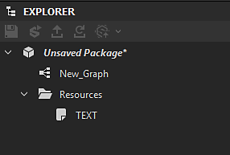

# 包元数据

包元数据是在包级别定义的文本（字符串）值的词典。 它在发布时包含在SBSAR中，是一种旨在供Python脚本使用的通用存储。

## 通过Designer界面显示和编辑元数据

如果您正在开发Python插件，则可能需要手动编辑元数据以供测试和调试之用。 具体操作方法如下：

1. 如果双击资源管理器中的某个包，则会打开此包上的“属性”面板。

   
1. 这里有一个专用部分“元数据”。 在您的情况下，它可能为空，如上面的捕获所示。

   您可以使用“加号”按钮添加新元数据。

   
1. 此部分中将显示一个新项目：

   
1. 有一个“键”字段和一个“值”字段。 两者都可以设置为任何适合您需要的内容。 “键”字段在列表中必须具有唯一值。

   
1. 还可以选择项目的“类型”。 目前，它可以是“字符串”或“URL”：

   
1. 此处“URL”表示对包中所含资源的引用。 为此，请在硬盘上选择一个文件，然后在资源管理器中将其拖放到包上。 它可以是常规资源（如图像），也可以是任何其他文件（如文本文件）。

   
1. 该文件在包中显示为新资源。

   现在，返回到“包属性”面板，创建一个新元数据，为其提供一个适当的密钥，然后选择“URL”作为类型。 然后选择“……” 按钮，然后选择“从资源”。 最后，选择您之前包含的文件，并验证：

   
1. 现在，您可以看到资源的“URL”存储在“值”字段中。

   您还可以使用项目右侧的“X”按钮删除元数据：

   

>[!NOTE]
>
> 移动或重新排序元数据条目被禁用：该顺序没有意义，并且在发布包时不会保留。

## 已发布的SBSAR文件中的元数据

在某些情况下，您可能需要检索在匹配的已发布SBSAR中的包上定义的元数据。 您可以在下面阅读元数据如何变换并存储在存档文件中，以及从中利用元数据的正确方法。

元数据根据JSON格式存储在名为/assemblies/content/0000/metadata.json的文件中（路径相对于.sbsar归档文件的根）。

常规（字符串）元数据是按原样存储的，例如“key”：“stringValue”，每行一个。 同样，各个密钥的原始顺序没有被保留，并且是定义的实现。 在流程中绝不要像普通的Python指令那样依赖订购！

由于URL元数据的目的是允许用户和插件在.sbsar存档中包含外来文件，因此它们需要进行特定的转换：首先，与存储的URL匹配的资源的文件将复制到存档中实现定义的位置(通常在编号的子文件夹中，该文件夹将仅包含此文件。 重点是避免名称冲突。) 该文件将保留其原始名称（此时将放弃资源的名称）。 然后，将写入归档中复制的文件相对于metadata.json的路径，而不是metadata.json中的原始URL。

如果我们导出在上一节中创建的示例包（使用某些输出创建至少一个图形后），则会获得以下存档内容：

```
myPackage.sbsar

|-- assemblies

        |-- content

            |-- 0000

                |-- New_Graph.sbsasm

                |-- New_Graph.xml

                |-- metadata.json

                |-- resources

                    |-- 0

                        |-- TEXT.txt
```


而metadata.json内容为：

```
{

    "myResource": "resources/0/TEXT.txt",

    "myText": "This is a text"

}
```


目前，没有提供特定的工具来访问存储在存档中的元数据和资源。 建议的方法是使用您选择的LZMA解码器打开存档文件，并使用常规JSON解析器解析metadata.json（如果键或值字符串包含一些花哨的字符，则会用JSON方式对其进行转义）。

>[!NOTE]
>
> 由于没有留下任何有关每个元数据是简单的字符串还是URL的信息，因此您必须了解您可能想要阅读的每个密钥的含义。
