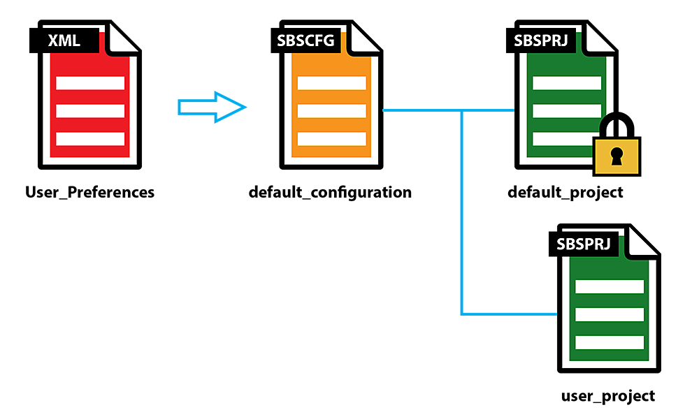

# 管道和项目配置

Substance 3D Designer拥有一套功能强大的系统，可配置应用程序以备管道使用。 通过分层的“**项目**”文件的高级系统，应用程序可以立即配置为Studio或Project标准，所有配置和库内容都受版本控制。 系统的主要目标是集中所有与管道相关的设置，但仍允许多个配置相互覆盖和扩展。

>[!WARNING]
>
> 此系统不适用于要求较简单的单个用户，而是适用于拥有大型项目和团队的&#x200B;*工作室*&#x200B;以及更高的组织需求。 为充分利用该系统，建议进行充分的规划和准备，以及一定程度的自动化设置！

<table>
<tr style="border: 0;">
<td style="border: 0;" valign="top">

## 配置文件层次结构

Designer有3个级别或配置文件，每个级别都有不同的用途。 对于Windows，所有文件都位于&#x200B;*~User\AppData\Local\Adobe\Adobe Substance 3D Designer.*

新安装完成后，此图像说明了Designer默认设置中不同文件之间的关系。

</td>
<td style="border: 0;" valign="top">

</td>
</tr>
</table>

* <b>[User\_Preferences.XML](../pipeline-and-project-con/user-preferences-aut/user-preferences-automating-setup.md)</b>包含常规程序设置，其中除一项之外的所有设置都与项目管道无关。 此文件是唯一的，无法交换，Designer经过硬编码以使用此精确文件。\
  它包含一个对配置文件的引用。
* <b>[Default\_Configuration.SBSCFG](../pipeline-and-project-con/configuration-list-sbscfg/configuration-list-sbscfg.md)</b>可以替换其他具有不同名称的SBSCFG文件，但同一时间只能使用一个SBSCFG文件。\
  它包含对项目文件的多个引用。 *请注意，对于默认配置，这些文件没有明确定义，而是硬编码！*
* <b>[Project.SBSPRJ](../pipeline-and-project-con/project-configuration-fil/project-configuration-files-sbsprj.md)</b>文件包含项目/管道相关设置。 可以在层次结构中定义多个项目，覆盖或扩展以前定义的项目。

## Designer管道设置

本页子页上将详细介绍每种类型的文件，但有关如何理想地定义Designer自定义设置的简要概述如下：

1. <b>识别并分组要添加到项目文件中的设置。</b> 每个工作室的情况都不相同，需要一定程度的规划！\
   几乎在每种情况下，至少应定义2个项目：一个项目用于全局、全工作室范围的默认值（如标准模板、着色器文件、烘焙设置），另一个项目具有更具体的内容，如库内容。 如果同时运行了不同的项目，则可能需要为每个项目创建多个项目配置（总共3个或更多）。
1. <b>创建相关的[SBSPRJ文件](../pipeline-and-project-con/project-configuration-fil/project-configuration-files-sbsprj.md)并将它们及其内容置于版本控制下。</b> 强烈建议通过为实际项目内容和资源（3D模型、纹理、代码）创建&#x200B;*单独的存储库*，将Designer管道和库内容与其分离。
1. <b>创建列出所有项目文件的[ SBSCFG配置](../pipeline-and-project-con/configuration-list-sbscfg/configuration-list-sbscfg.md)文件，并将其置于版本控制下</b>。 如果您有多个项目，则可以为每个项目创建一个配置。
1. <b>设置每个用户的[User\_Preferences.xml](../pipeline-and-project-con/user-preferences-aut/user-preferences-automating-setup.md)以引用其相关配置文件。</b>\
   您可以让每个用户手动执行此操作，也可以通过向其XML文件中插入行来编写脚本。 [有关相关页面的更多信息](../pipeline-and-project-con/user-preferences-aut/user-preferences-automating-setup.md)。
