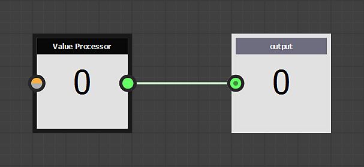
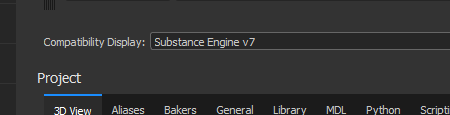
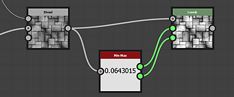

# 版本2019.1 (9.1)

**Substance Designer2019.1**&#x200B;对Substance 引擎进行了新更新，以进一步扩展其功能并添加了新过滤器。

## 主要功能

### 新值处理器节点

该Substance 引擎现在处于版本7，随着其推出，合成图表中引入了“值”的新概念。 值是数值，而不是纹理，因此可用于执行可通过函数图表和合成图表在节点间共享的各种计算。 值处理器节点可以读取输入图像并计算单个输出值。

“价值处理器”节点并不是唯一的一个，它能够在图表间传输信息已进行了一些更改和添加：

* 输出节点可以直接输入值，而不必再输入图像。

  
* 已添加名为“输入值”的新&#x200B;**输入节点**，以便图形可以查询值。

  
* 节点现在在其参数下有一个名为“输入值”的新类别，可用于创建节点自身的输入值。\
  然后可以通过“Get”节点在函数图内引用输入值。

  

>[!NOTE]
>
> 与每次主要Substance 引擎更改一样，兼容性模式设置为以前的版本（默认情况下为新版本6）。 这意味着不兼容的节点在图中将有一个黄色边框。 要禁用/隐藏黄色边框，只需将主要设置中的引擎版本更改为最新版本（通过项目设置） ：
> 
> 

### 在Bakers中支持Optix

Substance Designer的最新更新引入了DXR，允许在兼容RTX的硬件上执行GPU 射线追踪。 现在，我们增加了对[Optix](https://developer.nvidia.com/optix)的支持，允许在Linux环境下，在其他Nvidia的GPU上进行光线追踪。 使用Optix时，烘焙速度预计至少比常规CPU光线追踪快&#x200B;**5倍**。

以下是受此更改影响的面包师列表：

* 来自网格的环境遮蔽
* 从网格弯曲法线
* 从网格Thickness

如果要禁用两个后端之一，请前往主要首选项（**编辑>首选项**）和面包师设置：

>[!NOTE]
>
> 要访问该功能，请确保&#x200B;**更新到以下驱动程序** ：
> 
> * Nvidia 10XX和20XX GPU ：**驱动程序430.39**（与DXR和Optix兼容）
> * Nvidia 9XX及更早版本： **d** **rivers 419.67或430.39**（驱动程序425.31存在Optix问题）
> 
> 请注意，DXR也可用于[GeForce GTX 10xx GPU](https://www.nvidia.com/en-us/geforce/news/geforce-gtx-dxr-ray-tracing-available-now/)（带有最新驱动程序）。 DXR还要求Windows为最新版本才能工作，有关详细信息，请参阅[此页面](../../../best-practices/performance-optimization/performance-optimization-guidelines.md)。

### 改进了OBJ网格的加载时间

在此版本中，我们改进了&#x200B;**obj**&#x200B;文件阅读器以减少3D网格的加载时间。 加载时间已加快到3倍，尤其是对于未定义UV和法线的网格。

此性能改进将同时影响Bakers视图和3D视图。

### 改进的Python增效工具系统

经过此次更新，我们在脚本系统中添加了许多新功能：

* **支持Qt** ：允许按照应用程序其余部分的相同样式生成自定义UI。 自定义UI也可以更轻松地与这个新系统集成。 （Tkinter现已弃用。）
* **回调函数** ：现在可以注册回调函数。 目前，它仅包括打开和保存文件以及创建UI元素。 将来会添加其他回电。
* **线程** ：插件现在可以创建线程以进行后台处理或等待OS事件（例如网络连接）。

有关更多详细信息，请查看API的更改日志，可以通过Substance Designer内的&#x200B;**帮助> Python API文档**&#x200B;菜单项访问该日志。

### 新内容

在默认库中，我们还有几个新的节点可用，其中一些现在使用新的值处理器节点供电：

* **索引Flood Fill**\
  为Flood Fill节点中的形状指定一个唯一的索引。\
  在下面的示例中，像素处理器节点将“值输入”与形状进行匹配，并输出蒙版。

  
* **Non Uniform Directional Warp**\
  应用方向变形，其中强度和角度从图像输入采样。

  
* **多方向变形**\
  将输入图像多次变形到各个方向。

  
* **高度挤出**\
  生成给定Height的正交3D渲染。 使用位置小工具可控制相机视角。

  
* **最小/最大值**\
  从输入图像返回最小和最大像素值。

  

>[!WARNING]
>
> 此版本不再支持CentOS 6.x。 要使用最新版本的Substance Designer，请升级到CentOS 7.x。

## 发行说明

### 2019.1.3

*（2019年8月19日发布）*

**已修复：**

* [烘焙]当烘焙输出的长宽比和倾斜映射不匹配时，DXR崩溃
* [烘焙师]使用法线映射时，“来自网格的环境遮蔽”烘焙师在Optix或DXR中输出错误的结果
* [烘焙]使用“每个顶点”设置时，“曲率”烘焙器输出错误的结果
* [Bakers]错误消息表明后端失败，而不是错误的原因
* [面包师]处理没有高多边形网格的细节地图面包师时崩溃
* [面包师]倾斜映射似乎不会影响启用了DXR的所有输出
* [内容] mg\_leaks：参数名称中出现拼写错误
* [内容] “形状”返回烹饪警告
* [内容]多边形1和2不支持随机函数
* [内容]多边形1和2的边数可以少于3个
* [Content] “正常Height色调”在非方形中无法正常使用
* [Parameters]整数输入参数：下拉列表不显示值

### 2019.1.2

*（2019年7月2日发布）*

**已修复：**

* [3D视图]启用字段深度的3D视图导出看起来不正确
* [3D视图]使用“存储渲染”时PSD图像的Alpha通道错误
* [3D视图]将存储渲染选项与Iray一起使用时，PNG和PSD损坏
* [3D视图] dds格式在保存渲染时不起作用
* [Graph]以特定方式结合右键和左键拖动时，节点发生偏移
* [Graph]修改函数实例不再更新节点结果
* [Graph]显示空格键菜单时崩溃
* [内容]形状凸出：形状没有旋转时的质量问题
* [内容]没有H和V拼贴，形状投影（和灰度）不会生成阴影
* [内容]材质裁剪正常问题
* [烘焙师]未正确加载JSON烘焙师预设
* [烘焙师]使用Optix或DXR烘焙重度网格时崩溃（现在可能会因Vram不足而失败，但不会崩溃）
* [位图编辑器]位图绘画工具在描边定界框中偏移描边并重新绘制
* [位图编辑器]位图绘画工具在OSX中损坏
* [UI]某些按钮的菜单几乎无法访问
* [UI]拖放面包机实例时崩溃
* [SVG]嵌入式SVG编辑工具不可靠
* [参数]在SBSAR实例中应用带有布尔型参数的预设时崩溃
* [网络]在SSL加密连接中发生错误时有时会崩溃

### 2019.1.1

*（2019年5月28日发布）*

**已添加：**

* [PythonIntegration]保存和恢复插件管理器状态
* [首选项]&#x200B;[依赖项]添加一个选项以确定依赖项文件路径的存储方式
* [内容]Flood Fill映射器：添加“适合形状框”选项

**已修复：**

* [Content]Flood Fill映射器：“旋转自动缩放”的效果恰好相反
* [Content] “Flood Fill映射器颜色”未使用“luminance\_offset\_map”输入
* [Content] “Flood Fill映射器灰度”节点生成步进伪像
* [Content]无法发布高度挤出
* [参数]在Designer中未加载sbsar中的嵌入预设
* [面包师]面包师姓名在面包师列表中显示不正确
* [3D视图]“在3D视图中查看输出”对值不起作用
* [Cooker]更正错误的参数类型时崩溃
* [API] SDResource.setInputPropertyFromId函数对SDSBSCompGraph输入参数不起作用
* [更新程序]部分SBS无法在2019年更新
* [资源管理器]导入特定的.obj文件时崩溃
* [PythonIntegration]初始化PYTHONPATH时，Windows上的反斜杠未正确转义
* [UI]面包机中某些滑块的值问题
* [Linux] Designer无法在CentOS &lt; 7.6上运行

### 2019.1

*（2019年5月9日发布）*

**已添加：**

* [API]将“updatePackages”参数添加到SDPackageMGR.loadUserPackage()方法，以控制是否应在加载时应用更新程序
* [API]添加断开连接SDConnection的功能
* [API]添加类SDSBSARExporter以发布SDPackage
* [API]添加SDHistoryUtils类以管理无法执行的命令
* [API]在Substance合成图中添加灰度输入节点定义(sbs：:compositing:：input\_grayscale)
* [API]在Substance合成图中添加值输入节点定义(sbs：:compositing:：input\_value)
* [API]添加SDProperty.isFunctionOnly()方法
* [API]在SDSBSCompNode上添加对自定义输入参数的支持
* [API]将“reloadIfModified”参数添加到SDPackageMGR.loadUserPackage()方法，以控制包在修改后是否被重新加载
* [API]添加SDPackageMgr.getPackages()方法
* [API]添加从SDModuleMgr获取/添加/删除根路径的可能性
* [API]允许获取SDTexture像素缓冲区的指针和音调
* [API]允许检索主窗口的指针
* [API]允许在主菜单中创建自定义菜单
* [API]允许在主窗口中创建自定义DockWidget
* [API]使用对象名称查找工具栏中的菜单
* [API]提供系统以管理针对API的应用程序通知
* [PythonIntegration]添加默认环境变量以查找Python插件
* [PythonIntegration]添加文本搜索并替换到Python编辑器
* [PythonIntegration]启动时实例化Python插件
* [PythonIntegration]将PYTHONPATH环境变量考虑在内
* [PythonIntegration]允许在图表小组件中创建工具栏
* [PythonIntegration]支持Python线程
* [PythonIntegration]添加插件管理器（在“工具”菜单中）
* [内容]法线矢量旋转：添加可选的图像输入以驱动角度
* [内容]新的最小/最大过滤器
* [内容]新的“索引Flood Fill”过滤器
* [内容]新的“Flood Fill映射器”过滤器
* [内容]新建Atlas Splitter过滤器
* [内容]改进三平面滤波器
* [内容]新建Non Uniform Directional Warp过滤器
* [内容]新的多方向变形
* [内容]新建高度挤出过滤器
* [引擎] Fxmap：新的“具有偏移的渐变”模式
* [引擎]支持统一值处理（新值处理器节点）
* [3D View]&#x200B;[Bakers]改进OBJ加载器性能
* [3D视图]增加相机剪辑平面的距离
* [首选项]添加面包师的设置
* [Graph]通过避免字符串比较而更快地失效
* [MDL]支持MDL阵列
* [UI]引擎选择用户界面改进
* [IRay]升级到IRay SDK 2018.1.4
* [依赖关系管理器]在重新定位资源时使用“最后路径”
* [烹饪]在sbsar中添加布尔标签支持
* 集成Qt 5.12.2

**已修复：**

* [图形]更改输入名称时，连接中断
* [图表]调整参数时触发的无效验证过多
* [图表]如果我们右键单击徽章，则“复制到剪贴板”操作不起作用
* [图表]使用Alt移动帧不会存储在.sbs中
* [MDL]颜色配置文件未在MDL编辑器中自动更新
* [MDL]导出包含特定设置的模块时崩溃
* [MDL]无法导出包含LightProfile或MBSDF资源的MDL图形
* [UI]快捷键不再显示在上下文菜单中
* [UI]重新启动后，浮动窗口变为可停靠
* [脚本]“取消”选项在Python编辑器中不起作用
* [脚本]“保存”菜单中的“全选”选项不起作用
* 复制后[参数]下拉列表无法正确显示
* [Explorer]默认情况下，重新定位资源应打开最后一个重新定位的路径
* [Library]从一个版本切换到另一个版本时，始终重新生成库的内容
* [库]导入的位图在保存时失效
* [IRay]切空间计算不正确/法线映射不正确
* [函数]从所选对象创建新图表时崩溃或失败
* [API]未定义属性的默认值
