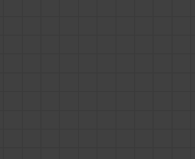
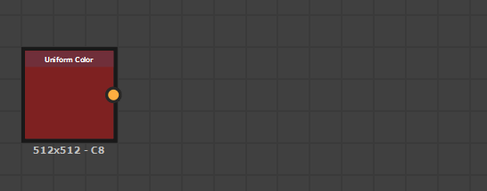
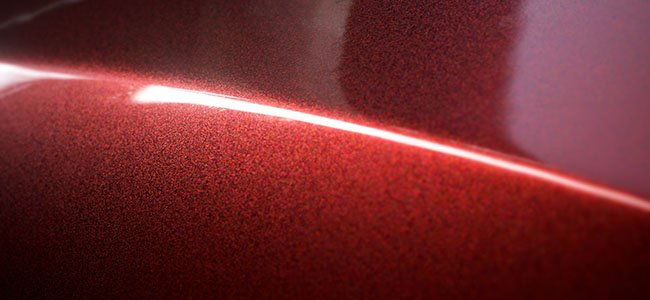

# 版本2019.2 (9.2)

**Substance Designer2019.2**&#x200B;提供了新的“点”节点、HDR筛选器和强大的优化。

## 主要功能

### 新建点节点

“点”节点是一个等待已久的请求。 它的用途是重定向节点之间的连接以重新组织图形。 与之前的重定向点相反，该点可以累积链接，并且不会在连接断开时消失。

若要了解有关点节点的更多信息，请参阅[图形项](../../../interface/the-graph-view/graph-items/graph-items.md)页面。

### 改进了节点创建菜单

按“空格键”时显示的“节点创建”菜单现在可以定义您的收藏夹并将其优先列出。 菜单周围还添加了一些新行为，使其更易于使用。

* **首先显示收藏夹**\
  单击文本字段旁边的图标时，可以先启用或禁用收藏夹列表。

  
* **添加或删除收藏夹**\
  显示收藏夹时，您可以单击节点名称旁边的图标，在列表中添加或删除节点。\
  （也可以在“库”窗口中直接管理收藏夹。）

  
* **从节点中单击并拖动链接时打开菜单**\
  现在，单击并拖动节点连接并松开鼠标时，它将打开“节点创建”菜单。 随后创建的节点将连接到该链接。 列表中可用的节点将取决于传入连接。

### 实时渲染器的新技术

已改进Substance Designer的实时视口以支持新的渲染功能：**各向异性**、**涂层**&#x200B;和&#x200B;**次表面散射**。 这些功能引入的所有新通道和用法也与Iray兼容。

* **各向异性**\
  各向异性是一个属性，它定义反射在给定方向上应如何表现。 它通常用于特定材料类型，如头发和拉丝金属。\
  要创建各向异性材料，图形中需要两个输出，用途如下：

  * **各向异性角度**：定义各向异性方向。 从黑到白再到循环。
  * **各向异性级别**：定义各向异性强度。 建议的值为0.9至0.98（灰度）。

  注意：所有默认PBR着色器都支持各向异性。

  {width="400px"}
* **涂层**\
  涂层允许在基础材质上方限定第二材料层。 可用于模拟汽车油漆或金属表面的薄膜。\
  要创建涂层材料，您可以使用新Substance模板“PBR Coated（金属/粗糙度）”或在图形中添加以下输出：

  * **涂层重量**：涂层的不透明度。
  * **coatSpecularLevel**：涂层的Specular level。
  * **coatColor**：涂层的颜色。
  * **coatNormal**：对于涂层为正常。
  * **涂层粗糙度**：涂层的粗糙度。

  注意：涂层需要使用新的着色器“physically\_metallic\_roughness\_coated”。

  {width="400px"}
* **次表面散射**\
  次表面散射模拟光线在材料内的吸收和扩散。 它对模拟皮肤和其它有机表面非常有用。\
  要创建子表面材料，您可以使用新Substance模板“PBR子表面散射（金属/粗糙度）”或将以下输出添加到图形中：

  * **散射**：控制光线在素材内扩散的强度。

  注意：子表面需要新的着色器“physically\_metallic\_roughness\_sss” 。 散射颜色可由着色器参数控制。

  {width="400px"}

>[!NOTE]
>
> 所有这些新的渲染功能之所以成为可能，要归功于着色器Substance Designer系统的重新设计。 我们的&#x200B;**GLSLFX**&#x200B;格式现在支持“**技术**”的定义，该定义允许多次渲染。 有关一些示例，请查看我们在&#x200B;**Substance Designer/资源/view3d/shaders**&#x200B;中提供的默认着色器

### 改进了性能

对Substance引擎进行了一些改进（跳转到7.2.0版），这在以下几种情况下是有益的：

* **缓存图形计算以加快微调**\
  通过添加新的缓存系统，图形渲染得到了改进。 这使得调整图表的速度比以前快得多，因为我们现在跳过未更改的节点。
* **改进了库加载时间**\
  由于新的烹饪优化和解码速度的提高，库的加载得到了很大改进。 库生成速度现在提高2到8倍。

### HDR滤镜的新内容

在此新版本中，我们引入了许多专用于处理HDR环境地图的新滤镜。

* **HDR合并**:Bring&#x200B;多张LDR（低动态范围）照片以创建一个HDR图像。
* **Nadir Patch**:This&#x200B;节点允许您在考虑球面变形的情况下克隆/修补HDRI的地面部分。
* **Nadir Extract**：此节点可以从HDRI中提取纹理。 它可用于映射3D场景中的地面纹理。
* **Color Temperature Adjustment**：调整输入图像的色温，包括支持HDR值。
* **拉直水平线**：旋转环境图的经纬度。 根据拍摄条件，生成的360°全景图可能不是直的。
* **物理太阳和天空**：此节点是Hosek-Wilkie Skylight模型的实现。 指定太阳位置，它将生成物理上精确的天空全景图。
* **平面光**：生成类似于3D形状的矩形光。 可在2D视图中更改其位置，应用纹理，并使用色温或RGB值设置颜色。
* **线光**：生成线形光，并更改其在2D视图中的位置。 除了专门为霓虹灯等细长形状设计的选项之外，它还有与平面光类似的选项。
* **球面光**：生成球面光，并使用2D视图小工具更改其位置。 您还可以应用球形纹理来创建遥远的行星。

所有新的[HDRI 工具](../../../compositing-graphs/nodes-reference-for-com/node-library/3d-view-library/hdri-tools/hdri-tools.md)都记录在[节点库部分](../../../compositing-graphs/nodes-reference-for-com/node-library/node-library.md)中。

## 发行说明

### 2019.2.3

*（2019年11月26日发布）*

**已修复：**

* [Bakers]使用包含无效链接的倾斜映射资源进行生成时崩溃
* [烘焙师] Embree未考虑0以外的UV集
* [Bakers] “Bent Normals from Mesh”（从网格弯曲法线）在DXR上使用0以外的UV集输出错误结果
* [烘焙]重新打开烘焙窗口时，“UV设置”参数被重置为“0”值
* [烘焙师]“位置”输出的UV集不是0的黑色图像
* [内容]智能自动磁贴：8k中的采样问题
* [Content]Atlas Splitter：在某些情况下，形状检测会失败，应显示精度参数
* [内容]在某些情况下，Pow无法返回正确的值
* [内容]索引Flood Fill：发布到sbsar时结果不正确
* [库]加载会话的第一个SBS包时崩溃
* [库]对于直接导入到“资源管理器”面板的资源，将忽略“在库中默认显示资源”设置
* [控制台]使用节点菜单时，控制台中出现意外消息
* [Parameters]无法删除“输出用法”列表中的单个条目
* [3DView]在磁盘上修改场景文件时未正确重新加载场景[图形]使用“值”输出时，节点菜单过滤不正确

**已添加：**

* [MacOS]对软件进行公证，以遵循新的MacOS Catalina分发要求

### 2019.2.2

*（2019年10月23日发布）*

**已修复：**

* [Graph]使用“值”输出时，“节点”菜单过滤不正确
* [Graph]显示节点菜单时崩溃
* [图表]使用Shift快捷键时出现搜索工具
* [Graph]从值输入连接器连续生成节点菜单时崩溃
* [Graph]将裁剪包含长字符串的注释
* [Graph]使用“从连接器拖动”菜单创建节点时，流突出显示不正确
* [图表]在加载其他图表时从场景中删除所有图表项时崩溃
* [Graph]在使用click and drag from connector时，使用创建节点时崩溃
* [Graph]使用“节点查找器”工具时崩溃
* [图表]在“材质紧凑”模式下输出管脚颜色不正确
* [Cooker]多输出节点下游的节点未正确更新
* [Cooker]值输出和直通节点的问题
* [Cooker]仅使用“Get”节点时，值处理器输出错误结果
* [Content] “Contrast/Luminosity”节点输出1.0的Alpha值
* [内容]“Studio全景图”模板没有描述
* [内容]索引Flood Fill：当输入包含环绕形状时，结果不正确
* [内容] “HDR合并”：内部曝光度计算不正确
* [点节点]使用级别和点节点时崩溃
* [依赖关系管理器]“转到”操作不再有效
* [PSD]撤消删除PSD导出程序中包含的多个节点时崩溃
* [UI]使用“窗口”菜单关闭图形并在固定一个图形时再次打开图形时崩溃
* [渐变编辑器]“移除键”按钮过大
* [Engine] sqrt() acos()和asin()出现精度问题
* [面包师]网格中的AO：“扩散角度”滑块在调整时的值范围不正确

### 2019.2.1

*（2019年9月20日发布）*

**已添加：**

* [模板]将默认输入节点添加到Specular/光泽度和其他模板
* [模板]添加PBR各向异性模板
* [3D视图]增加自动剪切平面的远距离
* [3D视图] PBR Coated：更改Coat常规继承的默认值
* [内容]Atlas Splitter：为“自动裁剪”功能添加选项
* [节点菜单]不筛选没有输入的节点

**已修复：**

* [Content]Atlas Splitter：使用“自动裁剪”选项时，某些输出未正确裁剪
* [Content]材质Height混合：与不存在参数相关的烹饪错误
* [内容]“平面光”：图案UV模式无法正常工作
* [Content] “Height到正常世界单位”：输入被强制为16位
* [Content]如果在小形状上未平铺使用angular“Bevel”节点，则出现意外形状
* [库] sbsar的图标在库中不可见
* [库]使用“\”过滤URL不再有效
* [库]筛选器值区分大小写
* [库]选中“合成”后，搜索过滤器不起作用
* [Bakers]双击特定单元格并取消更改会将其恢复为不正确的值
* [烘焙]烘焙器窗口中的后端状态文本始终显示“GPU加速：启用”
* [Cooker]在图表中处理“冒名顶替”依赖项时崩溃
* [Cooker]使用值时灰度转换的输出大小错误
* [Explorer]处理“共享时启用Publish”时崩溃
* [Graph]打开特定包时崩溃
* [MDL]使用强制转换运算符时崩溃
* [模板]输出标识符在PBR涂层模板中不正确

### 2019.2

*（2019年8月29日发布）*

**已添加：**

* [内容]新的“全景光”形状
* [内容]新的“全景Nadir Patch滤镜”
* [内容]新的“全景Nadir Extract”滤镜
* [内容]新的“全景拉直地平线”滤镜
* [内容]新的“全景旋转”滤镜
* [内容]新的“全景位置”节点
* [内容]新的“全景物理太阳和天空”节点
* [内容]新的“全景渐变”节点
* [内容]新的“HDR合并”滤镜
* [内容]新的“HDR预览”滤镜
* [内容]新的“Color Temperature Adjustment”过滤器
* [内容]新的“Blackbody”节点
* [内容]新的“曝光度”滤镜
* [UI]节点创建菜单：在菜单中显示和管理收藏夹
* [UI]从“节点创建”菜单中添加/删除收藏夹中的节点
* [UI]节点创建菜单：从输出单击/拖动链接时生成菜单
* [UI]节点创建菜单：根据当前选择类型筛选内容
* [3D View]支持各向异性
* [3D视图]支持涂层效果
* [3D视图]支持次表面散射
* [图形]点节点
* [图形]通过缓存烹饪结果来优化图形渲染
* [首选项]将“烹饪大小限制”默认值更改为8192
* [首选项]添加切换开关以打开/关闭新的“Tab”键功能
* [API]添加SDResource.getPackage()方法
* [Iray]更新至NVIDIA Iray RTX 2019.1.3 SDK (317500.3714)
* [资源管理器]允许将任何类型的文件作为资源链接到包中
* [GradientNode]按ESC可取消渐变选取
* [参数]删除标识符上的自动大写
* [Project]添加一个选项，以指定图形和资源在默认情况下是否为“在库中可见”
* [预设]自动固定修改的参数

**已修复：**

* [MDL]由于参数类型问题，无法导出模块
* [MDL]加载时公开的int不可见
* [MDL]导出MDL期间发生崩溃
* [MDL]修改材料表面节点的颜色时崩溃
* [MDL] void MDLGraphNodeControllerSelector：：updateSelectorCurrentMember(const DataMessage&amp; msg)已损坏
* [图表]图表显示中的链接Thickness不正确
* [图表]调整参数时触发的无效验证过多
* [Graph]在打开包的两个窗口的情况下关闭包并使用上下文编辑时发生崩溃
* [函数图表]关闭函数视图时未显示警告
* [3D视图]将相机投影设置为“正交”作为默认场景状态时，3D视图初始化时崩溃
* [3D视图]后FX DOF在Iray中保持启用状态
* [2D视图]更改画笔大小时画笔选区窗口消失
* [2D视图]信息面板：使用特定布局裁切值
* [2D视图]最小化并恢复主窗口时，图像发生偏移
* [Bakers] “来自资源”选择列表未正确筛选
* [Bakers]在Embree上链接“网格的颜色图”和“网格的法线图”面包时发生崩溃
* [烘焙]每个顶点的曲率会导致严重的伪影
* [Explorer]无法导入UDIM资源，无法将其拖放到资源管理器中
* [Explorer]链接异常文件格式后链接网格和字体时，“资源管理器”窗口未正确过滤
* [资源管理器]当图形的“在库中显示”设置为“否”时，资源可见
* [内容]“电源”和“夹紧”输入顺序不正确
* [内容]未标记“RGBA合并”节点输入
* [Cooker]数值的连接仍然无效
* [Cooker]将图像输入连接到输入值时断言
* [UI]在某些情况下，鼠标光标会停滞在“调整大小”状态
* [UI]在Linux上，包视图中的右键单击无法显示正确的菜单
* [依赖项]临时资源的文件路径不正确
* [依赖项]重新定位后，缺少位图资源的警告将保持活动状态
* [库]未生成某些缩略图
* [库]在库中显示MDL文件
* [参数]公开参数时崩溃
* [参数]在下拉列表中重新创建新元素后崩溃
* [导出] 8K批量导出失败
* [预设]应用涉及SBS实例中的布尔运算的预设时崩溃
* [脚本]使用“ — quit”命令行参数时，“欢迎”屏幕仍然出现
