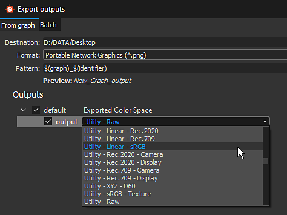

# 版本2019.3 (9.3)

**Substance Designer2019.3**&#x200B;引入了色彩管理，它支持OpenColorIO、改进的Baker更新和新的Atlas Scatter节点。

发行日期：*2019年12月19日*

## 主要功能

### 色彩管理和OpenColorIO支持

Substance Designer现在支持色彩管理，它允许您控制如何解释和变换颜色。 此功能支持[OpenColorIO](https://opencolorio.org/)，后者是娱乐和VFX行业中广泛使用的色彩管理系统。

* **在主设置中设置色彩管理**\
  默认情况下，Substance Designer将设置为“旧版”模式，这意味着它不会加载任何特定配置，并将像以前一样继续工作。 例如，要切换到OpenColorIO，只需转到主要设置，然后在项目设置中对其进行配置和启用。

  {width="600px"}
* **色彩管理以3种不同的方式应用**\
  应用程序的不同部分会收到具有不同含义的色彩管理：

  * **2D和3D 视图**\
    实时opengl视口和Iray都可以进行色彩管理。 这允许您在上下文中预览材料和纹理效果。 可通过专用下拉菜单轻松切换颜色配置文件。 还可以在线性灰度系数中显示视图以在没有颜色校正的情况下进行预览。

    {width="400px"}

    {width="400px"}
  * **图形的输入和输出以及位图导出**\
    在图形的入口和出口处读取和写入位图图像时，色彩管理可以调整图像并将其转换为在适当条件下工作。 这可以在图形中的位图主首选项中控制，并在导出过程中在导出对话框中修改。 从2D 视图中保存图像还将提供一种选择色彩空间的方法。

    {width="400px"}

    {width="505px"}

### 从Baker新建弯曲

已从Baker重新创建弯曲。 它现在利用允许GPU加速的射线追踪，但也增加了对网格交叉点的支持。

有关详细信息，请参阅网格](https://experienceleague.adobe.com/en/docs/substance-3d/bakers/bakers-settings/curvature-from-mesh)文档中的[弯曲。

>[!NOTE]
>
> 以前从Baker进行的弯曲现已弃用。 我们建议切换到新版本。

### 改进了Baker中的Ambient occlusion

“从Ambient occlusion”Baker现在有一个名为“地面平面”的新设置，它模拟网格下的平面以生成地面遮蔽。 这有助于为静态几何或非有机对象生成更有趣的外观效果。 默认情况下，地面平面位于网格定界框的底部，但可通过专用设置进一步推动。

有关详细信息，请参阅网格](https://experienceleague.adobe.com/en/docs/substance-3d/bakers/bakers-settings/ambient-occlusion-from-mesh)文档中的[Ambient occlusion。

### 改进的属性和预设编辑器

改进了属性编辑器和预设编辑器：

* **更快的预览模式**\
  现在，编辑图形参数时切换到预览模式的速度快得多，特别是在具有许多公开参数的图形上。 预览模式现在是一个专用的选项卡，可简化参数编辑器与其预览之间的来回切换。
* **已修改预设编辑器**\
  现在，在Substance Designer中管理预设的方式更加简单快捷：预设编辑器现在有一个专用的选项卡，每个预设现在列出它们影响的参数。
* **可视条件现在考虑了2D变换小工具**\
  当变换2D Gizmo具有可见条件时，现在可以在2D 视图中将其隐藏，使其与参数相关联。

### 新内容

在此版本中，我们引入了新的&#x200B;**Atlas Scatter**&#x200B;节点。 该节点允许读取地图集图像（包含子图像的图像）并自动将其内容分离成可随机散布的单个分量。 例如，此节点可用于在地面材料上放置分支和树叶。 [Substance Source](https://source.substance3d.com/allassets?q=atlas)现在包括许多Atlas材料，它们可以散布在此新节点中。

>[!WARNING]
>
> 此版本不再支持CentOS 6.x。\
> 在CentOS 7.x上，应用程序可能由于某些依赖项问题而无法启动，若要解决此问题，请更新系统或复制安装文件夹中的[以下库](https://centos.pkgs.org/7/centos-x86_64/freetype-2.8-12.el7.x86_64.rpm.html)。

## 发行说明

### 2019.3.3

*（2020年2月14日发布）*

**已添加：**

* [批处理工具]使用批处理工具发送默认OCIO配置文件

**已修复：**

* [内容]Atlas Scatter：在某些情况下，使用随机颜色/正常颜色时出现问题

### 2019.3.2

*（2020年2月4日发布）*

**已添加：**

* [SBSRender]添加色彩管理支持

**已修复：**

* [内容]线性sRGB到ACEScg节点：I/O标签不正确
* [内容] ACEScg到sRGB节点：输出标签不正确
* [内容]全景光照节点：调整温度范围
* [图表]在处于“In-Context Editing”活动状态的嵌套图表中进行微调时，性能严重下降并冻结
* [Graph]在FX-Map中删除多个节点时崩溃
* [性能]Designer的流程在退出后可能会继续运行

### 2019.3.1

*（2020年1月27日发布）*

**已修复：**

* [图形]在激活“In-Context Editing”的情况下调整嵌套图形时，性能严重下降并冻结
* [Graph]无法在Integer1 tweak中输入除[0， 99]之外的枚举值
* [图表]置换相应的帧时不会移动注释
* [Graph]自定义实例节点上缺少输入名称
* [图形]即使在“首选项”中禁用了相应的选项，加载图形时也可能会渲染缩览图
* [2D视图]无论显示选项如何，负Alpha均显示棋盘格
* [2D视图]从32f到8位的表面转换失败，显示较高的值
* [2D View] Top/left skew和Make Square将某些坐标设置为正向变换矩阵中的巨大值
* [2D视图]除“0”之外，所有网格对象的UV均不会显示在UV集上
* [Content]斜面：Angular模式无法正确用于拼贴蒙版
* [Content]Flood Fill到渐变：斜率图像值未在形状的中间采样
* [Content]函数；“Equality Boolean”损坏
* [烘焙]在特定情况下在“网格曲率”烘焙器中使用自动色调映射时出现伪像
* [烘焙]在未选择任何材质的情况下进行烘焙时DXR崩溃
* [Bakers]启用“信息”时，2D视图中的性能问题
* [Engine]在SSE2引擎上使用极低的输入值和高的指数时，“Pow”函数输出巨大的值
* [引擎]在位图资源上使用高jpg压缩时崩溃
* [引擎]值处理器在子图内返回错误的$size值
* [Parameters]选择具有大量参数的实例节点时，会显示空弹出窗口
* [Parameters]整数值未显示在下拉参数项中
* [参数]转换矩阵“编辑”按钮在预览模式下不可用
* [Cooker] $size in ValueProcessor right when inside in a graph instance （在图表实例中时，ValueProcessor中出现$size错误）
* [Cooker]当值链接通过点节点到原子节点时，输出大小不正确
* [UI]在2D视图底部栏中显示所有项目的按钮不可见
* [UI]使用“色彩管理”时，所选RGB值的预览显示不正确的数字
* [导出]将16f RGBA图像导出为灰度
* [3D视图]无法导入具有多个空格的OBJ
* [色彩管理]发布sbsar时未考虑OCIO配置
* [颜色构件]颜色滑块范围在特定情况下可指数扩展
* [Doc]在Sbs格式引用中，“paramValue”节不完整
* [MDL] sbsar实例中的颜色构件不正确
* [预设]在特定情况下更新预设时崩溃
* [PSD]从最新版本的Photoshop加载PSD文件时出现FreeImage错误
* [资源]还原直接链接到图形的位图时发生崩溃
* [SVG]使用矢量工具时，SVG节点不会自动更新

### 2019.3.0

*（2019年12月19日发布）*

**已添加：**

* [常规]支持使用OpenColorIO配置文件进行色彩管理
* [预设]改进预设管理
* [预设]同步2D视图Gizmo和预览滑块
* [预设]切换回预览模式时恢复预览值
* [预设]在编辑其他节点、资源或图形时保持预览模式处于活动状态
* [预设]在3个预设选项卡之间导航时，撤消操作平稳进行
* [预设]允许在“预览”模式下将参数重置为图形的默认值或预设值
* [预设]改进参数的固定功能
* [预设]将图形的所有预设导入/导出到文件
* [面包师]基于光线追踪新建“网格曲率”面包师
* [烘焙师]在“网格上的AO”烘焙师中添加地平面选项
* [烘焙师]在“Mesh from Mesh”烘焙师的“AO”中添加按名称匹配选项以忽略背面
* [Content]新建Atlas Scatter节点
* [内容]新的色彩空间转换节点和功能(ACEScg)
* [内容]改进具有颜色/灰度版本的节点的命名一致性
* [图表]改进预设预览模式下的性能
* [图形]添加$（色彩空间）宏以导出图形输出选项
* [参数]当参数设置为不可见时，在2D视图中隐藏相应的线框
* [参数]公开参数时，不要添加“图形输入组”作为前缀
* [参数]在图形参数中添加VisibleIf的工具提示
* [AXF]将AXF SDK更新到v1.6

**已修复：**

* [Linux]由于Qt平台加载失败，Designer无法在CentOS 8上启动。
* [Linux]警告：已从SD应用程序中删除Freetype库：CentOS版本&lt;= 7.5的用户必须手动安装它。
* [AxF]导入使用较新AxF版本创建的文件时崩溃
* [2DView]未应用由资源提供的画笔纹理
* [2DView]修改具有位置调整的实例化图的输入时崩溃
* [3DView]取消“加载……”时崩溃 操作
* [3DView]针对GLSLFX着色器中的发射纹理添加“色彩空间”选项
* [烘焙师]通过资源馈送的地图在烘焙期间被忽略
* [Bakers]“世界空间方向”选项被错误锁定
* [位图]具有浮点值的EXR位图将呈现为黑色图像
* [内容]索引Flood Fill：形状检测在特定情况下失败
* [内容]裁剪：当裁剪节点的分辨率比输入的分辨率低时，出现采样问题
* [常规]生成库时关闭Designer会发生崩溃
* [Graph]位图节点不反映关联的位图的压缩
* [Graph]在首次渲染后清除节点缩略图时，未清除缓存
* [Graph]节点大小错误地失效
* [图表]在某些情况下，当在像素处理器节点上更改输入连接时，im会出现崩溃
* [MDL图形]恢复函数调用默认值时出现故障
* [属性]转换矩阵参数中的“编辑”和“矩阵”按钮令人困惑
