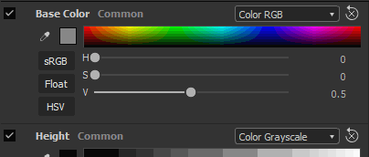
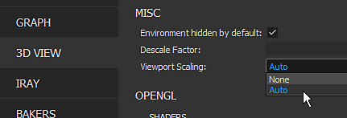

# 版本2020.1 (10.1)

**Substance Designer2020.1**&#x200B;包括新的快捷键编辑器、MaterialX增效工具以及通过Adobe 颜色引擎和新Baker功能对色彩管理的许多新改进。

发行日期：*2020年4月10日*

>[!NOTE]
>
> 从此版本开始，应用程序版本号将更改其格式。 原本应该为&#x200B;**2020.1**&#x200B;的内容现在变为&#x200B;**10.1.0**。

## 主要功能

### 用于创建节点的新快捷键编辑器

在此版本中，我们引入了一个新的快捷键编辑器，该编辑器允许定义键盘快捷键以加快在各种图形模式下创建节点的速度。

新的快捷键编辑器可通过&#x200B;**编辑>首选项>快捷键**&#x200B;在主首选项中访问。 默认情况下，每个快捷键字段都为空。

* **每种类型图形的快捷键**\
  可以为Substance Designer中可用的每种图形类型（从常规合成图形到更高级，如函数和MDL）定义快捷键。

  
* **为原子节点和自定义筛选器分配快捷键**\
  默认情况下，界面会显示每种图形类型的原子节点。 使用搜索字段可以细化列表，还可以使自定义库筛选器和节点可访问：

  
* **创建新快捷键**\
  要为特定节点创建新快捷键，只需单击其名称旁边的文本字段，然后在键盘上键入请求的键。 若要清除快捷键，请使用叉号按钮。

  
* **管理快捷键冲突**\
  使用警告图标上的工具提示可了解有关冲突的更多信息。 它提及某个密钥是否与现有密钥冲突，或者该密钥是否已被应用程序用于其他目的。

  

  
* **搜索快捷键**\
  如果要跟踪的快捷键过多，或者某个节点在默认情况下不可见，请使用搜索系统将其隔离：

  

### 新建MaterialX增效工具(Beta)

在SIGGRAPH 2019期间，我们演示了用于Substance Designer的MaterialX增效工具。 [MaterialX](http://www.materialx.org/)是由[工业光和魔法(ILM)](https://www.ilm.com/)开发的格式，使艺术家能够创建材料，然后将其用于各种平台和多种用途（例如电影、电视节目、游戏、VR体验和制造业）。 此新增效工具现在在Beta版中提供，允许创建MaterialX材料以便在其他兼容的DCC应用程序中使用。 请查看我们最近关于MaterialX](https://magazine.substance3d.com/research-a-portable-shader-graph/)的[文章，以了解有关此新增效工具背后的过程和目标的更多信息。

此新插件允许：

* 并行开发程序化着色器和纹理。
* 使用可在运行时更改的功能（如细节映射和程序化蒙版）为Substance Painter创建高级着色器。
* 匹配Substance Designer和Substance Painter视口中游戏引擎或VFX管道中的着色器功能。

要获取该插件，只需前往[Substance share](https://share.substance3d.com/libraries/6111)以下载它即可。

### Adobe 颜色引擎的新集成(ACE)

除OpenColorIO之外，现在还可以使用Adobe 颜色引擎(ACE)来支持ICC配置文件进行色彩管理。 这意味着您现在可以导入和导出校准图像，以匹配其他软件，如Photoshop和Illustrator。

* **正在启用Adobe 颜色引擎**\
  使用项目设置定义要使用的色彩管理系统：

  
* **正在更改屏幕配置文件**\
  通过2D或3D视图预览图像时，请使用下拉菜单指定要使用的配置文件：

  
* **适用于旧版色彩管理的ACE**\
  ACE色调映射的输出变换现在可用于旧版色彩管理模式。

### 改进了Baker

我们通过两个主要变化完善了一些面包师：

* **已改进的取样**\
  ambient occlusion、Thickness和弯曲Baker现在采用了新的采样方法，极大地提高了烘焙结果的质量。 它产生更吸引人的噪声和更稳定的结果，而无需增加样本数。 下图显示了上图中的上一次采样方法，下图中的新方法，从左到右4次、8次和16次采样（所有渲染均在消除锯齿设置为4x4次采样的情况下完成）。

  {width="600px"}
* **新的标准化设置**\
  Thickness和Heightmap烘焙器具有新的标准化参数，该参数允许您将原始值烘焙到纹理，而不是范围0-1中的固定值。 这对于Height映射非常有用，例如可以了解低多边形网格和高多边形网格之间的原始距离。 除数值将完全对应于要在低多边形网格上设置的位移强度，以匹配高多边形网格的侧面影像。 为了正确地解释Height图，我们还公开了一个新的“标量零值”参数来定义与0对应的像素值。 此外，手动因素允许修复每个UV拼贴标准化导致的UDIM网格上的潜在接缝问题。

  

### 改进了3D视图

3D视图在生活质量方面得到了各种改进，应该会让日常工作更加愉快：

* **渲染器之间的参数同步**\
  着色器参数现在在OpenGl和Iray之间同步，这使得在它们之间跳转更加容易。
* **显示纹理输入预览并添加禁用参数**\
  着色器输入参数现在显示其输入的预览：可以是统一颜色参数、图形节点或位图。 也可以取消选中某个参数以暂时禁用它。

  

  
* **设置中的环境映射预览**\
  转到&#x200B;**3D视图>环境>编辑**&#x200B;时，现在可以看到用于照亮场景的环境映射的预览。

  
* **新的未照明着色器**\
  默认情况下包括名为“unlit”的新着色器。 它不会对任何光照做出反应，而是可用于在网格上显示视口中的单个纹理。 例如，对于烘焙纹理而言，这是非常有用的。

  {width="500px"}
* **提升了视口缩小时高DPI屏幕上的性能**\
  与Substance Painter类似，主首选项中现在有一个名为&#x200B;**视口缩放**&#x200B;的新参数，该参数检测屏幕是否使用HDPI缩放（例如MacOS上的视网膜屏幕），并将视口分辨率自动划分2。 此行为可以避免在太高的分辨率下绘制视区，并改善总体性能。\
  当前设置值为：

  * **无**：无视区缩放。
  * **自动**（默认）：如果应用程序在HDPI屏幕上，则视口分辨率将除以二。

  

### 新内容

此版本还包括一些新的或改进的节点：

* **已改进的PBR 渲染节点**\
  在以前版本中已经引入，此节点得到了很大的改进。 它现在提供摄像机控制、新形状（如平面和圆柱体）、后效果（场深度、开花/眩光、晕影等）和新的材质类型（如透明涂层和各向异性），以及对不透明度材质的支持。\
  有关详细信息，请参阅专用的[文档页面](../../../compositing-graphs/nodes-reference-for-com/node-library/material-filters/pbr-utilities/pbr-render/pbr-render.md)。

  {width="250px"}

  {width="250px"}

  {width="250px"}
* **新PBR 渲染映射节点**\
  作为PBR 渲染的扩展，您可以使用此新节点构建复合映射通道预览。\
  有关详细信息，请参阅专用的[文档页面](../../../compositing-graphs/nodes-reference-for-com/node-library/material-filters/pbr-utilities/pbr-render-mapping/pbr-render-mapping.md)。

  {width="250px"}

  {width="250px"}
* **新FXAA筛选器**\
  新滤波器实现了快速近似消除锯齿算法(FXAA)，是一种消除锯齿的方法。 它可以用于常规纹理，以平滑锯齿线或边缘。\
  有关详细信息，请参阅专用的[文档页面](../../../compositing-graphs/nodes-reference-for-com/node-library/filters/effects/fxaa/fxaa.md)。

  {width="600px"}
* **新的Hald CLUT筛选器**\
  此滤镜允许使用输入查找表(LUT)调整图像的色调和颜色。 它使用Hald CLUT格式，只需从此处提供的标识LUT 开始创建一个即可。\
  有关详细信息，请参阅专用的[文档页面](../../../compositing-graphs/nodes-reference-for-com/node-library/filters/adjustments/hald-clut/hald-clut.md)。

  {width="600px"}

## 发行说明

### 2020.1.3

*（2020年6月11日发布）*

**已添加：**

* [内容]在安全变换灰度节点中显示“遮罩颜色”参数
* [内容]PBR 渲染：添加自定义背景输入选项
* [内容]全景光照节点：用于从背景图像取样颜色的新选项
* [参数]从“公开参数”窗口列表中隐藏带有“不受支持”标志的参数

**已修复：**

* [3D视图]在特定情况下切换自定义网格时崩溃
* [3D视图]启动时，正常格式始终DirectX
* [内容] 3D工作噪声：使用高网格大小值时渲染伪像
* [Content] Dissolve节点混合不正确
* [内容]PBR 渲染：删除锅具警告
* [Content]PBR 渲染：在某些情况下，结果包含负颜色
* [Cooker]多输出实例节点的缓存注入问题
* [资源管理器]关闭包含显示的MDL图形的包时崩溃
* [Graph] 2 pass cooking： node type change doesn&#39;t trigger a recook（图形]两遍烹饪：节点类型更改不会触发重新确认）
* [Graph]在使用输入内容的连接时删除输入内容时发生崩溃
* [Graph]可将链接端点移动到空白空间
* [MDL]从MaterialX图形取消MDL导出时崩溃
* [MDL]取消导出到MDLE时出错
* [预设]更改预设中包含的参数类型后，预设选项卡崩溃
* [资源]对于作为非UDIM链接的网格，图形上下文菜单中的材质列表为空

### 2020.1.2

*（2020年4月27日发布）*

**已添加：**

* [Content]添加Alchemist筛选器模板
* [内容]PBR 渲染：添加参数以控制扩散/Specular阴影强度
* [内容]形状光照节点：添加摄像机位置参数
* [新闻]首次显示窗口时，组“箭头”样式被断开
* [Baker]将Z快捷键添加到2D 视图中，查看1:1的图像
* [Project]从列表中隐藏$(PROJECT\_DIR)别名
* [资源管理器]不要为磁盘上不是文件的资源创建自定义资源

**已修复：**

* [播放器]加载SBS包时报告缺少别名
* [播放器]以小数位数显示随机植入值
* [播放器]捆绑包Substance Designer中包含的所有环境图
* [播放器]macOS High Sierra退出时崩溃
* [Player]无法加载使用sbs://的包
* [内容] 3D工作噪声：使用高网格大小值时渲染伪像
* [内容]未使用“波形”节点中的“greaterThanZero”输入
* [内容]平面光：世界空间位置模式不起作用
* [内容]球面光：内部光位置无法正常工作
* [Baker]在运行“刷新所有已烘焙贴图”时使用烘焙窗口烘焙时崩溃
* [Baker]在Optix for AO上，对法线图使用“低”和“高”网格时烘焙失败
* [面包师] UVTiles预览的分辨率与屏幕的大小不匹配
* [3D 视图]如果默认值不是纹理2d，则加载MDL时会覆盖分配的位图
* [3D视图]属性重置后，材质属性构件发生变化
* [3D 视图]“普通格式”全局首选项不再有效
* [MatX]资源库：MaterialX图形类别未显示所有可用节点
* [MatX]自定义图表的上下文菜单可以在“添加节点”文件夹中包含空的子文件夹
* [SBSAR]主输入还原为列表中的第一个输入
* [库]对于多个图形，仅包含来自SBSAR的第一个图形
* [CustomGraph]节点不是当前图形类型的一部分，在某些情况下会自动创建
* [Iray] Box投影“深度”参数无法正常工作
* [首选项]改进项目设置中的布局
* [参数]删除参数后移动位置构件时崩溃
* [UI]在输出节点中更改使用实例层次结构时崩溃
* [Graph]在注释和带徽章的节点上使用选择框时崩溃

### 2020.1.1

*（2020年4月10日发布）*

**已修复：**

* [3D视图]处理合成图表时内存使用率过高
* [内容] “Polygon”节点的非方形输出中出现意外形状
* [Content]PBR 渲染：使用非方形分辨率时，正交摄像机无法正常工作
* [内容]PBR 渲染：旋转散景增加图像边框亮度
* [色彩管理]“新建位图”对话框中的拾色器未进行色彩管理。
* [色彩管理]绘画中的拾色器和2d视图中的矢量工具不进行色彩管理。

### 2020.1.0

*（2020年4月9日发布）*

**已添加：**

* [快捷键]用于创建节点的快捷键管理器
* [Content]新建PBR 渲染节点
* [内容]新的FXAA滤镜
* [内容]新的Hald CLUT滤镜
* [内容]在“裁剪”节点中显示过滤
* [3D视图]改进着色器参数/纹理分配工作流程
* [3D视图]新的无光着色器
* [3D视图]向位移着色器添加“标量零值”
* [3D视图]在启用高DPI时添加用于缩小视口分辨率的选项
* [3D视图] GLSLFX：允许在sampler上设置gui信息（默认、最小值、最大值、guiMin、guiMax、guiStep、guiWidget、guiName、guiGroup）
* [3D视图]在“场景”菜单中添加“带网格的加载状态……”选项
* [3D视图]在旧版色彩管理模式下添加ACES色调映射的输出变换
* [面包师]在自适应光学中，曲率，弯曲法线，Thickness面包师中新的采样方法
* [烘焙师]Height和Thickness烘焙师中的新标准化选项
* [色彩管理]集成AdobeACE(Adobe 颜色引擎)
* [色彩管理]添加选项以设置缺少ICC配置文件时的默认行为
* [参数]使滑块增量与Substance Painter一致
* [打包]捆绑尽可能多的Qt dll，以用于Python脚本
* [Project]禁用只读项目文件的设置并清楚地传达该状态
* [首选项]隐藏与响应和计算周期相关的不明确的具体设置
* [UI]重命名Pow2 -> 2Pow
* [属性]优化合成图形属性显示
* [AXF]更新到AXF SDK 1.7.1

**已修复：**

* [3D视图]环境光参数即使在启用后也不可见
* [3D视图] glslfx：颜色构件始终是没有Alpha的vec3
* [3D视图]资源中的环境地图集未保存在场景资源中
* [3D视图] Iray：环境光在场景原点转换为点光
* [3D视图] glslfx：颜色构件始终是没有Alpha的vec3
* [参数]实例程序包URL在属性组中不正确
* [参数]公开参数时崩溃
* [参数]图标在曲线节点的参数中未正确对齐
* [参数]仅在显示时以“预览”模式显示“文本”节点字符串
* [Parameters]重命名在“Visible If”语句中使用的输入参数时崩溃
* [参数]删除在其任何参数中设置了函数的“级别”节点时崩溃
* [UI]输入参数列表中的警告图标位于现有按钮的顶部
* [UI]在特定情况下，正确输入参数项上的警告未被清除
* [UI]阻止“是网格UDIM ？” 网格UV严格位于[0,1]拼贴中时显示的弹出窗口
* [UI]只需将鼠标悬停在预设上，即可使用鼠标滚轮滚动预设下拉列表
* [UI]图形属性中的“输出计算”选项命名不正确
* [MDL]将SBS图形资源放入MDL图形时崩溃
* [MDL]具有图像输入的SBS节点无法正常工作
* [MDL]纹理绑定和使用名称不正确
* [图形]在“材质”链接创建模式中忽略输入值组和用法
* [图形]输入值使用默认值，而不是布尔值的输入数据
* [Bakers]在特定情况下使用正切法线映射时，世界空间法线中的法线不正确
* [烘焙]在打开预览窗口的情况下烘焙时内存使用过量
* [预设]损坏的预设导致渲染崩溃
* [预设]旧SBS中的布尔参数不受预设的影响
* [库]第一个打开的包中的资源列在节点创建浮动菜单中
* [Publish]在macOS上发布到SBSAR时，SBSCooker中返回错误代码13
* [Publish]发布到SBSAR时，SBSCooker中的参数警告已弃用
* [API]无法从来自.sbsar文件的包获取元数据
* [导出]在旧版模式下，色彩空间选项恢复为特定输出的默认值
* [2D视图]复制到剪贴板不会考虑色彩管理状态
* [Unix] Designer忽略系统信号
* [库]由于翻译了标签，库中的某些过滤器无法正常工作
* [Cooker]负数的平方根应返回0而非NaN
* [2D视图]还原第一个绘画描边后，红色和蓝色通道会被交换
* [控制台]控制台中的警告消息太多“QPixmap：:scaled: Pixmap是空像素映射”
* [内容] “形状发光”：烹饪警告
* [依赖关系]将位于不同软件包中的图形指定给网格不会创建依赖关系
* [Iray]切换几何后，素材属性变为非活动状态

**已添加：**

* [快捷键]用于创建节点的快捷键管理器
* [Content]新建PBR 渲染节点
* [内容]新的FXAA滤镜
* [内容]新的Hald CLUT滤镜
* [内容]在“裁剪”节点中显示过滤
* [3D视图]改进着色器参数/纹理分配工作流程
* [3D视图]新的无光着色器
* [3D视图]向位移着色器添加“标量零值”
* [3D视图]在启用高DPI时添加用于缩小视口分辨率的选项
* [3D视图] GLSLFX：允许在sampler上设置gui信息（默认、最小值、最大值、guiMin、guiMax、guiStep、guiWidget、guiName、guiGroup）
* [3D视图]在“场景”菜单中添加“带网格的加载状态……”选项
* [3D视图]在旧版色彩管理模式下添加ACES色调映射的输出变换
* [面包师]在自适应光学中，曲率，弯曲法线，Thickness面包师中新的采样方法
* [烘焙师]Height和Thickness烘焙师中的新标准化选项
* [色彩管理]集成AdobeACE(Adobe 颜色引擎)
* [色彩管理]添加选项以设置缺少ICC配置文件时的默认行为
* [参数]使滑块增量与Substance Painter一致
* [打包]捆绑尽可能多的Qt dll，以用于Python脚本
* [Project]禁用只读项目文件的设置并清楚地传达该状态
* [首选项]隐藏与响应和计算周期相关的不明确的具体设置
* [UI]重命名Pow2 -> 2Pow
* [属性]优化合成图形属性显示
* [AXF]更新到AXF SDK 1.7.1
