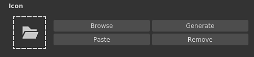
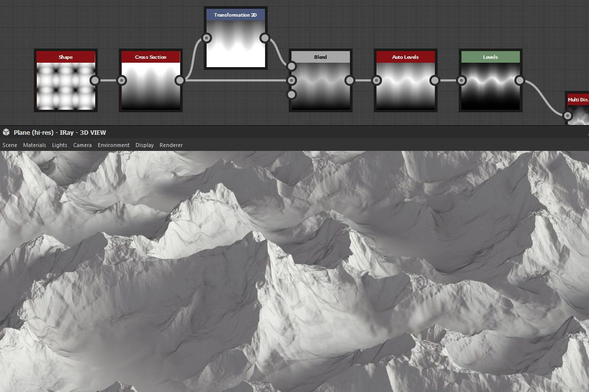

# 版本2020.2 (10.2)

**Substance Designer2020.2**&#x200B;带来了新的Substance 引擎更新、改进了用于公开参数的工作流程、某些性能改进和新内容。

发行日期：*2020年10月12日*

## 主要功能

### 新引擎更新（版本8）

在此新版本中，该Substance 引擎现在位于版本8，并且带来了新功能和几项改进：

* **输入图像的默认值**\
  图形中的图像输入现在可以定义默认颜色，以便在未加载任何内容或未连接到该输入内容时回退到适当的值。

  {width="600px"}

* **新的距离模式**\
  [距离节点](../../../compositing-graphs/nodes-reference-for-com/atomic-nodes/distance/distance.md)现在具有两种新模式，它们改变了计算方式：

  * **欧几里德**（原始模式）：欧几里德几何中点之间的直线距离。
  * **曼哈顿**：点之间的距离，但限制在网格上，类似于城市街区。
  * **切比雪夫**：距均匀大小网格上两点之差的最大距离。

  {width="600px"}

* **新的渐变插值**&#x200B;[&#x200B;渐变节点](../../../compositing-graphs/nodes-reference-for-com/atomic-nodes/gradient-map/gradient-map.md)具有新的&#x200B;**平滑**&#x200B;模式，用于插值键，从而生成更自然的颜色转换。 它通过查看邻居键来工作。 上一个模式&#x200B;**Interpolation**&#x200B;已重命名为&#x200B;**Flat Tangent**。

  {width="600px"}

  

  **平滑**&#x200B;模式还有另一个参数，用于控制用于计算混合颜色的曲线的切线的长度。 值为0表示切线的长度为0，而值为1表示切线的长度将是两个键之间长度的一半。

  

* **改进的曲线节点**&#x200B;[&#x200B;曲线节点](../../../compositing-graphs/nodes-reference-for-com/atomic-nodes/curve/curve.md)现在可以直接输出灰度图像。 此更改允许定义曲线并直接输出它，而无需先插入渐变纹理。

  

### 改进了公开参数

用于展示和编辑参数的工作流程经过改进，更加直接：

* **改进的菜单操作**&#x200B;公开和编辑公开参数的操作已分开，以更加明确。 还引入了新的快捷键，以便更轻松、更快速地编辑公开参数。 例如，现在有一个专用按钮用于编辑参数的功能，还有一个专用操作用于跳转到所显示的图形参数。

  

  

* **直接从对话框中配置新参数**&#x200B;公开参数时，现在可以从&#x200B;**公开参数**&#x200B;对话框中访问所有常规控件，如说明和默认值。 这样可以更轻松、更快速地配置和创建新的Graph参数，从而避免在创建参数后立即进入Graph参数视图。

  {width="600px"}

### 改进了Substance图形的图标配置

借助改进的界面，现在可以在Substance图中设置缩略图更加简单：

* **自动生成图形缩略图**\
  现在，只需单击图形参数中图标旁边的“生成”按钮，即可自动生成Substance图形的预览。 它目前仅支持使用“金属/粗糙度”PBR工作流程作为输出节点的图形。 在生成缩略图时，位移强度根据定义的物理尺寸值计算，否则默认为0.1值。

  {width="600px"}

* **使用新按钮添加自定义缩略图**\
  我们添加了多个新按钮来简化自定义缩览图的设置：

  * **浏览**：打开文件对话框以加载图像。 也可以通过单击按钮旁边的文件夹图标来完成。
  * **生成**：查看上面的演示。
  * **粘贴**：从剪贴板加载图像。
  * **移除**：移除图标当前分配的图像。

  

### 改进了性能

此新版本中进行了两项新的优化，缩短了迭代之间的时间：

* **改进了图形计算性能**\
  现在当请求时直接计算输出节点，而不是在途中计算中间节点（现在是在第二步中）。 此更改允许更快地预览图形的结果，即使在调整根节点时也是如此。 在下面的比较中，此优化允许在相同时间段内查看图形的更多迭代（此处以4K分辨率查看材质）：

  

* **改进的烘焙器膨胀和扩散生成**\
  现在，烘焙纹理的膨胀和扩散速度比以前的版本快4倍。 这减少了烘焙之间的等待时间。

  

### 新内容

此版本添加了一些新节点，并在一些现有节点上提供了更多可能性：

* **[新阈值滤镜](../../../compositing-graphs/nodes-reference-for-com/node-library/filters/adjustments/threshold/threshold.md)**&#x200B;此节点允许快速隔离为黑色，并根据灰度输入将图像的某些部分白色蒙版。 在实践中，这与现有的直方图扫描滤镜类似，但是每天使用起来更方便。 通过[专用文档页面](../../../compositing-graphs/nodes-reference-for-com/node-library/filters/adjustments/threshold/threshold.md)了解更多相关信息。

  {width="650px"}

* **[新建横截面筛选器](../../../compositing-graphs/nodes-reference-for-com/node-library/filters/effects/cross-section/cross-section.md)**&#x200B;此节点允许将灰度输入的形状可视化为配置文件，从而使用此筛选器作为调试工具可更轻松地创建高度图和形状。 有关详细信息，请查看[专用文档页面](../../../compositing-graphs/nodes-reference-for-com/node-library/filters/effects/cross-section/cross-section.md) 。

  {width="600px"}

  {width="600px"}

* **改进了[Tile Generator](../../../compositing-graphs/nodes-reference-for-com/node-library/texture-generators/patterns/tile-generator/tile-generator.md)和** [**平铺Sampler**](../../../compositing-graphs/nodes-reference-for-com/node-library/texture-generators/patterns/tile-sampler/tile-sampler.md)\
  这两个节点现在具有新的参数，可进一步扩展功能和用法：

  * **保持比例**：保持拼贴的比例，当X和Y轴上的计数不均匀时，无需手动补偿大小。
  * **绝对**：使拼贴保持为最终图像宽度的预定义百分比。
  * **像素**：定义拼贴大小（以像素为单位）。

  有关更多详细信息，请参阅[专用文档页面](../../../compositing-graphs/nodes-reference-for-com/node-library/texture-generators/patterns/tile-generator/tile-generator.md)。

  

### 杂项

**Iray**&#x200B;已更新到版本2020.1.0，其中添加了Nvidia对新Ampere GPU（如RTX 3080和RTX 3090）的支持。

## 发行说明

### 2020.2.0

*（2020年10月12日发布）*

**已添加：**

* [内容]添加“横截面”节点
* [内容]将“Cross product vec2”函数添加到functions.sbs
* [内容]添加“获取大小”值节点
* [内容]在函数中添加“正交vec2”函数。sbs
* [内容]将“平均”函数添加到functions.sbs
* [内容]添加阈值过滤器
* [内容]颜色匹配：添加蒙版输入以指定应用滤镜的位置
* [Content]Tile Generator/Sampler：添加新选项以控制图案大小
* [内容]使用图像输入的默认值更新PBR 渲染节点
* [参数]添加警告图标以突出显示实例参数中的问题
* [Parameters] Ignore Visible If语句用于涉及应用了函数的参数的输入/输出
* [参数]改进组关联的UX
* [Parameters]重做公开单个参数的方法
* [Parameters]突出显示显示的参数
* [Parameters]改进未使用参数的清理
* [引擎]曲线节点：用于输出曲线纹理的新选项
* [引擎]输入图像的默认值
* [引擎]距离节点：新的距离模式（曼哈顿和切比雪夫距离）
* [引擎]渐变节点：新的插值模式可在颜色之间实现更自然的混合
* [引擎]某些参数现在显示为灰色，具体取决于其他参数
* [UX]接受拾色器十六进制字段中的6位RGB色
* [UX]避免在选择注释属性后立即显示它们
* [UX]开始写入组名称时显示相关组
* [UX]重新导出图形输出的快捷方式
* [UX]使所有Dropdown-textfield-combobox与常规组合框看起来不同
* [GraphRender]显示节点逐个缩略图，而不只是在计算完所有节点后才显示缩略图
* [GraphRender]改进图形渲染期间的取消延迟
* [GraphRender]提高渲染进度条的准确性
* [缩略图]自动缩略图（图标）计算
* [缩略图]返工UX以将缩略图（图标）添加到包
* [首选项]默认情况下为新用户启用GPU 射线追踪
* [首选项] 3DView / OpenGL /质量：用一个更直观的选项列表替换样本计数滑块
* [面包师]改进后期处理性能
* [色彩管理]在首选项对话框中显示当前工作色彩空间。
* [Iray]当没有兼容的GPU时，自动切换到CPU模式
* [Performance]提高响应时间以计算我们感兴趣的节点（现在先计算）
* [Python API]新增方法addActionToExplorerToolbar，用于将图标添加到浏览器工具栏
* [资源]升级到FBX 2020.0.1
* [iRay]更新至Iray 2020.1.0
* [API]添加Python访问权限以访问色彩管理设置和属性

**已修复：**

* [图形]更改父级大小或uv图块不会取消当前渲染
* [Graph]在移动输出连接并按Alt+LMB时发生崩溃
* [图表]在“材质”或“紧凑材质”模式下移动连接时崩溃
* [图形]输入节点无法预览位图资源
* [Graph]实例上的节点兼容性损坏
* [图形]更改图形参数时太多的节点失效
* [内容] “形状凸出”输出形状在特定情况下翻转：需要新版本，旧版本已弃用
* [内容]在“颜色匹配”节点中使用自定颜色变化时出现错误结果
* [Content] Size by X/Y Amount Ratio in Content具有相反的效果Atlas Scatter
* [内容]形状飞溅中大小与X/Y数量的比率具有相反的效果
* [3D视图]从包加载场景资源后，执行撤消操作时崩溃
* [3D视图]如果路径具有带有特殊字符的别名，则自定义环境不会保存在SBSSCN中
* [3D视图]在材质设置中切换正常格式会导致翻转状态
* [UI] “设置为主要”按钮文本从显示区域溢出
* [UI]在窗口模式下工作时，主窗口位置未正确恢复
* [UI]当窗口全屏显示或拖动到屏幕边缘附近时，状态栏文本会发生偏移
* [Iray]在渲染器之间来回切换时出现“无效标记”消息并崩溃
* [射线]非不透明表面上的可见表面
* [预设]在某些Substance Source图表的实例中应用预设时崩溃
* [预设]在SBS实例上撤消后显示错误的名称
* [Render]在预览模式下微调参数时渲染错误
* [烘焙]刷新多个已烘焙贴图会导致警告阻止某些烘焙
* [Cooker]调整SBS实例中的SBSAR节点会导致从实例输出0
* [Explorer]使用“在Substance Player中保存并打开”时，自定义别名未传递
* [渐变编辑器]绝对颜色选择不会影响所有选定的键
