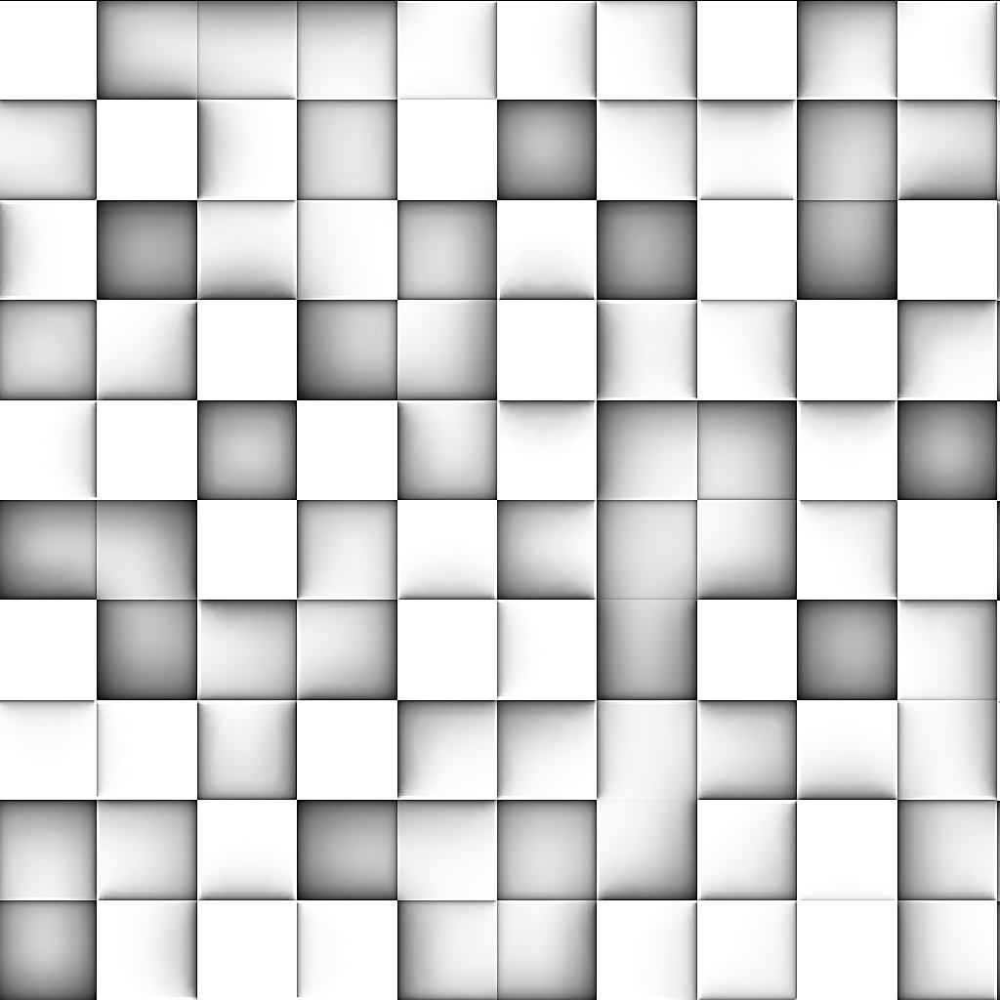
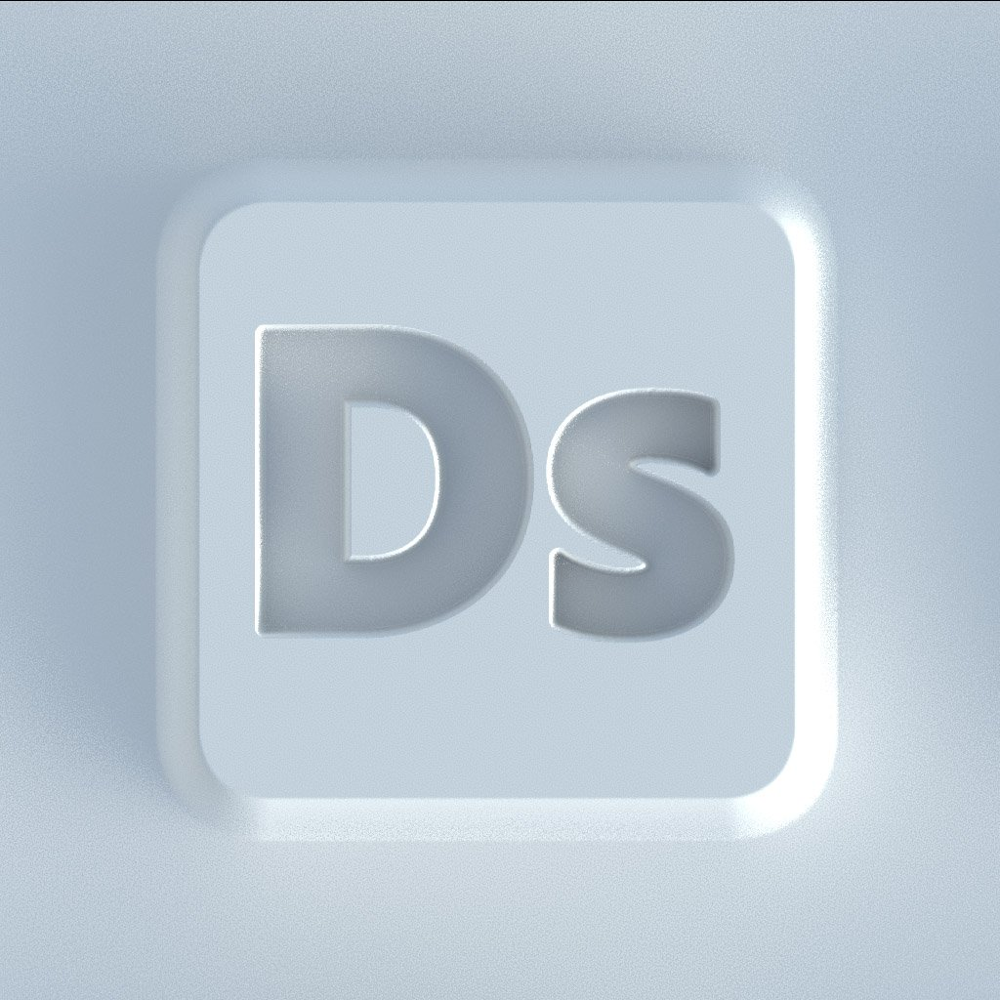
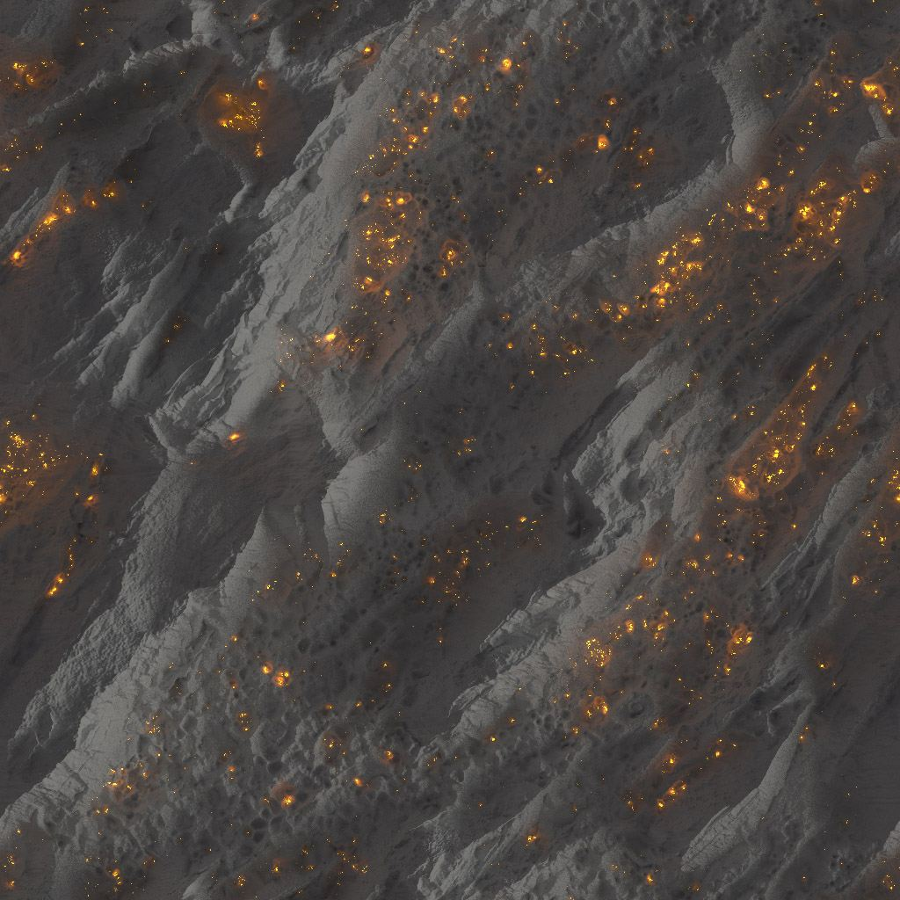

# 版本 11.2

**Substance 3D Designer 11.2**&#x200B;名称略有更改，现已连接到Adobe Creative Cloud。 它带来了第一个版本的Substance模型图、发送到(Send To)功能、一些基于Raytrace的节点和一些UI更改。

发行日期：*2021年6月23日*

## 主要功能

### 新Substance模型图

可使用一种全新的“图形”类型，即“Substance模型图形”，它允许您使用熟悉的“节点”界面创建程序化3D模型。

<table>
<tr style="border: 0;">
<td style="border: 0;" valign="top">

{width="300px"}

</td>
<td style="border: 0;" valign="top">

{width="300px"}

</td>
</tr>
</table>

请确保深入新的专用文档部分，以了解更多信息。

这是第一个版本，因此存在一些限制。

### “发送到”功能

Substance 3D Designer的Adobe版本具有新的“发送到”功能，可让您快速将资源发送到其他Substance 3D应用程序。 无需再以SBSAR格式发布并加载单个文件，只需单击一下“发送至”即可解决此问题。

>[!NOTE]
>
> Substance 3D Designer的Steam版本不具有“发送到”功能。

### 新建Raytrace节点

没有新节点，任何Designer版本都不会完成。 基于PBR 渲染的惊人强度，5个新的基于RT的节点在此版本中加入了我们。

<table>
<tr style="border: 0;">
<td style="border: 0;" valign="top">

{width="300px"}

</td>
<td style="border: 0;" valign="top">

{width="300px"}

</td>
</tr>
</table>

与之前的HBAO节点相比，RTAO在清晰的、正确的AO方面做得更好。

{width="300px"}

焦散线基于高度图（如简单的Perlin噪声）生成物理上正确的光线跟踪焦散线。 适合为实时焦散线创建逼真的动画Flipbook纹理。

{width="300px"}

RT Shadow可通过一些简单的控件生成精确的光线跟踪阴影。

<table>
<tr style="border: 0;">
<td style="border: 0;" valign="top">

{width="200px"}

</td>
<td style="border: 0;" valign="top">

{width="200px"}

</td>
<td style="border: 0;" valign="top">

{width="200px"}

</td>
</tr>
</table>

RT辐照度是新节点中最先进的。 它根据具有Height图、环境图和/或发射图的材料进行光线追踪。

{width="600px"}

这意味着，您可以使用预烘焙的光照进行纹理处理，就像处理风格化项目一样，或者您可以烘焙从高光地图上反射出来的光线跟踪光照。

{width="300px"}

最后是“Bent Normal”（弯曲正常）节点。 与常规正常转换相比，此节点使用AO修改正常映射以使用该AO信息。 在需要网格烘焙器创建效果之前，此节点以纹理空间为您创建效果。

### Adobe标准素材着色器

为了统一应用程序中的素材和渲染，Adobe标准素材着色器是3D视图中新的默认着色器。 乍一看，它和旧的PBR金属粗糙度着色器没有区别（无论如何，它都是基于它），但它支持更多奇特的通道，让您无需外部渲染器即可预览这些通道。

### UI更改

对UI进行了一些小的修改，但最明显的修改是改进的“文件”>“新建包”菜单（允许您选择图表类型），以及主工具栏上改进和更新的按钮（提供新图表类型的快捷方式并发送给其他应用程序）。

## 教程

以下是我们的视频教程，其中介绍了新增功能：

## 发行说明

### 11.2.0

*（2021年6月23日发布）*

**已添加：**

* [品牌推广]Substance Designer成为Adobe Substance 3D Designer
* [Substance模型]用于创建过程3D模型的新Substance模型图形
* [内容]添加新的HDR环境地图
* [内容]新的弯曲正常节点
* [内容]新的RT环境遮蔽节点
* [Content]新的RT Chastics节点
* [Content]新的RT Chastics节点
* [内容]新的RT辐照度节点
* [内容]新建RT阴影节点
* [互操作性]将资源发送到Painter将启动Painter并在库中添加或更新您的资源（需要Adobe的Substance 3D计划）
* [互操作性]将资源发送到Sampler将启动Sampler并在库中添加或更新您的资源（需要Adobe的Substance 3D计划）
* [互操作性]在Adobe Bridge中浏览您的资源，将在资源所在位置启动Bridge（需要Adobe的Substance 3D计划）
* [ASM]在Substance 图形和MDL图形中支持新的Adobe标准素材(ASM)
* [ASM]添加ASM模板
* [ASM]添加适用于ASM的OpenGL着色器
* [ASM]将ASM着色器设置为默认着色器
* [常规]将所有临时文件聚合到用户设置的临时目录中
* [常规]新增“将副本另存为”命令
* [常规]更新文件菜单
* [常规]更新帮助菜单
* [Publish]新的“发布”窗口
* [Publish]在首选项中添加选项，以便在发布SBSAR文件时不保存SBS文件
* [属性]将图形类型字段添加到图形属性
* [属性]以更相关的方式重新排列图表的属性
* [品牌推广]新的“关于”窗口
* [品牌]更新应用程序样式
* [GLSLFX]向技术添加标签
* [GLSLFX]添加设置GLSLFX着色器标签的可能性
* [元数据]在包资源上添加元数据
* [元数据]允许对图形、输入、输出和资源使用元数据版本
* [本地化]德语、法语和简体中文的新翻译
* [UX]在拖动鼠标的情况下反向缩放3D视图
* [AXF]更新至版本1.8.0
* [日志]将已安装的插件添加到日志
* [VFX]添加ACES 1.2 OpenColorIO配置
* [Python API]添加一种方法来查询在设置中指定的临时目录
* [Python API]将isModified方法添加到SDPackage以检查是否保存了pkg
* [Python API]向SDColorManagementEngine添加一些颜色转换方法
* [Python API]删除图表对象（注释、图钉、框架……）
* [Python API]公开图形实例节点的物理尺寸属性
* [Python API]显示将副本另存为
* [Python API]修复SDPackageMgr.savePackage方法
* [Python API]获取选定图形对象的列表
* [Python API]引入新的方法名称以使用图形选区
* [Python API]增效工具无法将操作添加到第一个创建的资源管理器面板

**已修复：**

* [Parameters]下拉列表Integer1参数上的负值会导致实例中出现不一致的行为
* [参数]在角度构件上递增值时出现问题
* [图形]在2D或3D视图中显示输出时出现计时问题。
* [国际化]某些特定字符被更改为文件标识符中的空格
* [Preferences] “用户项目”文件标签未从日语翻译回来
* [Python API]运行SDUIMgr.getCurrentGraphSelectedNodes()方法时出现RecursionError
* [Python API] SDApplication.getPath(SDApplicationPath.InstallationDir)不返回任何内容
* [Python API] SDSBSARExporter不发送文件保存通知
