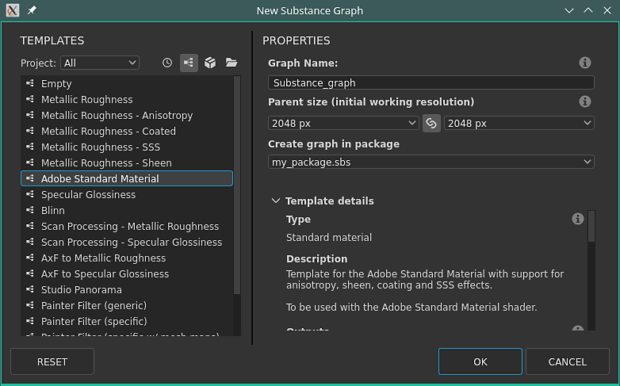

# 版本 11.3

**Substance 3D Designer**

发行日期： *2021年11月24日*

## 主要功能

### 新模型图表功能

为扩展建模功能，模型图中添加了许多改进：

* <b>新建粒子工作流</b>\
  新的粒子建模工作流程允许创建用于处理几何的点云。 它们可用于创建许多新的复杂和/或重复形状，例如上方图像上的屋顶拼贴。\
  要了解有关新粒子工作流程的更多信息，请参阅以下文档页面：

  * 场景中的项目类型
  * 粒子
  * 粒子删减
  * 来自实例的粒子

  

* <b>新的建模和变形节点</b>\
  已添加其他新节点来创建更复杂的形状，请单击每个节点以了解有关它们的更多信息：
  * 衍生变换
  * 有机图案
  * 旋转
  * 曲线裁切

* <b>常规改进\
  </b>针对建模图形的工作流程进行了以下改进：
  * 有关节点参数的新工具提示，可使其更易于学习。
  * 现在，在FBX中导出时，可保留3D模型层次结构
  * 材料分配可以导出为OBJ和FBX文件格式。
  * 在叠加模式下预览视口中的中间节点。

### 改进了互操作性

发件人操作已扩展，并增加了两种可能性：

* **将SBSM（Substance模型文件）发送到Stager**\
  现在可将程序化的3D模型发送到Stager，并从那里使用公开参数进行修改。

* **从Sampler接收SBS/SBSAR**\
  现在可以将Sampler生成的Substance文件直接接收到Designer中。

### 杂项

对生活质量进行了各种改进：

* **相对于输入的输入**\
  在相对于输入中设置的图形输入现在将继承连接的节点大小，而不是默认父图形大小。 这使通过不同大小的输入管理不同分辨率更加容易。

  {width="400px"}

* **新建图形窗口**\
  “新建图形”窗口已重新设计，现在可以更好地查看特定模板的详细信息，并直接在现有包中创建新图形。

  {width="400px"}

* **关闭所有包**\
  这是一个小操作，使在资源管理器中管理许多包变得不那么繁琐。 使用&#x200B;**文件** > **关闭全部**&#x200B;以关闭当前打开的所有包。

  

* **最大化当前视图**\
  使用新标题栏&#x200B;**图标**&#x200B;或快捷键&#x200B;**SHIFT+空格**&#x200B;将窗口扩展到全屏。 这也可以用于浮动窗口。

* **3D视图改进**\
  3D视图具有新的显示设置，用于切换3D模型上背面脸部的显示以及顶点、正切和八边形的显示。

### 内容

此版本添加新的漫射节点并改进了PBR 渲染节点：

* <b>漫射节点</b>\
  新的“漫射颜色”、“漫射灰度”和“漫射UV”节点允许基于输入蒙版生成柔和的出血模糊。

  {width="230px"}

   

* **已改进的PBR 渲染节点**\
  此节点进行了以下更改：
  * 球面形状的新三次UV模式。
  * 新增了对次表面散射的支持。
  * 各向异性现在遵循Adobe串接材料(5ASM)模型。
  * 在重要采样的支持下，改进了基于图像的光照。
  * 在重要采样的支持下，Emissive光照得到了改善。

## 发行说明

### 11.3.0

*（2021年11月24日发布）*

**已添加：**

* [Substance模型]添加节点参数的工具提示
* [Substance模型]允许在3D视口叠加中显示中间节点的结果
* [Substance模型]改进基数的显示方式
* [Substance模型]将Substance模型图形导出为.fbx时保留对象的层次结构
* [Substance模型]支持从Substance模型图表以FBX/OBJ方式导出多种材质
* [Substance模型]&#x200B;[内容]粒子节点
* [Substance模型]&#x200B;[内容]生成式转换节点
* [Substance模型]&#x200B;[内容]有机图案节点
* [Substance模型]&#x200B;[内容] Instances节点的粒子
* [Substance模型] [内容]粒子剪枝节点
* [Substance模型]&#x200B;[内容]车床节点
* [Substance模型]&#x200B;[内容] Shell节点
* [Substance模型]&#x200B;[内容]投影节点
* [Substance模型]&#x200B;[内容]曲线修剪节点
* [Substance模型]&#x200B;[内容]更新曲线Sampler节点
* [Substance模型]&#x200B;[内容]更新网格Sampler节点
* [Substance模型]&#x200B;[内容]更新抖动节点
* [UX]用于最大化当前视图的按钮
* [UX]更新“新建图形”窗口
* [UX]在“工具”菜单中添加“下载播放器”选项，然后与“定位播放器”聚合
* [UX]将“全部关闭”条目添加到“文件”菜单
* [UX]在整个主菜单中应用一致的大小写
* [UX]自动显示重复的图形项目的属性
* [UX]在图形工具栏中添加按钮，以禁用帧标题/注释/图钉的恒定屏幕大小
* [UX]用于将版本信息复制到“关于”对话框中的剪贴板的按钮
* [材料]与输入值相关的输入值
* [Content]在3D Perlin噪声上添加“拼贴”选项
* [Content]新的漫射进程节点
* [Content]新PBR 渲染节点版本
* [互操作性]从Sampler接收SBS和SBSAR
* [互操作性]将SBSM发送到Stager
* [3D 视图]添加选项以禁用背面消隐
* [3D 视图]添加一个选项以显示顶点正切空间
* [资源管理器]双击图形背景时突出显示资源管理器中的图形视图
* [资源管理器]删除上下文菜单中的“浏览”选项
* [Baker]隐藏已弃用的Baker
* [色彩管理]添加对OCIO v2配置文件规则的支持
* [资源库]根据图形类型重命名类别
* [首选项]如果检测到支持的CUDA GPU，则会在Iray 硬件首选项中自动禁用CPU

**已修复：**

* [Substance模型]在.fbx中使用“as sudb”选项时，在Mac上崩溃
* [Substance模型]在特定情况下导出为SBSM时崩溃
* [Substance模型]导出从未构建小组件的公开参数时导出失败
* [Substance模型]打开引用多个.fbx文件的图形时的随机崩溃
* [Substance模型]范围未动态应用于公开参数的小部件
* [Substance模型]重新加载网格选项不适用于Substance模型图形中使用的资源
* [Substance模型]在特定情况下，场景不会显示在可用的3D 视图中
* [UI]材料选项中的禁用区域过大
* [UI] “未保存包文件”对话框中的样式问题
* [UI]必须按两次Tab键才能在值之间导航
* [UI]使用鼠标拖动进行缩放会在3D视图和其他视口之间反转
* [UI]使用“最近打开的文件”列表加载已打开的SBS时，错误地触发“未找到包”提示
* [UI]&#x200B;[macOS]启动应用程序后的默认界面布局不正确
* [UI]包无法保存到驱动器的根目录（仅限Windows）
* [图形]在特定情况下，“在2D视图中自动显示”选项不一致
* [图形] “打开引用”选项适用于SBSAR实例节点
* [图形]仅在创建项目时显示图钉属性
* [图形] Pin字符串规则的执行不一致
* [Graph]保存空图表时崩溃
* [3D视图]各向异性角度在ASM着色器中反转
* [3D视图] ASM着色器：SSS相关映射的线性化问题
* [3D视图]在特定情况下关闭其他3D视图后，OpenGL渲染中断
* [3D视图]对于某些.fbx文件，预定义相机在3D视图中的位置不正确
* [MDL]上下文菜单中的“添加节点”对MDL图表不起作用
* [MDL]错误：使用float2.x组件及类似组件时，节点连接失败(SD 11.1.2)
* [MDL]打开特定.sbs文件时崩溃
* [MDL]渲染会话开始时未设置Iray中每米的场景单位
* [MDL]在MDL图中微调lerp节点时冻结
* [MDL]导出的MDL代码中的参数顺序
* [资源管理器]取消资源创建后创建空的资源文件夹
* [资源管理器]只能将包的第一个元素移动到列表底部
* [内容] RT Bent Normal和RT AO在嵌套图表中触发节点计算
* [输入节点]当UDIM更改时，输入节点中的位图未更新
* [Iray]尝试显示包含大量实例的Substance模型场景时花费较长时间
* [首选项]取消添加项目文件时出现空行
* [Python编辑器]关闭最后一个脚本后，“关闭”选项保持启用状态，并且仍然包括其名称
