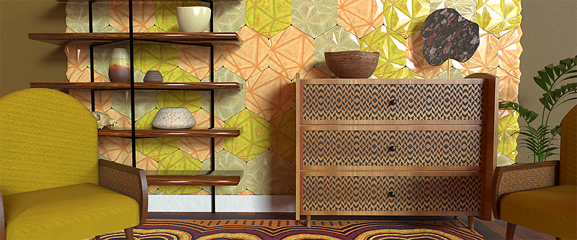

# 版本 12.1

**Substance 3D Designer 12.1**&#x200B;为Substance素材图表带来了许多新节点、支持USD文件格式并添加了与Stager的更多互操作性。

发行日期：*2022年4月26日*

## 主要功能

### 用于Substance材料图表的新内容

此版本中添加了许多节点，您可以找到一些新图案、新杂色、新滤镜……

请查看下面链接的节点页面，了解这些功能强大的新节点可实现的广泛输出的示例！

* **新图案**

  * 我们添加了一个新的<b>拼贴随机2</b>节点，以生成具有随机大小和比例的相邻拼贴，这对于快速创建具有倾斜、圆角和斜角的完全不规则网格非常有用。

    {width="640px"}
  * 新建<b>Triangle Grid</b>图案以生成由三角形组成的网格。 我们将其用于下面的素材中，以轻松而完美地模拟皮革颗粒。 此生成器表示3D空间中的顶点表面，可用于创建各种多边形样式。

    {width="640px"}
* **新噪声**

  * 为了给您更多样化，我们提供了一组<b>15个新污渍地图</b>（混凝土、泄漏、溅污……） 已添加到库。

    {width="640px"}
  * 您还会发现很多<b>新的2D和3D噪声</b>，例如Voronoi（2D和3D）、Voronoi分形（2D和3D）、3D脊状分形以及对当前3D Perlin噪声的更新（添加拼贴和绝对选项）。\
    这些噪声全部映射到3D空间并提供多种样式，从而允许增加多样性和控制力，这将为您提供足够的选择来为您的材料创建完美的地图，例如海和下面的科幻面板材料。

    {width="640px"}

    {width="640px"}
  * <b>“3D纹理”节点</b>（位置、SDF、偏移）和<b>“3D渲染”节点</b>（表面或体积）的集合，用于创建和渲染3D纹理，这是3D模型切片的贴图集。

    {width="640px"}

* **新筛选器**

  * 使用<b>自动裁剪</b>节点，您可以在图像的&#x200B;*中心*&#x200B;放置一个形状，而无需调整大小，或者调整其大小以适应空间。 例如，可以随意调整形状，同时在散布时保持一致的位置和大小。

    {width="640px"}
  * 使用<b>Extend Shape</b>节点，您将能够在自定义方向和距离上拉伸形状的某一部分。

    {width="640px"}
  * 使用<b>非均匀旋转</b>节点，可以根据给定的映射旋转输入。

    {width="640px"}
* **以及……**

  * 缓动函数（函数图表），这些函数对于以非线性方式驱动值非常有用。
  * 最后，此版本还带来了一个新的、更准确的<b>Quantize</b>节点版本，以及一个全新的<b>求和区域表</b>实用程序筛选器。

### 提高互操作性

* **USD支持**&#x200B;除了

  和

  文件格式，现在可以导入和导出USD文件(

  ,

  ,

  )，以将其用作Substance模型图表的资源，用于烘焙或在3D视图中展示Substance材料。 还可以使用此格式导出Substance模型图形或3D视图的内容。
* <b>发送到Stager\
  </b>您现在只需单击一下即可将材料发送到Stager，使用Sampler和Painter即可做到这一点。 得益于此功能，不再需要以SBSAR格式发布并加载单个文件（需要使用新的材料管理器安装Stager版本1.2.0）

  

### 杂项

* 如果您正在处理织物，现在可以在3D视图中显示专用网格，以便更好地查看材料如何在褶皱形状上呈现。 打开3D视图面板中的<b>场景</b>菜单，然后选择<b>布料</b>选项以显示此模型。

  {width="640px"}

* 我们还为Substance模型图添加了一些新的场景管理节点。 这些节点允许您重命名、重新设置父级、合并或扩展场景元素，以便整理场景层次结构。 还有一个新节点用于设置场景的一个或多个元素的透视。

* 在Designer中处理项目时，您可能会遇到警告和错误消息，这些消息会通知您项目中存在问题。 在此版本中，我们<b>改进错误管理系统</b>，以显示资源管理器中的所有错误和警告：所有内容都列在一个位置，因此可以更轻松地检查您的项目是否包含任何问题。

  {width="640px"}

## 发行说明

### 12.1.0

*（2022年4月19日发布）*

<b>已添加：</b>

* [主要]材料图表的新内容
* [主要]将材料发送到Stager
* [主要]支持USD文件
* [主要]改进UI中的错误报告
* [Main]模型图的场景管理节点
* [内容]为3D柏林噪音添加更多选项（拼贴、绝对……）
* [内容]新的3D脊状噪声分形节点
* [内容]新的3D纹理偏移节点
* [内容]新的3D纹理位置节点
* [内容]新的3D纹理渲染表面节点
* [内容]新的3D纹理渲染体积节点
* [内容]新的3D纹理符号距离场节点
* [内容]全新自动裁剪节点
* [内容]新的缓动功能
* [内容]新Extend Shape节点
* [内容]新污渍地图
* [内容]新的非均匀旋转节点
* [内容]新的总和区域表过滤器
* [内容]新的平铺随机2生成器
* [Content]新的Triangle Grid模式生成器
* [内容]新版本的“量化灰度”节点
* [内容]新的Voronoi和Voronoi分形噪声(2D/3D)
* [内容]阈值：添加“下限”和“下限和相等”比较模式
* [Content][3D View]添加网状结构，以便向已发运的资源显示结构
* [Substance模型]新的“展开组实例”节点
* [Substance模型]新建Fuse节点
* [Substance模型]新建重命名节点
* [Substance模型]新建父节点
* [Substance模型]新建集透视节点
* [Substance型号]更新到SDK 1.6.0
* [第三方]将Qt（和QtForPython）升级到5.15.8
* [第三方]将Python升级到3.9.9
* [第三方]将OpenSSL升级到1.1.1m
* [UI]改进了误击时的节点菜单行为
* [UI]即使在固定状态下，也可在同一选项卡中打开子图
* [UI]从资源管理器面板的标题栏中删除Pin按钮
* [UI]保存各个版本欢迎屏幕上的“不再显示”选项
* [3D视图]启用“轴”帮助程序后，在视区中显示网格单位
* [自动化]在Designer中提供sbsbaker命令行工具
* [色彩管理]为AdobeACE实施新的GPU后端
* [Cooker]添加无需时间戳即可烹饪包的选项
* [图表]在FxMap图表中添加徽章
* [库]为Easings函数添加新筛选器
* [播放器]美元支持
* [属性]当找不到资源时，在位图节点的“PKG资源路径”参数上添加警告错误
* [Substance 引擎]升级到8.4.1
* [Yebis]警告用户Yebis后期效果将在下一版本中移除
* [文档]新的“警告和错误”页面
* [文档]介绍图形继承的新页面
* [文档]更新“Iray”部分
* [文档]更新“MDL图表”部分

<b>已修复：</b>

* [UI]新图形窗口中的模板工具提示中的剪切问题
* [UI]在macOS中使用深色模式时，很难读取节点中的白文本
* [UI]某些对话框中的版面问题
* [UI]在资源管理器中创建Substance函数图表时，警告消息显示为截断。
* [UX]拾色器将在每个新打开的位置向下移动
* [UX]每次生成渐变时，渐变编辑器窗口都会向上移动
* [UX]对于加载的包，图形属性不会自动显示
* [Content]Flood Fill映射器：在特定情况下不正确的输入选择
* [Content]Flood Fill：布尔型参数按钮中的文本出血
* [内容] “多角度到法线”节点的第一个示例光角度参数的范围不正确
* [Substance模型]节点的属性显示标识符而不是标签
* [Substance模型][3D视图]重新打开项目时出现刷新问题
* [Substance模型][3Dview]使用线框预览时出现刷新问题
* [参数]在特定情况下快速连续删除图表输入时发生崩溃
* [参数]在编辑实例参数的引用说明时重置实例参数时发生崩溃
* [位图]对于拖放到图形中的位图文件，不会触发UDIM检测
* [Graph]加载包后在磁盘上修改资源时，位图/SVG节点不会失效
* [GraphRender]取消Substance图形评估时内存泄漏
* [本地化]字符串“Rebak all maps for this resource”未本地化
* [MDL]如果输入连接到未连接的Dot节点，则公开参数初始化为0
* [首选项]即使光标在空白空间中也会显示工具提示
* [属性]在特定情况下，撤消色彩空间值更改会设置默认值
* [Text]无法撤消切换到缺失字体资源的字体
